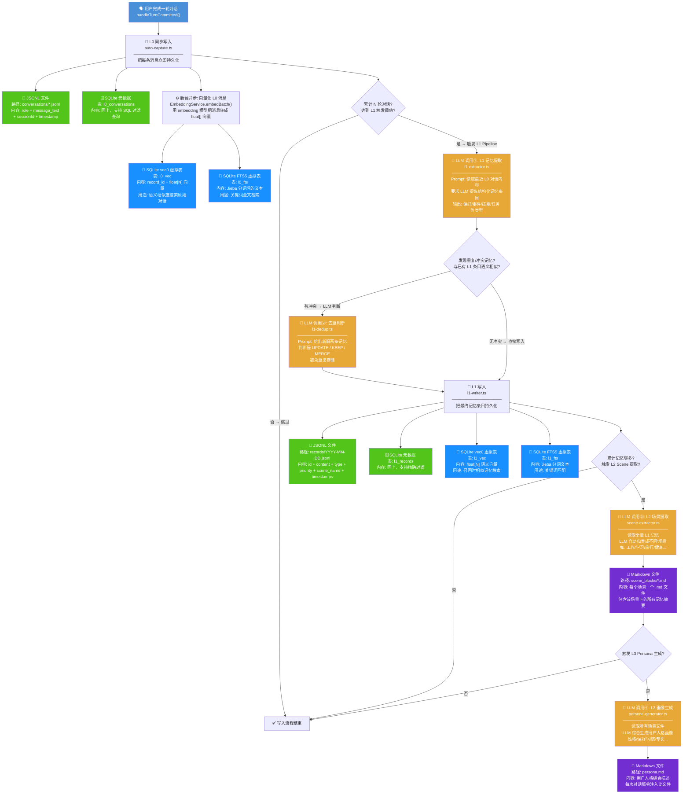
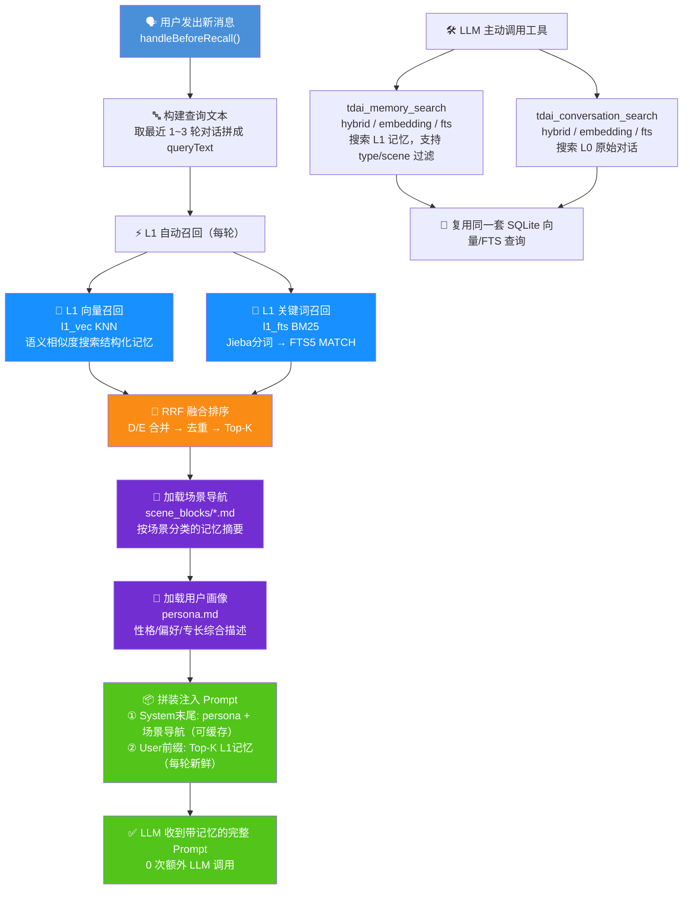

> **TencentDB Agent Memory** — 腾讯 LLM Agent 多层记忆系统。核心思路是分层抽象：L0 即时捕获原始对话，L1 用 LLM 提炼结构化记忆，L2 按场景归类，L3 生成用户人格画像。写入时逐层触发（累计 N 轮 → 记忆够多 → 场景够多），召回时采用向量 + BM25 混合多路召回，Top-K 记忆注入 User 前缀，场景导航 + 用户画像常驻 System Prompt 末尾。

# 写入流程


# 召回流程

> **⚡ 分层召回策略**
> - **L2 场景导航 + L3 用户画像**：每次拼入 System Prompt 末尾（内容可缓存，不频繁读取 storage）
> - **L1 记忆**：每轮自动搜索（L1 向量 + L1 FTS → RRF 融合 → Top-K 注入 User 前缀）
> - **L0 对话**：**LLM 主动调用** `tdai_conversation_search` 才搜索，不在每轮自动召回链路里



# 存储概览

## 存储内容详情

### L1 记忆条目（JSONL 示例）

```jsonl
{"id":"m_1750000000_a1b2","content":"用户偏好使用中文交流","type":"persona","priority":85,"scene_name":"工作","source_message_ids":["msg_001","msg_002"],"metadata":{},"timestamps":["2025-06-14T10:00:00Z","2025-06-15T14:30:00Z"],"createdAt":"2025-06-14T10:00:00Z","updatedAt":"2025-06-15T14:30:00Z","sessionKey":"openclaw","sessionId":"sess_abc123"}
{"id":"m_1750000001_c3d4","content":"昨天下午3点在健身房跑步1小时","type":"episodic","priority":60,"scene_name":"健身","source_message_ids":["msg_010"],"metadata":{"activity_start_time":"2025-06-15T15:00:00Z","activity_end_time":"2025-06-15T16:00:00Z"},"timestamps":["2025-06-15T16:05:00Z"],"createdAt":"2025-06-15T16:05:00Z","updatedAt":"2025-06-15T16:05:00Z","sessionKey":"openclaw","sessionId":"sess_xyz"}
```

**字段说明：** `type` = persona（人格偏好）/ episodic（事件经历）/ instruction（指令规则）；`priority` = 0-100 重要度，-1 为强制全局指令；`scene_name` = L1 提炼时 LLM 打的初步场景标签；`source_message_ids` = 记忆来源的 L0 消息 ID。

### L2 场景文件（Markdown 示例）

```markdown
-----META-START-----
created: 2025-06-10T08:00:00Z
updated: 2025-06-15T18:00:00Z
summary: 用户在健身、饮食方面的习惯和偏好
heat: 85
-----META-END-----

## 健身场景

### 记忆摘要
- 昨天下午3点在健身房跑步1小时
- 每周健身2-3次，偏好有氧运动
- 最近在尝试增肌食谱

### 相关记忆 ID
- m_1750000001_c3d4
- m_1750000002_e5f6
```

**META 字段：** `created`/`updated` = 创建/更新时间；`summary` = LLM 生成的场景一句话摘要；`heat` = 场景活跃度得分（影响 L3 生成优先级）。

### L3 用户画像（Markdown 示例）

```markdown
-----META-START-----
created: 2025-06-01T00:00:00Z
updated: 2025-06-15T20:00:00Z
-----META-END-----

## 用户人格画像

### 性格特征
- 注重效率，喜欢简洁直接的表达方式
- 对新知识有好奇心，愿意尝试新工具

### 偏好习惯
- 偏好中文交流
- 每周健身2-3次，关注健康饮食
- 工作认真，有明确的目标感

### 专长领域
- 软件开发，擅长 TypeScript 和 Python

### 沟通风格
- 简洁明了，不喜欢冗长的解释
- 喜欢直接给出结论再补充细节
```

## 存储介质总览

| 层级 | 存储名称 | 存储介质 | 路径 / 表名 | 作用 |
|------|---------|---------|------------|------|
| **L0 原始对话层** | 对话原文 | JSONL 文件 | `conversations/*.jsonl` | 持久化每条消息原文（role / message_text / sessionKey / timestamp） |
| | 对话元数据 | SQLite 普通表 | `l0_conversations` | 结构化元数据，支持 SQL 过滤查询 |
| | 对话语义向量 | SQLite vec0 虚拟表 | `l0_vec` | 语义向量索引，KNN 相似度搜索原始对话 |
| | 对话全文索引 | SQLite FTS5 虚拟表 | `l0_fts` | Jieba 分词索引，关键词全文检索 |
| **L1 结构化记忆层** | 记忆条目 | JSONL 文件 | `records/YYYY-MM-DD.jsonl` | 持久化记忆条目（id / content / type / priority / scene_name / timestamps） |
| | 记忆元数据 | SQLite 普通表 | `l1_records` | 结构化元数据，支持精确过滤 |
| | 记忆语义向量 | SQLite vec0 虚拟表 | `l1_vec` | 语义向量索引，召回时相似记忆搜索 |
| | 记忆全文索引 | SQLite FTS5 虚拟表 | `l1_fts` | Jieba 分词索引，关键词匹配 |
| **L2 场景归类层** | 场景文件 | Markdown 文件 | `scene_blocks/*.md` | 每个场景一个 .md 文件，含 META + 记忆摘要 + 来源 ID |
| **L3 用户画像层** | 用户画像 | Markdown 文件 | `persona.md` | 用户人格综合描述，末尾附带场景导航，注入 System Prompt |
