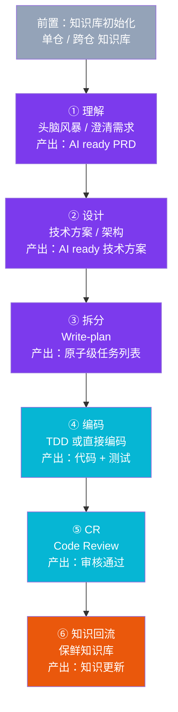

# aicoding 流程总结（v0.1）

# 一、解决什么问题

## 1.1 三个本质问题

### 问题 1：模型缺少上下文 / 信息
**症状**：模型不知道业务规则、领域术语、组件用法、已有架构约束。  
**本质**：模型是通用预训练的，对**你的具体业务 / 仓库**一无所知。  
**解法**：
- **单仓知识库**（规则 / 架构 / 代码规范 / 业务流程 / 领域实体）
- **跨仓知识库**（领域总览 / 服务调用关系 / 外部依赖 / 领域能力）
- **头脑风暴**（在每次新任务开始时主动探测上下文）

### 问题 2：模型上下文窗口不够
**症状**：再大的窗口也装不下"整个仓库 + 所有上下文 + 历史对话 + 工具输出"。  
**本质**：上下文是有限的，要靠**分层中间产物**消化信息。  
**解法**：
- **PRD**（产品需求文档）→ 让模型知道要做什么
- **技术方案** → 让模型知道怎么做
- **Write-plan**（任务拆分）→ 让模型一次只关注一个原子任务

### 问题 3：模型幻觉（讨好 / 说谎 / 偷懒）
**症状**：模型会"看起来对"、"应该可以了"、"差不多就行"——**会过早宣布成功**。  
**本质**：LLM 的训练目标是"流畅回答"，不是"正确回答"。  
**解法**（5 个）：
1. **需求澄清**（clarify 阶段）→ 把模糊点变成具体问题
2. **人类确认中间文档**（PRD / 技术方案）→ 关键节点人类审查
3. **验收标准**（Given/When/Then 场景）→ 让成功可度量
4. **门禁**（CI / 自动化校验）→ 客观判断"完成"
5. **TDD（测试先行）** → 用失败测试驱动开发，铁律禁止"先写代码后写测试"

## 1.2 关键技巧（来自用户认知）

| 技巧 | 含义 |
|------|------|
| **从少到多** | 非必要不添加——知识库不要一开始搞太多 |
| **非必要不增加技术复杂度** | 非必要不上 RAG 等"听起来高级"的东西 |
| **代码注释 > 单仓知识库** | 注释对 LLM 更直接，知识库是补充 |

## 1.3 三个项目共同应对的问题

| 项目 | 应对 #1 缺信息 | 应对 #2 上下文不够 | 应对 #3 幻觉 |
|------|:---:|:---:|:---:|
| **OpenSpec** | specs 源真相 + explore | 7 步分层产物 | archive 校验 |
| **Spec Kit** | constitution 治理 + clarify | 7 步 + 多产物（spec/plan/data-model/research/quickstart/contracts） | analyze 一致性 + TDD |
| **Superpowers** | brainstorming 探索 | 7 步核心 + 3 按需 | **强 TDD 铁律** + verification-before-completion |

---

# 二、抽象的总体流程（7 步）

基于用户的认知 + 三个项目的核心流程，提炼一条**通用版** aicoding 流程：

## 2.1 各步骤详细说明

### 步骤 0：知识库初始化（前置，不算 7 步之一）
- **目的**：给模型提供项目级上下文
- **产物**：单仓知识库 + 跨仓知识库
- **关键原则**：按仓库类型选内容
  - **B 端服务**：规则、领域实体领域行为、架构文件、代码规范目录
  - **长流程 C 端**：规则、业务流程说明（开发维度）、架构文件、代码规范目录
  - **API 聚合服务**：分模块说明、架构文件、代码规范目录

### 步骤 1：理解（头脑风暴）
- **目的**：把模糊想法精化为清晰需求
- **工具**：Superpowers.brainstorming / OpenSpec.explore / SpecKit.clarify
- **产物**：AI ready PRD（产品需求文档）
- **核心动作**：一次问一个问题 / 给出 2-3 个方案 + 推荐 / 用户确认

### 步骤 2：设计
- **目的**：把需求转化为技术方案
- **工具**：OpenSpec.design / SpecKit.plan
- **产物**：AI ready 技术方案
- **核心动作**：语言/版本 / 存储 / 测试框架 / 性能目标 / 约束条件

### 步骤 3：拆分（Write-plan）
- **目的**：把方案拆为原子级可执行任务
- **工具**：OpenSpec.tasks / SpecKit.tasks / Superpowers.writing-plans
- **产物**：Write-plan（精确到分钟级 / 每步含文件路径 + 完整代码 + 验证命令）
- **核心动作**：禁止占位符（TBD/TODO/参考 Task N）

### 步骤 4：编码
- **目的**：按任务执行编码
- **工具**：OpenSpec.apply / SpecKit.implement / Superpowers.subagent-driven-development
- **产物**：代码（含测试）
- **核心动作**：
  - **强 TDD**（Superpowers）：RED → GREEN → REFACTOR 循环，铁律"先写失败测试"
  - **直接编码**（SpecKit/Superpowers）：当任务清晰时也可以

### 步骤 5：CR（Code Review）
- **目的**：双层审查（规格符合性 + 代码质量）
- **工具**：Superpowers.receiving-code-review / requesting-code-review
- **产物**：审核通过的代码

### 步骤 6：知识回流
- **目的**：把这次的新发现回流到知识库
- **产物**：知识库更新（保鲜）
- **关键**：每次任务完成都应该更新相关知识

## 2.2 关键节点的人类介入

| 节点 | 人类介入 | 自动化 |
|------|---------|--------|
| 步骤 1 头脑风暴 | ✅ 每次回答问题 | — |
| 步骤 1 PRD 完成 | ✅ 审查 + 批准 | — |
| 步骤 2 技术方案 | ✅ 审查 + 批准 | — |
| 步骤 3 Write-plan | ⚠️ 可选审查 | ✅ 自动拆分 |
| 步骤 4 编码 | ⚠️ TDD 失败时介入 | ✅ 自动实现 |
| 步骤 5 CR | ⚠️ 争议时介入 | ✅ 双 subagent 审查 |
| 步骤 6 知识回流 | ⚠️ 关键知识审查 | ✅ 自动追加 |

---

# 三、每个项目的特点

每个项目都有自己独特的**灵魂**——它最擅长解决什么问题、最不擅长什么、什么场景下选它。

## 3.1 OpenSpec：知识库与提议分离的语义

**灵魂一句话**：把「系统现状」和「提议修改」分开——`specs/` 是源真相，`changes/` 是提议。

- **流程**：7 步（explore → proposal → design → tasks → apply → verify → archive）
- **命令数**：5 core + 6 expanded（默认只开 5 个）
- **哲学**：动作而非阶段（fluid not rigid）、brownfield 优先
- **强项**：起步轻（5 命令就够）、specs/changes 语义分离清晰、archive 时自动合并 delta
- **弱项**：不强制 TDD、不强调多 subagent 审查、靠人类审查保证质量
- **选它**：已有代码库起步 / 想清楚区分「现状」和「提议修改」 / 不希望一开始就上 14 个 Skills

## 3.2 Spec Kit：项目级治理 + 模板复用

**灵魂一句话**：用 `constitution.md` 把项目级原则写死——TDD / 集成测试 / 架构规则都进 governance。

- **流程**：7 步（constitution → specify → clarify → plan → analyze → tasks → implement）
- **命令数**：7 个 `/speckit.xxx`
- **哲学**：spec-driven + constitution 治理 + 严格 7 步
- **强项**：constitution 治理原则、模板 Placeholder 系统（`[大写字母下划线数字]` 占位符）、Pre/Post-Execution 钩子、handoffs 自动串联下一步
- **弱项**：流程较重（7 步全跑）、constitution 是一次性投入、commands 偏工程化
- **选它**：大型企业项目 / 需要 constitution 原则统一团队 / 多 Agent 多工具协作 / 复用模板

## 3.3 Superpowers：强 TDD + 多 subagent 审查

**灵魂一句话**：14 个 Skills 协同 + 强 TDD 铁律 + 多 subagent 两阶段审查——把「LLM 幻觉」问题压到最低。

- **流程**：7 步核心 + 3 步按需（brainstorming → writing-plans → using-git-worktrees → subagent-driven-development → TDD → verification → finishing；按需 systematic-debugging / dispatching-parallel-agents / writing-skills）
- **Skill 数**：14 个
- **哲学**：1% 适用性原则（"只要有 1% 可能性某个 Skill 适用，就必须调用它"）
- **强项**：TDD 铁律（先写失败测试，禁止"先写代码"）、multi-subagent 两阶段审查（规格符合性 + 代码质量）、verification-before-completion（必须给实际输出证据）、systematic-debugging 4 阶段、worktree 隔离工作区
- **弱项**：14 个 Skills 学习成本高、需要强 TDD 纪律、偏 "流程重 + 审查严"
- **选它**：强 TDD 团队 / 需要多 subagent 审查 / Skills 灵活组合 / 多人并行多任务 / 调试流程化

---

# 四、三个项目的横向对比

| 维度 | OpenSpec | Spec Kit | Superpowers |
|------|----------|----------|-------------|
| **阶段数** | 7 | 7 | 7 + 3 按需 |
| **核心创新** | specs/changes 分离 | constitution 治理 + 钩子 | 14 Skills + 强 TDD |
| **命令/Skill 数** | 5+6 | 7 | 14 |
| **TDD** | 不强制 | 推荐 | **铁律** |
| **多 subagent 审查** | 不强调 | 不强调 | **强（两阶段）** |
| **项目级治理** | 弱 | 强（constitution） | 弱 |
| **默认轻量化** | ✅ 5 命令起步 | ❌ 7 命令全跑 | ❌ 14 Skills |
| **适合 brownfield** | ✅ 优先 | 一般 | 一般 |
| **适合 greenfield** | 一般 | ✅（constitution 必跑） | ✅ |
| **适合调试** | 弱 | 弱 | **强（systematic-debugging）** |

---

# 五、选型建议（基于用户认知）

| 场景 | 推荐 | 理由 |
|------|------|------|
| **从零起步的项目** | OpenSpec core profile | 5 个命令就够，不用一次吃 14 Skills |
| **大型企业项目** | Spec Kit | constitution 治理原则 + 严格 7 步 |
| **强 TDD 团队** | Superpowers | TDD 是铁律 |
| **多 subagent 审查** | Superpowers | 唯一有双阶段审查 |
| **需要灵活 Skill 编排** | Superpowers | 14 Skills 可独立调用 |
| **需要 constitution 治理** | Spec Kit | 唯一有 constitution 概念 |
| **已有代码库起步** | OpenSpec | brownfield 优先 + specs/changes 分离 |
