## 0. 写入流程（Add）

```mermaid
flowchart TD
    A["🟢 用户调用 memory.add(messages, user_id/agent_id/run_id, metadata, infer, memory_type)"] --> B{"验证参数：至少提供 user_id / agent_id / run_id 之一？"}
    B -- 否 --> B_ERR["❌ 抛出 Mem0ValidationError"]
    B -- 是 --> C{"memory_type == procedural_memory 且有 agent_id？"}
    C -- 是 --> C1["📝 走程序性记忆分支 _create_procedural_memory()"]
    C1 --> C1a["LLM 生成程序性记忆摘要"]
    C1a --> C1b["Embedding 模型向量化"]
    C1b --> C1c["写入向量库 + SQLite 历史记录"]
    C1c --> C1d["返回结果"]
    C -- 否 --> D{"是否启用视觉模型 enable_vision？"}
    D -- 是 --> D1["👁️ parse_vision_messages(): 用 LLM 描述图片内容，替换为文本"]
    D -- 否 --> D2["parse_vision_messages(): 仅保留文本消息"]
    D1 --> E{"infer 参数？"}
    D2 --> E
    E -- "False（非推理模式）" --> E1["🔄 逐条消息处理循环"]
    E1 --> E1a["跳过 system 角色消息"]
    E1a --> E1b["Embedding 模型对每条消息内容向量化"]
    E1b --> E1c["_create_memory(): 直接写入向量库 + SQLite 记录 ADD 事件"]
    E1c --> E1d["返回 ADD 结果列表"]

    E -- "True（推理模式，V3 批量管线）" --> F

    subgraph F["🧠 V3 批量写入管线（8 个阶段）"]
        direction TB
        F0["Phase 0️⃣ 上下文收集<br/>从 SQLite 获取该 session 最近 10 条消息<br/>拼接 messages 为纯文本 parsed_messages"] --> F1
        F1["Phase 1️⃣ 已有记忆检索<br/>对 parsed_messages 做 Embedding<br/>在向量库中搜索 top_k=10 相似记忆<br/>UUID 映射为整数 ID（防 LLM 幻觉）"] --> F2
        F2["Phase 2️⃣ LLM 事实提取（单次调用）<br/>System Prompt: ADDITIVE_EXTRACTION_PROMPT<br/>若 agent_id 存在且 user_id 不存在则追加 AGENT_CONTEXT_SUFFIX<br/>User Prompt: 包含已有记忆 + 新消息 + 历史消息 + 自定义指令<br/>LLM 返回 JSON: {memory: [{id, text, linked_memory_ids, attributed_to}]}"] --> F3
        F3["Phase 3️⃣ 批量向量化<br/>对提取的所有记忆文本调用 embed_batch()<br/>失败则逐条 embed 降级"] --> F4
        F4["Phase 4️⃣ 逐条 CPU 处理 + Phase 5️⃣ Hash 去重<br/>计算每条记忆的 MD5 hash<br/>与已有记忆 hash 比对去重<br/>对记忆文本做词形还原 lemmatize_for_bm25() 用于 BM25 检索<br/>构建 metadata: data, text_lemmatized, hash, created_at, updated_at"] --> F5
        F5["Phase 6️⃣ 批量持久化<br/>vector_store.insert() 批量写入向量库<br/>失败则逐条 insert 降级<br/>SQLite batch_add_history() 批量记录 ADD 事件<br/>失败则逐条 add_history 降级"] --> F6
        F6["Phase 7️⃣ 批量实体链接<br/>7a: extract_entities_batch() 用 spaCy 批量提取实体（专有名词/引号文本/复合名词）<br/>7b: 全局去重 + embed_batch() 批量向量化实体<br/>7c: entity_store.search_batch() 批量搜索已有实体<br/>7d: 相似度 ≥ 0.95 → 更新 linked_memory_ids；否则 → 新建实体<br/>7e: entity_store.insert() 批量写入新实体"] --> F7
        F7["Phase 8️⃣ 保存消息 + 返回<br/>SQLite save_messages() 保存原始消息（每 session 保留最近 10 条）<br/>返回 [{id, memory, event: ADD}] 列表"]
    end
```



### 写入流程关键说明

| 阶段 | 核心操作 | 涉及组件 |
|------|---------|---------|
| 参数验证 | 必须提供 `user_id`/`agent_id`/`run_id` 之一 | Memory |
| 视觉处理 | LLM 描述图片 → 替换为文本 | LLM |
| 上下文收集 | 从 SQLite 获取最近 10 条历史消息 | SQLiteManager |
| 已有记忆检索 | Embedding + 向量库语义搜索 top_k=10 | Embedder + VectorStore |
| LLM 提取 | 单次 LLM 调用，提取结构化记忆 JSON（agent_id 存在且 user_id 不存在时追加 AGENT_CONTEXT_SUFFIX） | LLM |
| 批量向量化 | 对提取的记忆文本批量生成 Embedding | Embedder |
| Hash 去重 | MD5 hash 比对，跳过重复记忆 | Memory |
| 批量持久化 | 向量库 insert + SQLite 记录历史 | VectorStore + SQLiteManager |
| 实体链接 | spaCy NER 提取实体 → 向量化 → 搜索/插入实体库 | EntityExtraction + EntityStore |
| 消息保存 | SQLite 保存原始对话消息 | SQLiteManager |

---

## 1. 检索流程（Search）

```mermaid
flowchart TD
    A["🟢 用户调用 memory.search(query, top_k, filters, threshold, rerank)"] --> B{"验证参数：filters 必须包含 user_id / agent_id / run_id 之一？"}
    B -- 否 --> B_ERR["❌ 抛出 ValueError"]
    B -- 是 --> C{"filters 中是否包含高级操作符？<br/>AND / OR / NOT / eq / ne / gt / lt / contains 等"}
    C -- 是 --> C1["_process_metadata_filters(): 将高级过滤条件转换为向量库兼容格式"]
    C1 --> D
    C -- 否 --> D

    subgraph D["🔍 混合检索管线（9 个步骤）"]
        direction TB
        D1["Step 1️⃣ 查询预处理<br/>对 query 做 lemmatize_for_bm25() 词形还原<br/>用 spaCy extract_entities() 提取查询中的实体"] --> D2
        D2["Step 2️⃣ 查询向量化<br/>Embedding 模型对 query 生成向量"] --> D3
        D3["Step 3️⃣ 语义搜索<br/>vector_store.search() 语义相似度搜索<br/>internal_limit = max(top_k × 4, 60) 过量获取"] --> D4
        D4["Step 4️⃣ 关键词搜索<br/>vector_store.keyword_search() BM25 全文检索<br/>使用 text_lemmatized 字段匹配<br/>部分向量库不支持则返回 None"] --> D5
        D5["Step 5️⃣ 计算 BM25 分数<br/>对关键词搜索结果做 Sigmoid 归一化到 0~1<br/>参数根据查询词数自适应调整<br/>短查询(≤3词): midpoint=5.0, steepness=0.7<br/>长查询(>15词): midpoint=12.0, steepness=0.5"] --> D6
        D6["Step 6️⃣ 计算实体增强分数<br/>对查询中提取的实体（最多取前 8 个去重）：<br/>  → Embedding 向量化<br/>  → entity_store.search() 搜索相似实体(top_k=500)<br/>  → 相似度 ≥ 0.5 的实体，对其关联的 memory_id 加分<br/>  → 加分公式: similarity × 0.5 × 1/(1+0.001×(n-1)²)<br/>  → 多实体对同一记忆取最大值"] --> D7
        D7["Step 7️⃣ 构建候选集<br/>以语义搜索结果为基础候选集<br/>每条候选包含: id, score, payload"] --> D8
        D8["Step 8️⃣ 加权评分与排序<br/>score_and_rank() 加法评分：<br/>  combined = (semantic + bm25 + entity_boost) / max_possible<br/>  max_possible 根据激活信号数自适应：<br/>    仅语义=1.0 / +BM25=2.0 / +实体=2.5<br/>  语义分数低于 threshold 的候选直接淘汰<br/>  按 combined 降序排列，取 top_k"] --> D9
        D9["Step 9️⃣ 格式化结果<br/>构建 MemoryItem 对象<br/>提取 payload 中的 data, hash, created_at, updated_at<br/>提升 user_id, agent_id, run_id, actor_id, role 到顶层<br/>其余字段归入 metadata"]
    end

    D --> E{"rerank=True 且配置了 Reranker？"}
    E -- 是 --> E1["🔄 Reranker 重排序<br/>支持: Cohere / SentenceTransformer / ZeroEntropy / LLM / HuggingFace<br/>reranker.rerank(query, results, top_k)"]
    E1 --> F
    E -- 否 --> F
    F["📦 返回 {results: [{id, memory, score, ...}]}"]
```



### 检索流程关键说明

| 步骤 | 核心操作 | 涉及组件 |
|------|---------|---------|
| 查询预处理 | 词形还原 + spaCy NER 实体提取 | Lemmatization + EntityExtraction |
| 查询向量化 | Embedding 生成查询向量 | Embedder |
| 语义搜索 | 向量相似度搜索，过量获取 4× top_k | VectorStore |
| 关键词搜索 | BM25 全文检索（基于 lemmatized 字段） | VectorStore.keyword_search() |
| BM25 归一化 | Sigmoid 归一化，参数按查询长度自适应 | Scoring |
| 实体增强 | 查询实体 → 实体库搜索 → 关联记忆加分 | EntityStore + Scoring |
| 加权评分 | 语义 + BM25 + 实体 三路融合，自适应归一化 | Scoring |
| Reranker | 可选的二次精排 | Reranker |

### 评分公式详解

```
combined_score = (semantic_score + bm25_score + entity_boost) / max_possible

其中:
- semantic_score: 向量余弦相似度 [0, 1]
- bm25_score: Sigmoid 归一化后的 BM25 分数 [0, 1]
- entity_boost: 实体增强分数 [0, 0.5]
- max_possible: 1.0(仅语义) / 2.0(+BM25) / 2.5(+实体) / 1.5(语义+实体无BM25)

BM25 Sigmoid 归一化:
normalize_bm25(raw) = 1 / (1 + exp(-steepness × (raw - midpoint)))

实体增强:
boost = similarity × 0.5 × 1 / (1 + 0.001 × (linked_count - 1)²)
```

---

## 2. 存储介质

### 2.1 核心存储介质总览

| 存储介质 | 技术 | 存储的内容 | 何时写入 | 何时查询 |
|---------|------|-----------|---------|---------|
| **向量库（主记忆库）** | 可插拔：Qdrant / Chroma / PGVector / Milvus / Pinecone / Redis / Elasticsearch / OpenSearch / FAISS / MongoDB / Weaviate / Supabase / Azure AI Search / Cassandra / Neptune / 等 25+ 种 | 记忆向量 + payload（data, hash, text_lemmatized, created_at, updated_at, user_id, agent_id, run_id, actor_id, role, metadata） | `add()` Phase 6 批量写入；`update()` 更新；`delete()` 删除 | `search()` Step 3 语义搜索；`search()` Step 4 关键词搜索；`get()` / `get_all()` 列表查询 |
| **向量库（实体库）** | 同主记忆库，使用 `{collection_name}_entities` 集合 | 实体向量 + payload（data, entity_type, linked_memory_ids, user_id, agent_id, run_id） | `add()` Phase 7 实体链接时 upsert；`update()` 重新链接实体；`delete()` 清理实体关联 | `search()` Step 6 实体增强搜索；`add()` Phase 7 实体去重搜索 |
| **SQLite（历史记录）** | SQLite3，文件路径 `~/.mem0/history.db` | **history 表**: id, memory_id, old_memory, new_memory, event(ADD/UPDATE/DELETE), created_at, updated_at, is_deleted, actor_id, role | `add()` Phase 6 批量记录 ADD 事件；`update()` 记录 UPDATE 事件；`delete()` 记录 DELETE 事件 | `history()` 查询某条记忆的变更历史 |
| **SQLite（消息缓存）** | 同上 SQLite 数据库 | **messages 表**: id, session_scope, role, content, name, created_at（每 session 保留最近 10 条） | `add()` Phase 8 保存原始对话消息 | `add()` Phase 0 获取最近 10 条历史消息作为上下文 |

### 2.2 向量库 Payload 字段详解

| 字段 | 类型 | 说明 | 写入时机 | 查询用途 |
|------|------|------|---------|---------|
| `data` | string | 记忆文本内容 | add / update | search 结果展示；keyword_search BM25 匹配 |
| `hash` | string | 记忆文本 MD5 哈希 | add / update | 写入时去重判断 |
| `text_lemmatized` | string | 词形还原后的文本 | add / update | keyword_search BM25 全文检索 |
| `created_at` | ISO datetime | 创建时间 | add | 结果展示；排序 |
| `updated_at` | ISO datetime | 更新时间 | add / update | 结果展示；排序 |
| `user_id` | string | 用户标识 | add | 过滤条件；结果展示 |
| `agent_id` | string | Agent 标识 | add | 过滤条件；决定使用 Agent 记忆提取 Prompt |
| `run_id` | string | 运行标识 | add | 过滤条件 |
| `actor_id` | string | 消息发送者标识 | add（从 message.name 解析） | 过滤条件；结果展示 |
| `role` | string | 消息角色（user/assistant） | add | 过滤条件；结果展示 |
| `attributed_to` | string | 归属方 | add（LLM 提取时指定） | 结果展示 |
| `memory_type` | string | 记忆类型 | procedural_memory 创建时 | 过滤条件 |

### 2.3 实体库 Payload 字段详解

| 字段 | 类型 | 说明 | 写入时机 | 查询用途 |
|------|------|------|---------|---------|
| `data` | string | 实体文本（如人名、地名、品牌名） | 实体链接时 | 实体搜索匹配 |
| `entity_type` | string | 实体类型（PROPER/QUOTED/COMPOUND/NOUN） | 实体链接时 | 元数据 |
| `linked_memory_ids` | list[str] | 关联的记忆 ID 列表 | 实体链接时追加；记忆删除时移除 | 实体增强时查找关联记忆并加分 |
| `user_id` | string | 用户标识 | 实体链接时 | 过滤条件 |
| `agent_id` | string | Agent 标识 | 实体链接时 | 过滤条件 |
| `run_id` | string | 运行标识 | 实体链接时 | 过滤条件 |

### 2.4 可插拔组件一览

| 组件类型 | 支持的 Provider | 默认 |
|---------|----------------|------|
| **LLM** | OpenAI / OpenAI Structured / Anthropic / Azure OpenAI / Azure OpenAI Structured / DeepSeek / Gemini / Groq / Ollama / Together / AWS Bedrock / LiteLLM / MiniMax / xAI / Sarvam / LMStudio / vLLM / LangChain | OpenAI |
| **Embedder** | OpenAI / Ollama / HuggingFace / Azure OpenAI / Gemini / VertexAI / Together / LMStudio / LangChain / AWS Bedrock / FastEmbed | OpenAI |
| **VectorStore** | Qdrant / Chroma / PGVector / Milvus / Pinecone / Redis / Elasticsearch / OpenSearch / FAISS / MongoDB / Weaviate / Supabase / Azure AI Search / Azure MySQL / Upstash / Cassandra / Neptune / Databricks / Vertex AI / Baidu / S3 Vectors / Turbopuffer / Valkey / LangChain | Qdrant |
| **Reranker** | Cohere / SentenceTransformer / ZeroEntropy / LLM / HuggingFace | 无（可选） |

### 2.5 数据流向图

```
用户输入 messages
       │
       ▼
  ┌─────────┐    LLM 提取     ┌──────────┐
  │  LLM    │ ──────────────► │ 记忆文本  │
  └─────────┘                 └────┬─────┘
                                    │
                    ┌───────────────┼───────────────┐
                    ▼               ▼               ▼
             ┌──────────┐   ┌──────────┐   ┌──────────┐
             │ Embedder │   │ spaCy    │   │ MD5 Hash │
             │ 向量化    │   │ 实体提取  │   │ 去重计算  │
             └────┬─────┘   └────┬─────┘   └────┬─────┘
                  │              │              │
                  ▼              ▼              │
        ┌──────────────┐  ┌───────────┐        │
        │ 向量库(主库)  │  │ 向量库(实体)│        │
        │ insert()     │  │ upsert()  │        │
        └──────┬───────┘  └───────────┘        │
               │                                │
               ▼                                ▼
        ┌──────────────┐                 ┌──────────┐
        │   SQLite     │                 │ Hash 对比 │
        │ history ADD  │                 │ 去重判断  │
        │ messages 保存 │                 └──────────┘
        └──────────────┘

查询 query
       │
       ├──────────────┬──────────────┐
       ▼              ▼              ▼
  ┌──────────┐  ┌──────────┐  ┌──────────┐
  │ Embedder │  │ 词形还原  │  │ spaCy    │
  │ 查询向量  │  │ BM25预处理│  │ 实体提取  │
  └────┬─────┘  └────┬─────┘  └────┬─────┘
       │              │              │
       ▼              ▼              ▼
  ┌──────────┐  ┌──────────┐  ┌──────────┐
  │ 向量库    │  │ 向量库    │  │ 实体库    │
  │ 语义搜索  │  │ 关键词搜索 │  │ 实体搜索  │
  └────┬─────┘  └────┬─────┘  └────┬─────┘
       │              │              │
       ▼              ▼              ▼
  ┌──────────────────────────────────────┐
  │         score_and_rank()             │
  │  semantic + bm25 + entity_boost      │
  │  加权融合 → 阈值过滤 → top_k 截断    │
  └──────────────┬───────────────────────┘
                 │
                 ▼
          ┌─────────────┐
          │  Reranker    │  (可选)
          │  二次精排     │
          └──────┬──────┘
                 │
                 ▼
            返回结果
```
