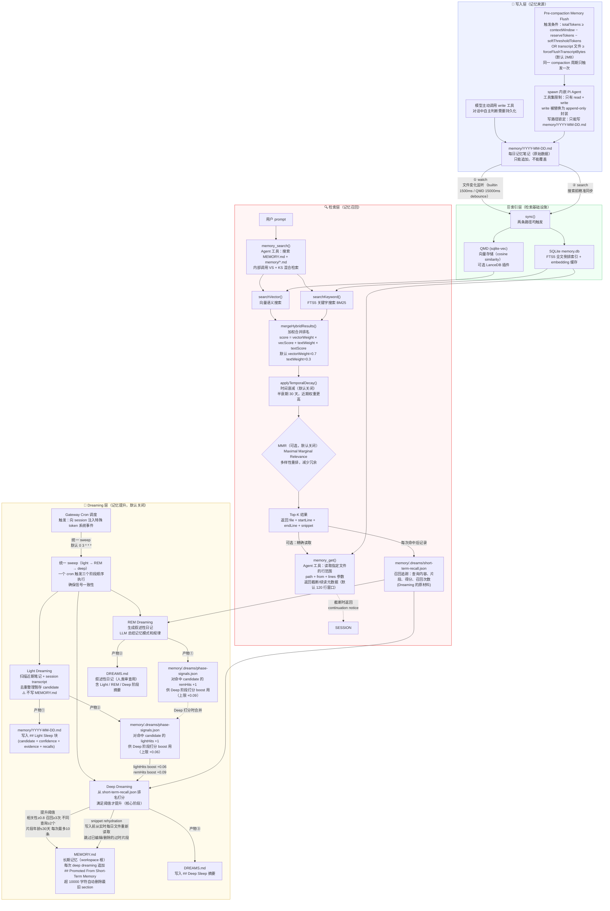

**简述**：OpenClaw 长期记忆系统通过「写入 → 索引 → 检索 → Dreaming」的层级架构实现智能记忆管理。每日对话内容以追加方式写入 `memory/YYYY-MM-DD.md`，经 FTS5 全文索引和向量存储双重索引后，支持混合检索召回。Dreaming 层通过统一 cron 作业（默认每日凌晨 3 点）执行 light→REM→deep 三阶段记忆提升，仅将满足相关性≥0.8、召回≥3次、不同查询≥2个的优质片段晋升至 workspace 根目录的 `MEMORY.md`，供 session 启动时 bootstrap 注入。



## 📝 写入机制

### 两条写入路径

长期记忆系统支持两条写入路径：

1. **主动写入**：模型在对话中自主判断需要持久化的内容，调用 `write` 工具直接写入 `memory/YYYY-MM-DD.md`

2. **自动 Flush**：在 auto-compaction 触发前，系统会执行 Pre-compaction Memory Flush
   - **触发条件 A**：`totalTokens ≥ contextWindow − reserveTokens − softThresholdTokens`
     - `softThresholdTokens` 默认值为 4000。就是离上下文压缩还剩4000token的时候。
   - **触发条件 B**：`transcript 文件 ≥ forceFlushTranscriptBytes`（默认 2MB）
   - 同一 compaction 周期只触发一次，避免重复

### Flush 执行过程

Flush 由一个内嵌的 Pi Agent 执行，具有以下限制：

- **工具集**：只允许 read + write 操作
- **写路径约束**：通过提示词要求只能写入 `memory/YYYY-MM-DD.md`，追加模式（不覆盖已有内容）
- **写路径锁定**：提示词约束禁止写入 MEMORY.md、DREAMS.md、SOUL.md 等 bootstrap 文件

Flush 产物写入 `memory/YYYY-MM-DD.md`（每日记忆笔记），采用追加模式。

### 每日文件结构

每日笔记文件只能追加、不能覆盖。新内容追加到文件末尾，历史内容保持不变。

---

## 🔍 搜索机制

### 两阶段索引

写入 `memory/` 目录的每日文件会通过两条路径进入索引：

1. **文件变化监听（watch）**：内置 1500ms / QMD 15000ms debounce
2. **搜索前同步（search）**：搜索前精准同步

索引层维护两个存储：

- **SQLite memory.db**：FTS5 全文倒排索引 + embedding 缓存
- **QMD (sqlite-vec)**：向量存储，使用 cosine similarity，可选 LanceDB 插件

### 混合检索流程

当 agent 调用 `memory_search()` 时：

1. **并行检索**：
   - `searchVector()`：向量语义搜索
   - `searchKeyword()`：FTS5 关键字搜索（BM25 算法）

2. **结果合并**：`mergeHybridResults()` 使用加权合并
   - 公式：`score = vectorWeight × vecScore + textWeight × textScore`
   - 默认权重：vectorWeight=0.7, textWeight=0.3

3. **时间衰减**：`applyTemporalDecay()` 可选启用
   - 半衰期默认 30 天
   - 近期记忆权重更高
   - 默认关闭

4. **MMR 多样性重排**（可选，默认关闭）：
   - Maximal Marginal Relevance 算法
   - 基于 Jaccard 相似度
   - 减少结果冗余

5. **返回 Top-K 结果**：包含 file + startLine + endLine + snippet

### 精确读取

`memory_get()` 工具支持精确读取指定文件的行范围：

- **参数**：`path`、`from`、`lines`
- **默认行窗口**：120 行
- **返回**：截断/续读元数据
- **截断时**：返回 continuation notice，提示继续读取

### 召回追踪

每次搜索命中后，系统自动记录到 `memory/.dreams/short-term-recall.json`：

- 查询内容
- 命中的片段
- 得分
- 召回次数

这些数据是 Dreaming 层的原材料。

---

## 🌙 Dreaming 机制（记忆提升）

Dreaming 层通过 Gateway Cron 调度触发，向 session 注入特殊 token 系统事件。**默认关闭**。

### 统一 Sweep 模型

所有 Dreaming 阶段由**单一 cron 作业**统一调度（默认 `0 3 * * *`），按顺序执行：

```
light → REM → deep
```

这种设计确保三个阶段的信号一致性，避免独立调度带来的状态不一致问题。

### Light Dreaming

**作用**：扫描近期笔记和 session transcript，去重整理暂存 candidate

**产物**：
1. `memory/YYYY-MM-DD.md`：写入 `## Light Sleep` 块，包含 candidate + confidence + evidence + recalls
2. `memory/.dreams/phase-signals.json`：对命中的 candidate 的 `lightHits +1`，供 Deep 阶段打分 boost（上限 +0.06）

**注意**：Light Dreaming **不写 MEMORY.md**

### REM Dreaming

**作用**：生成叙述性日记，LLM 总结记忆模式和规律

**产物**：
1. `memory/.dreams/phase-signals.json`：对命中的 candidate 的 `remHits +1`，供 Deep 阶段打分 boost（上限 +0.09）
2. `DREAMS.md`：叙述性日记（人类审查用），包含 Light / REM / Deep 阶段摘要

### Deep Dreaming（核心阶段）

**作用**：从 `short-term-recall.json` 读取召回数据，进行六维加权打分排序

#### 六维权重

| 维度 | 默认权重 | 说明 |
|------|---------|------|
| frequency | 0.24 | 召回频率 |
| relevance | 0.30 | 相关性得分 |
| diversity | 0.15 | 多样性 |
| recency | 0.15 | 时间衰减 |
| consolidation | 0.10 | 巩固程度 |
| conceptual | 0.06 | 概念重要性 |

#### Phase Signal Boost

Deep 阶段会合并 phase-signals.json 中的 boost 信号：
- `lightHits` boost：上限 +0.06
- `remHits` boost：上限 +0.09
- 合并后统一用于最终打分

#### 提升阈值

只有满足以下**全部条件**的片段才会被提升到 MEMORY.md：

| 条件 | 阈值 |
|------|------|
| 相关性得分 | ≥ 0.8 |
| 召回次数 | ≥ 3 次 |
| 不同查询数 | ≥ 2 个 |
| 片段年龄 | ≤ 30 天 |
| 每次上限 | 最多 10 条 |

#### Snippet Rehydration

写入 MEMORY.md 前，系统会从实时每日文件重新读取片段内容：
- 跳过已编辑或删除的过时片段
- 确保写入的内容是最新版本

#### 产物

1. `MEMORY.md`：追加 `## Promoted From Short-Term Memory` 块
2. `DREAMS.md`：写入 `## Deep Sleep` 摘要

#### MEMORY.md 维护

- 位置：workspace 根目录
- 每次 deep dreaming 追加新内容
- 超过 10000 字符时，自动删除最旧的 section

### Bootstrap 注入

MEMORY.md 的内容在 session 启动时通过 bootstrap 机制注入 agent：

- **Bootstrap 注入**：全量注入 MEMORY.md、AGENTS.md、SOUL.md 等作为长期背景知识
- **总上限**：60000 chars（`DEFAULT_BOOTSTRAP_TOTAL_MAX_CHARS`）
- **每次对话**：通过 `systemPromptAddition` 注入 Top-K 搜索结果 