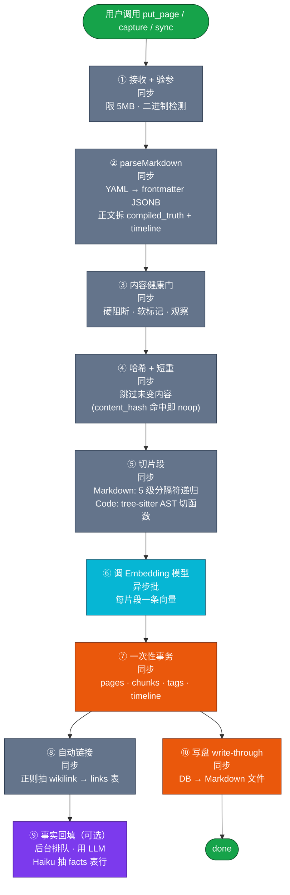
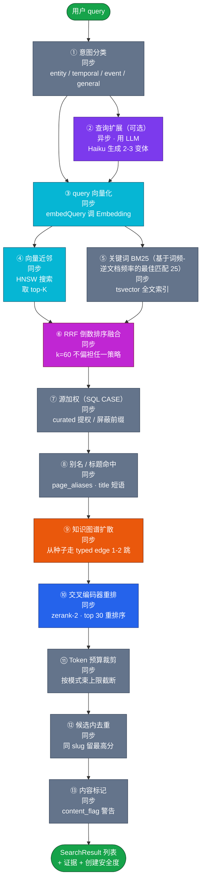
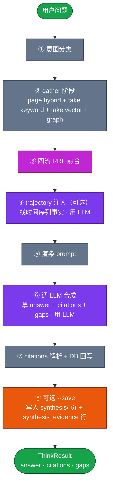
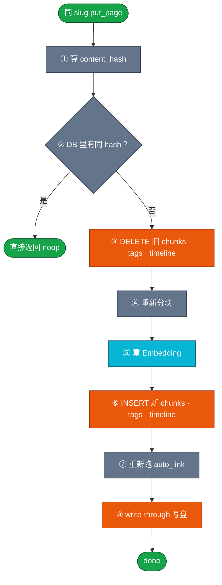
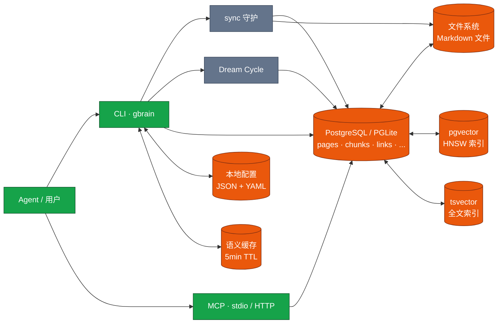

## RAG

- [项目分析 - GBrain（v0.1）](#项目分析---gbrainv01)
  - [第一章 概述](#第一章-概述)
  - [第二章 写入流程](#第二章-写入流程)
- [2026-05-20 与 Alice 的 Q1 产品评审](#2026-05-20-与-alice-的-q1-产品评审)
  - [Compiled Truth](#compiled-truth)
  - [Timeline](#timeline)
  - [Takes](#takes)
  - [第三章 检索流程](#第三章-检索流程)
  - [第四章 更新与删除](#第四章-更新与删除)
  - [第五章 存储结构](#第五章-存储结构)
  - [参考文件及作用](#参考文件及作用)
# 项目分析 - GBrain（v0.1）

> 参考 v0.3 章节结构撰写；与 openviking、gbrain 文章并排阅读。

## 第一章 概述

### 1.1 这个项目解决什么具体问题？

GBrain 解决的是 **AI 智能体（Agent）的"失忆症"问题**——一个会话里表现良好的 Agent,会话一关,所有上下文清零;下一轮再问"上次跟 Alice 聊到哪了",它答不上来;同一家公司的两次提及,会被当成两个陌生实体处理。

GBrain 的做法不是给 Agent 接一个"更聪明的 RAG",而是**把 Agent 的脑子持久化成一个在运行的"脑"**——所有记忆落地在本地仓库的 `.md` 文件 + PostgreSQL / PGLite 引擎里,对外暴露**基础层** (`search` / `query` / `get` / `list_pages` / `get_backlinks` / `traverse_graph` / `get_timeline`) 和**大脑层** (`think`) 两组接口。

**脑的实体数据结构**——只有 **6 张核心表 + 1 套 markdown 仓库**(都是确定性的,无 LLM 介入):

| 结构 | 物理形态 | 作用 | 关键事实 |
|---|---|---|---|
| **Pages** | 仓库里的 `.md` 文件 + `pages` 表 | 事实载体 | 每页 = YAML frontmatter + `## Compiled Truth`(当前最佳认知,新证据会重写)+ `## Timeline`(append-only 证据链) |
| **Chunks** | `chunks` 表(每页 3-8 行) | 检索粒度 | Markdown 页走 5 级分隔符递归切、代码页走 tree-sitter AST 切(36 种语言,按函数 / 类 / 类型)、媒体页整段;每块带 embedding |
| **Embeddings** | `chunks.embedding` 列 + HNSW 索引 | 语义召回 | `embed --stale` 增量补全,跨脑不复制 |
| **Links** | `links` 表 + `page_aliases` / `slug_aliases` | 结构化关系 | 每次写入自动跑三行正则抽 `[[双链]]` / `markdown 链接` / 约定块,**零 LLM**;类型有 `mentions` / `attended` / `works_at` / `invested_in` / `founded` / `advises` 等 |
| **Timeline** | `pages.timeline` JSONB + `timeline_entries` 表 | 时序证据 | 每次写入追加新条目,**永不修改**;`find_trajectory` 走它做回归 / 漂移分析 |
| **Takes** | `takes` 表 | **冷**认知(多 holder) | 由 Dream Cycle 从页面里 LLM 抽出来,带 `kind=take/fact/bet/hunch` + 置信度 w;**多 holder**——能记下"PG 怎么看 X 学校"这种非本人观点 |
| **Facts** | `facts` 表 | **热**记忆(单 holder) | 对话里 Haiku 实时抽,带 `kind=event/preference/commitment/belief/fact`;**单 holder**——只记本人 |

> Takes 和 Facts 是**两套不互相倒的表**(详见 `docs/takes-vs-facts.md`):写入路径、读出路径、置信度更新规则都不一样;不能因为"看起来都是结构化知识"就把两表合并。

**Pages 怎么分类**——两个正交维度:

1. **`page_kind`**(DB 层,v25 起的 CHECK 约束,只有 2 值):
   - `markdown` —— 默认,文本页
   - `code` —— 代码文件经 tree-sitter AST 切过的页(36 种语言)

2. **`type`**(schema pack 定义;`gbrain-base-v2` 默认 14 个 + 1 兜底,聚成 5 个 **primitive**):
   - `entity`(实体):`person` / `company`
   - `media`(媒体):`media` / `tweet` / `analysis` / `source` / `writing`
   - `temporal`(时序):`social-digest` / `deal` / `email` / `slack`
   - `concept`(概念):`concept` / `project` / `note`(`note` 是兜底)
   - `annotation`(注解):`atom`

   Primitive 决定下游 routing:`enrichable_types` 只能挂在 `entity` 上(人是核心实体,值得写),`expert_routing` 决定哪个 skill 处理这一页。**Page type 不是用户填的字符串**,是 schema pack 里 `path_prefixes` + `aliases` + `extractable` 一起规约出来的——切到错 pack 之后,同一份文件可能被路由到完全不同的 type。

**脑的"行为层"**(不是存储,是操作):

- **Synthesis(`think`)** —— 大脑层接口;拿到 candidates 后 LLM 综合,输出带 `[1][2]` 引用 + gap 标注 + 矛盾提示的答案;`with_calibration` 可注入 anti-bias 改写
- **Skills(`skills/*.md`)** —— 胖 Markdown(不是代码),由外部 Agent 读后调 CLI / MCP;`skills/RESOLVER.md` 是**文本路由器**(不是 router LLM)
- **Dream Cycle** —— 8 阶段后台 cron:`lint` → `backlinks` → `sync` → `synthesize` → `extract` → `patterns` → `embed` → `orphans`,让脑"越睡越聪明"

**关键观察**:GBrain 把"找片段"、"出答案"、"组织页面"、"修脑"做成四个正交动作,每个动作都有明确边界。传统 RAG 把"找片段"和"出答案"混在一起,GBrain 把它们切开:`search` / `query` 全程零 LLM 廉价可重复,`think` 是可选的 LLM 综合;`put_page` / `add_link` / `add_timeline_entry` 是确定性写入,`enrich` skill / Dream Cycle 才是 LLM 增强。Agent 拿到这样的脑,才真的"有脑子"而不是"有文档"。

### 1.2 设计思路是什么？

四条核心设计原则：

1. **Markdown 即数据库，目录即模式（Schema）**：每条知识都是仓库里的一个 Markdown 文件，带 YAML frontmatter。目录前缀（`people/`、`companies/`、`meetings/`…）就是类型标记；这套映射关系打包成可插拔的"模式包"（Schema Pack），用户可改可扩。
2. **本地数据库 + 双引擎**：底层是 PostgreSQL（生产 / Supabase）或 PGLite（本地 WASM 版），schema 一致、迁移同步。两套引擎共享同一份 SQL，应用层用 `BrainEngine` 抽象接口屏蔽差异。
3. **混合检索 + 知识图谱双轨**：每条候选页面同时参加"向量 + 关键词 + RRF（Reciprocal Rank Fusion，排序倒数融合）"和"知识图谱扩散"，最终用 Rerank 模型精排。两条路互补——向量找语义邻居，关键词找字面命中，图谱找结构关系。
4. **多层存储 + 离线维护循环**：页面、片段、链接、标签、时间线、takes、facts 等表共同构成"大脑皮层"；"Dream Cycle"（维护循环）在后台跑 8 阶段管道（`lint` → `backlinks` → `sync` → `synthesize` → `extract` → `patterns` → `embed` → `orphans`），让大脑"越睡越聪明"。

### 1.3 这个项目的亮点是什么？有什么优势？

| 亮点 | 说明 |
|------|------|
| **从"返回片段"到"给出答案"** | `think` 接口在检索后接 LLM 综合，输出带引用编号 `[1][2]` 和"我还不知道什么"缺口分析。 |
| **脑本身是确定性引擎，智能来自外部 Agent 读 skill** | GBrain 的写入 / 检索 / 链接抽取 / 切块 / 路径解析等**热路径全部零 LLM**——`put_page` / `search` / `query` / `get` / `add_link` / `add_timeline_entry` 全是确定性 CLI / MCP 工具，跑的是 SQL + 正则 + 三行匹配 + RRF 融合；唯一的"路由器"是 `skills/RESOLVER.md` 一份小文本（**不是 router LLM**）。LLM 调用被刻意压缩在 4 个边界点：(1) **外部 Agent** 读 `SKILL.md` 触发词后,自己调 LLM 决定要不要装脑子、要不要走哪个 skill；(2) `think` 拿到 candidates 后,调 LLM 出带引用的答案；(3) Dream Cycle 后台 `synthesize` / `patterns` / `extract_facts` 阶段用 Sonnet 从页面里抽 take / pattern；(4) 对话里 Haiku 实时抽 fact 写热存。**GBrain 内部没有"写 LLM"**——脑不会自己"想到要写一条笔记",得靠外部 Agent 按 skill 调用 `put_page`；这个边界划得很死,直接体现在 `OperationContext.remote` 的信任分离上。 |
| **零 LLM 抽取的知识图谱** | 每次写入自动跑三行正则匹配，把 markdown 链接 / Obsidian 双链 / 约定块全部变成图边，**不需要 LLM 介入**。一次写入 17 万页全图抽取只要几秒。 |
| **自维护循环（DREAM / AUTOPILOT）** | 8 阶段管道：`lint` → `backlinks` → `sync` → `synthesize` → `extract` → `patterns` → `embed` → `orphans`。后台跑、可中断、可预算控制。 |
| **多源（Source）多脑（Brain）正交模型** | 一个脑（数据库）里可以有多个"源"（仓库 / 主题分区），一台机器可以挂多个脑。源之间默认联邦检索，跨脑由 Agent 显式选择。 |
| **强权限边界 + 多协议 MCP（Model Context Protocol，Agent 调用外部工具的标准协议）暴露** | 本地 CLI 信任、远程 MCP 不信任两种模式显式分离；支持 stdio / HTTP / OAuth 2.1 / DCR（Dynamic Client Registration，动态客户端注册）。读、写、admin 三级 scope。 |
| **开箱即用的代码检索** | 用 tree-sitter WASM（把代码解析为 AST 即"抽象语法树"）切 36 种语言，按"函数 / 类 / 类型"成段；提供 `code_callers` / `code_callees` / `code_def` / `code_refs` 四个 MCP 操作。 |
| **可插拔的 Schema Pack** | 自带 `gbrain-base`、`gbrain-base-v2`、`gbrain-recommended` 三个分层类型表；用户用 3 个命令就能从自己 Obsidian 仓库里聚类出新的类型。 |
| **瘦客户端（Thin Client）远程模式** | Agent 在笔记本上跑，脑在云端服务器上跑；MCP 走 OAuth，Agent 无需本地数据库。 |

---

## 第二章 写入流程

### 2.1 写入后的产物长什么样？给出实际例子

GBrain 的核心是 **一个 Markdown 文件 = 一行 `pages` 表记录 + 多行 `chunks`（片段）表记录 + 一行向量**。下面是一个 5KB 的会议笔记被摄入后，DB 和文件系统同时发生的事：

**DB 里的变化**

| 表 | 新行 | 关键字段 |
|----|------|----------|
| `pages` | 1 行 | `slug = meetings/2026-05-20-alice`, `type = meeting`, `title`, `compiled_truth`（综合正文）, `timeline`（时间线条目）, `frontmatter`（YAML 字典） |
| `chunks` | 3-8 行 | 每段一个片段：`chunk_text`, `chunk_index`, `embedding`（向量，1536 维） |
| `links` | 0-N 行 | 自动从正文抽出的引用：`from_slug`, `to_slug`, `link_type = 'mentions'`, `link_source = 'markdown'` |
| `tags` | 1-N 行 | 来自 frontmatter 的标签 |
| `takes`（可选） | 1-N 行 | LLM 后续从正文提炼的结构化判断（fact / opinion / preference） |
| `facts`（可选） | 1-N 行 | LLM 后续抽取的"事实"行，绑定可见性（world / private） |
| `ingest_log` | 1 行 | 写入来源（`capture-cli` / `mcp:put_page` / `sync`） |

> 一句话:`chunks` 是 `pages` 正文的物理切片,Markdown 页走 5 级分隔符递归切、代码页走 tree-sitter AST 切(36 种语言,按函数/类/类型)、媒体页整段,每页 3-8 段;`pages` 与 `chunks` 是一对多关系,`chunks` 承载向量和检索召回,`pages` 承载整页语义。

**文件系统里的变化**（本地模式，启用 write-through 时）

```
仓库根/
├── meetings/ 目录
│   └── 2026-05-20-alice  ← 真正的 Markdown 文件
└── people/ 目录
    └── alice-chen            ← 自动生成的被引页面（如果 wikilink 提到）
```

**`meetings/2026-05-20-alice` 这页 Markdown 实际长这样**：

```markdown
---
type: meeting
date: 2026-05-20
attendees: [[alice-chen]], [[bob-park]]
tags: [pricing, security-review]
ingested_at: 2026-05-20T18:30:00Z
ingested_via: put_page
source_kind: capture-cli
---

# 2026-05-20 与 Alice 的 Q1 产品评审

## Compiled Truth
Alice 负责 [[acme-ai]] 的工程管理。我们在 Q1 复盘了她负责的检索质量改造，
确认搜索 P@5 提升 31 个点。

## Timeline
- 2026-05-20: 会议开始
- 2026-05-20: 确认 P@5 31 点的提升
- 2026-05-20: Alice 提到下个季度要扩到 500 席位

## Takes
- 0: Alice 重视工程纪律   #opinion    holder: garry  weight: 0.7
- 1: 检索质量改造完成     #fact       holder: alice  weight: 0.9
```

> 关键观察：单个文件被 DB **冗余表示**——`compiled_truth` 字段对应 `## Compiled Truth` 区段，`timeline` 字段对应 `## Timeline` 区段，YAML frontmatter 原样存进 `frontmatter` JSONB（PostgreSQL 的 JSON 字段类型）列。DB 是真正的"源"（system of record），磁盘文件是缓存 + 给人 / Agent 编辑的视图。

### 2.2 数据怎么进？入口在哪？支持哪些数据源？

**入口有四类**：

| 入口 | 调用方式 | 用途 |
|------|----------|------|
| `gbrain capture <text>` | CLI 单条写入 | 随手记：单行命令把想法塞进 `inbox/日期-内容哈希` 默认目录 |
| `gbrain capture --file <path>` | CLI 文件写入 | 整文件摄入 |
| `gbrain sync` | CLI 目录同步 | **批量** 摄入：扫整个 Markdown 仓库，增量同步、文件改名 / 删除都跟得上 |
| `gbrain put_page <slug> <content>` | CLI / MCP / HTTP | 受控写入：一次一条，权限严格，远程 MCP 走它 |
| `POST /ingest` | HTTP Webhook | iOS 快捷指令 / Zapier / Apple Shortcuts 推一条 Markdown |
| `inbox` 文件夹 | 文件监听 | 把文件拖进 inbox 文件夹，自动摄入 |

**支持的数据源**：

- **Markdown（含 YAML frontmatter）**：核心格式，目录前缀决定类型。
- **代码文件（36 种语言）**：通过 tree-sitter WASM 切成函数 / 类级片段。
- **飞书 / Notion 导出**：通过 `skillpack` 走 `IngestionSource` 契约导入。
- **媒体（图片 / 音频 / 视频）**：多模态模型（CLIP / 视觉 LLM）生成描述后入向量化。
- **HTTP Webhook**：结构化 JSON 转 Markdown 后摄入。
- **对话脚本（transcripts）**：先经过 `conversation-parser` 切回合、说话人，再走 `extract_facts` 阶段。

### 2.3 完整写入流程分几阶段？每阶段产什么？



**各阶段详解**：

1. **接收 + 验参**：拒超 5MB、拒二进制（NUL 字节检测）、规范化行尾与 BOM（文件头标记）以保证 content_hash 稳定。
2. **parseMarkdown**：用 `gray-matter` 解 YAML frontmatter，剩余 markdown 按 `## 段落` 拆成 `compiled_truth` 与 `timeline` 两个字段。同时按当前激活的 Schema Pack 推断 `type`。
3. **内容健康门**：查 `content_sanity` 配置——命中"垃圾模式"（乱码、复制粘贴伪内容）→ 硬阻断；命中"超大" / "低密度" → 软标记为 `embed_skip`；不阻断观察流。
4. **哈希 + 短重**：算 `content_hash`（SHA-256 截前 16 字节），DB 内已有同 hash 行 → 整个写入变成 noop（节省 Embedding 钱）。
5. **切片段**：走两个分叉器
   - **Markdown 分叉器**：5 级分隔符递归（段落 → 行 → 句 → 子句 → 词），默认 300 词 / 段、50 词 overlap、6000 字符硬上限。
   - **代码分叉器**：用 tree-sitter 把代码解析为 AST，提取每个函数 / 类 / 类型 / 导出为一段；同时记录 `symbol_type`、`parent_symbol_path`、`symbol_name_qualified`（合格符号名）。
6. **Embedding**：对每段调 Embedding 模型，**批大小 100** 入队，**abortSignal 透传**（超时即取消）。
7. **一次性事务**：`pages`（UPSERT 插入或更新）、`chunks`（DELETE 旧 + INSERT 新）、`tags`（DELETE 旧 + INSERT 新）、`timeline`（DELETE 旧 + INSERT 新）。**链接表不在这次事务里**，留给步骤 8。
8. **自动链接**：拿整页正文跑三套正则——markdown 链接 `\[Name\]\(dir/slug\)`、Obsidian 双链 `\[\[dir/slug\]\]`、带源前缀的限定双链 `\[\[source:dir/slug\]\]`——产出 `link_candidates`。在 `addLinksBatch` 一次 SQL 调用里 `INSERT ... ON CONFLICT DO NOTHING`，自动跳过自指、跳过不存在的目标。
9. **事实回填（后台）**：若页面是"会话型 slug"（`meetings/...`、`daily/...`）且正文超过阈值，把"抽 fact"任务入队，由后台 worker 异步跑。
10. **写盘（write-through）**：若 `sync.repo_path` 解析到真实目录，把 `pages` 行重新渲染成 Markdown 文件写回磁盘（覆盖式、带 `ingested_via` 等写入戳）。这一步对远程 MCP 默认跳过（防越权）。

### 2.4 Agent 怎么操作这个工具写入？每个工具的作用是啥？具体的参数是什么？

GBrain 暴露 **30+ 个 MCP 工具**，下面是写入相关的 4 个核心工具：

#### `put_page(slug, content, source_kind?, source_uri?, ingested_via?)` ← **主入口**
**作用**：写入或更新一个 Markdown 页面。触发上面 10 步流程。

| 参数 | 类型 | 必填 | 默认 | 作用 |
|------|------|------|------|------|
| `slug` | `string` | ✅ | — | 页面 slug（小写字母 / 数字 / 连字符 / CJK（中日韩统一表意文字）字符，以 `/` 分段），例：`meetings/2026-05-20-alice` |
| `content` | `string` | ✅ | — | 完整 Markdown 内容（含 YAML frontmatter） |
| `source_kind` | `string` | ❌ | `null` | 摄入来源分类（`capture-cli` / `mcp:put_page` / `sync` / `webhook`）；**远程 MCP 调用时此字段被服务器覆盖为 `mcp:put_page`**，防止审计标签伪造 |
| `source_uri` | `string` | ❌ | `null` | 原始 URI / 路径 / 消息 ID |
| `ingested_via` | `string` | ❌ | `null` | 配合 source_kind 的更细粒度标签 |

#### `capture(content, slug?, type?, source?, quiet?, file?, stdin?)` ← **CLI 快捷入口**
**作用**：GBrain 写一行的"标准入口"。和 `put_page` 的差别：自动算默认 slug `inbox/YYYY-MM-DD-<hash8>`、本地模式自动写盘、Thin Client 模式自动转发到远端。

| 参数 | 类型 | 默认 | 作用 |
|------|------|------|------|
| `content` | `string` | — | 内联内容（与 `--file` / `--stdin` 三选一） |
| `--slug` | `string` | 自动生成 | 覆盖默认 slug |
| `--type` | `string` | `note` | 覆盖页面类型 |
| `--source` | `string` | `default` | 多源脑：写入非默认源 |
| `--quiet / -q` | `bool` | `false` | 只输出 slug（shell 管道友好） |

#### `sync(repo_path?, workers?, no_embed?, dry_run?)` ← **批量入口**
**作用**：扫整个 Markdown 仓库（git 跟踪或本地目录），增量同步到 DB。处理新增 / 修改 / 删除 / 改名，**带 git commit 级别去重**（HEAD 不变则跳过）。

| 参数 | 类型 | 默认 | 作用 |
|------|------|------|------|
| `repo_path` | `string` | config 解析 | 仓库根目录 |
| `workers` | `int` | 1（PGLite）/ 4-8（Postgres） | 并行 worker 数 |
| `no_embed` | `bool` | `false` | 只入片段，不调 Embedding（留给后续 `embed --stale`） |
| `dry_run` | `bool` | `false` | 预演不写盘 |

#### `embed_stale(...)` ← **补嵌入专用**
**作用**：找出 `embedding IS NULL` 的 chunk 重新调 Embedding。`sync --no-embed` 留下的尾巴用这个收。

#### `reindex --markdown` ← **切片段器升级后批量重切**
**作用**：找出 `chunker_version` 落后的 Markdown 页重新走 parse → chunk → embed。

**对 Agent 的提示**：

- **本地 CLI 写入**：走 `put_page` 或 `capture`；拥有完整审计标签权限。
- **远程 MCP 写入**：只能走 `put_page`；审计标签被服务器盖戳；auto_link 默认禁用（防 prompt injection 即"提示词注入攻击"）。
- **批量同步**：走 `sync`；不是实时，cron / `autopilot` 守护进程拉它。
- **同一 slug 短时间高频写**：内部有 advisory lock（PostgreSQL 提供的会话级互斥锁，基于哈希的 `pg_advisory_xact_lock`）串行化 auto_link 阶段。

**SKILL 与 MCP 视角 — 写入相关 skill 速查**

GBrain 把"何时 / 怎么写"封装成 SKILL 放在 `skills/` 目录下,每份 SKILL 是一份带 YAML frontmatter 的 Markdown。Agent 通过 `list_skills()` 拉目录、`get_skill(name)` 拿正文,按正文里的"步骤"组合 MCP 工具调用。SKILL.md 的统一结构:

```yaml
---
name: <skill 名>            # 唯一名
version: <semver>           # 协议版本
description: |              # 给 Agent 看的触发场景描述
  <一两段>
triggers:                   # 自然语言触发词
  - "save this thought"
tools:                      # 这个 SKILL 会调的下层 MCP / CLI
  - put_page
  - search
mutating: true|false        # 是否会改脑
writes_pages: true|false    # 是否会新建 / 改 pages 行
writes_to:                  # 写到的目录前缀
  - inbox/
  - people/
---
```

**MCP 视角 — 写相关的两个 skill 元工具**:

| 工具 | 作用 | 关键参数 |
|------|------|---------|
| `list_skills()` | 列所有 SKILL 的名字 + 简述 | 无;返回 `[{name, description, version}]` |
| `get_skill(name)` | 拿一份 SKILL 的完整正文(YAML + Markdown) | `name` 必填;返回 SKILL.md 全文 |

**写场景的 skill 矩阵**(摘自 `skills/` 目录,按触发场景分组):

| Skill | 触发场景 | 核心工具 | 写入位置 | mutating |
|-------|---------|---------|---------|---------|
| `capture` | "save this thought" / "drop this in the inbox" / "remember this" | `put_page`(thin-client 自动转 MCP) | `inbox/*` | ✅ |
| `ingest` | "ingest this"(通用入口,按内容类型自动路由到下级 skill) | `search` `get_page` `put_page` `add_link` `add_timeline_entry` | 跨目录 | ✅ |
| `idea-ingest` | 用户贴链接 / 文章 / 推文 / 想法 | (调 `media-ingest` 或 `capture`) | 按内容路由 | ✅ |
| `media-ingest` | YouTube / PDF / 播客 / 书 / 截图 / 仓库 | (多模态描述 → 调 `put_page`) | 按内容路由 | ✅ |
| `meeting-ingestion` | 会议转写文本 | `put_page` `add_timeline_entry` | `meetings/*` | ✅ |
| `voice-note-ingest` | 语音转文字片段 | `put_page` | `inbox/*` | ✅ |
| `book-mirror` | "mirror this book" / 整本书入脑 | (拆章节 → 调 `put_page`) | 自定义 | ✅ |
| `frontmatter-guard` | "validate frontmatter" / 写后体检 | `put_page`(修正版) | 不直接写,只校验 / 修 | ✅ |
| `concept-synthesis` | 多个分散 fact 合成一个 concept 页 | `query` `put_page` `add_link` | `concepts/*` | ✅ |
| `article-enrichment` | 简略文章补全 / 润色 | (LLM + `put_page`) | 原地 | ✅ |

**对 Agent 的提示**:

- **首次接到任务**:先 `list_skills()` 看目录,根据 `triggers` 匹配 skill 名,`get_skill(name)` 拿正文再执行
- **skill 之间可链式调用**:`media-ingest` 处理完链接后会 `add_link` 回链到 `people/` 页;`ingest` 是路由层,本身只做识别
- **写入位置遵循 `_brain-filing-rules.md`**:新建 page 前先读它,免得 `inbox/` 之外乱塞
- **trust 边界**:`capture` 走本地 CLI(可信任,`remote=false`);`media-ingest` 处理外部链接要走"内容健康门"(`content_sanity` 软标记);`POST /ingest` webhook 路径不可信,`auto_link` 默认关

### 2.5 chunk 怎么切？大小？overlap？语义切分还是规则切分？

**两条分叉器按文件类型自动选择**：

| 文件类型 | 切法 | 默认参数 | overlap |
|----------|------|----------|---------|
| Markdown | **5 级分隔符递归**（段落 → 行 → 句 → 子句 → 词） | 300 词 / 段、6000 字符硬上限 | 50 词 |
| 代码（36 种语言） | **tree-sitter AST**：函数 / 类 / 类型 / 导出 | 按 AST 节点大小自动 | **无 overlap**（AST 节点天然不重叠） |
| 媒体（图片 / 音视频） | 整体一段，多模态描述做 chunk_text | — | — |

**Markdown 切分细节**：

- **优先级 1 — 段落**：`\n\n` 切。
- **优先级 2 — 行**：`\n` 切。
- **优先级 3 — 句**：`'. '` `'! '` `'? '` 切，**CJK 句号 `。！？` 也算**。
- **优先级 4 — 子句**：`'; '` `': '` `', '` 切，**CJK `；：，` 也算**。
- **优先级 5 — 词**：空白切，CJK 字符级切。

**两条安全带**：

1. **6000 字符硬上限**：超长段落用滑动窗口切，窗口 6000、步长 5500（500 重叠）。
2. **CJK 词数统计**：默认按 CJK 字符 1 词算，否则一段 6000 字符的纯中文会按英文规则算成"6000 词"误导切分。

**代码切分细节**：

- `chunker_version` 当前值是 4，**改了 tokenizer 或合并策略必须 bump**。
- 顶层节点是函数 / 类 / 类型 / 接口 / 枚举 / 结构 / trait / 模块 / 合约。
- 嵌套节点用 `parent_symbol_path` 链记上下级（例：`['BrainEngine', 'searchKeyword']`）。
- 大型合并块（超阈值）回退到 `chunkCodeTextFull` 整段塞。

### 2.6 用 embedding 了吗？什么时候用的？用的什么模型？

**用了**，两处：

1. **写入阶段 6**：每个 chunk 调一次 Embedding 模型，**1536 / 1024 / 768 维向量**（按配置）。Provider 可插拔（OpenAI / Voyage / ZeroEntropy / Ollama / 自建 llama-server），**支持多模态**（`embedMultimodal`，给图片生成向量）。
2. **检索阶段**：query 进库前先调 Embedding 把它向量化，然后做 HNSW（Hierarchical Navigable Small World，一种近似最近邻索引）向量近邻搜索 + 关键词 + RRF 融合。

**`embedQuery` vs `embed`**：

- **文档侧**用 `embed(text)`：把要存的文本变成向量。
- **查询侧**用 `embedQuery(text)`：把用户问题变成向量。
- 对**非对称** Embedding 模型（ZeroEntropy zembed-1、Voyage v3+）这两条路径走的是**不同 endpoint**（带 `input_type: 'query'` vs 不带），**不要混用**。
- 对**对称** Embedding 模型（OpenAI text-3、DashScope、Zhipu）两条路径退化为同一条调用。

**写入流程中有哪些部分用了 LLM，prompt 是啥？**

| 阶段 | 用 LLM？ | 作用 |
|------|----------|------|
| 1-8 步同步路径 | ❌ | 全是规则切分、SQL、事务 |
| 步骤 9 事实回填 | ✅ | Haiku / Sonnet，**"从正文里抽结构化 fact"** 的 prompt；可见性（world / private）也在 prompt 里决定 |
| Dream Cycle `extract_atoms` | ✅ | 同上，但更细粒度（atom-level，不是 fact-level） |
| Dream Cycle `grade_takes` | ✅ | Judge 模型对人工 take 打分 / 决议 |
| Dream Cycle `calibration_profile` | ✅ | 把积累的 take 聚成 2-4 个"叙事模式陈述"（voice-gated，避免学院腔） |
| Dream Cycle `schema-suggest` | ✅（可关闭） | 给用户 Obsidian 仓库自动聚类出候选类型 |
| Dream Cycle `conversation-facts-backfill` | ✅ | 对长对话页批量补 fact |
| Dream Cycle `enrich-thin` | ✅ | 给"瘦 stub 页"扩写正文 |

**没有 LLM 的部分是默认路径**——CLI 写一页 Markdown 不会触发 LLM，这保证本地 PGLite 零成本可用。

---

## 第三章 检索流程

### 3.1 query 到结果分几阶段？每个阶段干了什么？产出了什么？

GBrain 有两个核心检索入口：`search`（纯文本，无 LLM）和 `query`（混合 + 候选摘要）；还有 `think`（综合层）。下图展示 `query` 完整流程：



**各阶段详解**：

1. **意图分类**（deterministic，零 LLM）：正则匹配把 query 归到 4 类——`entity`（"谁在 X 工作"）/`temporal`（"上周发生了什么"）/`event`（"Acme A 轮"）/`general`（其它）。每类有不同权重配置，**不分类也能跑**（退化到 default bundle）。
2. **查询扩展**（opt-in，仅 `tokenmax` 模式默认开）：调 Haiku 生成 2-3 个同义改写，每个改写独立跑后续流水线再 RRF 合并，**防止漏召回**。
3. **query 向量化**：`embedQuery(text)`，对非对称 Embedding 走 query 专用 endpoint。
4. **向量近邻**：HNSW 索引，pgvector `<=>` 余弦距离，按 `LIMIT 30` 取头。
5. **关键词 BM25**：PostgreSQL `tsvector` 全文索引，BM25 排名（pg 默认 rank 函数），按 `LIMIT 30` 取头。
6. **RRF 融合**：`score = sum(1 / (60 + rank))`，k=60 是不偏袒任一策略的常数（来自原 RRF 论文）。
7. **源加权**：在 SQL 里用 `CASE` 表达式，**curated 目录**（`originals/`、`concepts/`、`writing/`）提权，**bulk 目录**（`your-openclaw/chat/`、`daily/`、`media/x/`）降权；`test/`、`attachments/`、`.raw/` 硬排除。
8. **别名 / 标题命中**：四层补强——
   - **per-page max-pool**：把 chunk 候选归并到 page（每个 slug 留最高分 chunk），避免 chunk 重复；
   - **title-phrase boost**：query 完整是 title 短语时给 floor-ratio 门控的加分；
   - **alias hop**：从 `frontmatter.aliases` 建的 `page_aliases` 表匹配同义跳到规范页；
   - **evidence 标注**：每个结果带 `alias_hit | exact_title_match | high_vector_match | keyword_exact | weak_semantic` 之一，**让 Agent 知道这条命中的可信度**。
9. **知识图谱扩散**：以 top-K 为种子走 `links` 表 typed edge，深度 1-2 跳，把图邻居追加到候选。
10. **交叉编码器重排**：用 ZeroEntropy `zerank-2` 这类 cross-encoder（同时读 query 和文档的注意力模型）打分，重排 top 30。**关键事实**：在真实语料上 reranker 让 **60% 的 top-1 结果发生 reshuffle**。
11. **Token 预算裁剪**：按 `mode`（`conservative` / `balanced` / `tokenmax`）上限截断返回 token 数。
12. **候选内去重**：同一 slug 不同 chunk 留最高分。
13. **内容标记**：给命中的 page 标 `content_flag`（"高 markup 比例" / "超大"），**让 Agent 收到告警**。

**对比 benchmark（BrainBench 240 页 rich-prose 语料）**：

| 策略 | P@5 | R@5 |
|------|-----|-----|
| ripgrep BM25 only | ~18 | ~75 |
| vector-only RAG | ~18 | ~80 |
| gbrain graph-disabled（hybrid + RRF，无图） | ~18 | ~85 |
| **gbrain default（全栈）** | **49.1** | **97.9** |

**+31 P@5** 来自图谱 + 抽取质量（不是 hybrid 本身的功劳）。

### 3.2 召回策略用了哪些？每个策略的作用是啥？参数怎么选？

| 策略 | 作用 | 关键参数 |
|------|------|----------|
| **向量召回（HNSW）** | 语义近邻：query 改写 / 跨语言 / 同义表达 | `top-K=30`，`ef_search` 默认 40 |
| **BM25 关键词召回** | 字面命中：人名 / 代码标识符 / 精确短语 | `tsvector` 全文索引，`LIMIT 30` |
| **RRF 融合** | 让两种策略"投票"，避免单一策略偏置 | `k=60`（标准 RRF 常数） |
| **源加权** | curated 提权 / bulk 降权 | `GBRAIN_SOURCE_BOOST` env 或 per-call `SearchOpts.exclude_slug_prefixes` |
| **知识图谱扩散** | 跨页关系：`works_at` / `invested_in` / `attended` / `founded` / `advises` | 深度默认 1-2 跳；`backlink_boost_coef=0.05` |
| **per-page max-pool** | 解决 chunk 粒度问题（top 30 是 30 个 chunk，可能只覆盖 5 个 page） | `DISTINCT ON (slug) ORDER BY score` |
| **title-phrase boost** | 防止"query 是 title 短语"输给 body 巧合 | `applyTitleBoost` + `floor_ratio` |
| **alias hop** | 同义跳规范页（"Hall of Light" → "Mingtang"） | `page_aliases` 表投影 |
| **MMR 多样性** | 给相似候选降权 | 不默认开；`MMR` opt-in |
| **HyDE / 多查询扩展** | 防"query 太短"漏召回 | 仅 `tokenmax` 模式默认开；其它 opt-in |
| **RAG-Fusion** | 多变体合并（与扩展共用） | 同上 |
| **重排（cross-encoder）** | 全局最优重排 | 默认 `zerank-2`；可换 `llama-server` 本地 reranker |
| **autocut** | 分数断崖处截断 | `autocut_jump=0.20` |
| **floor-ratio** | 防弱候选被 boost 顶到头部 | `floor_ratio=0.85` |
| **查询缓存** | 减少重复 embedding + SQL | `cache_similarity_threshold=0.92`，`cache_ttl_seconds=300` |

**模式束**（mode bundle）一行记：

| 模式 | 适用 | Token 预算 | 扩展 | Rerank |
|------|------|-----------|------|--------|
| `conservative` | 默认 / 慢机 / 移动端 | 不限 | 关 | 关 |
| `balanced` | 日常 / 笔记本 | 不限 | 关 | 开 |
| `tokenmax` | 服务端 / 重召回 | 上限 | 开 | 开 |

### 3.3 检索流程中有哪些部分用了 LLM，prompt 是啥？

| 阶段 | 用 LLM？ | 作用 |
|------|----------|------|
| `search` / `query` 整流程 | **❌ 全程零 LLM** | 这是设计选择：便宜、快、可重复 |
| 查询扩展 | ✅ | `你是一名搜索专家，请把这个问题改写成 2-3 个语义同义变体。返回 JSON: ["变体 1", "变体 2", ...]` |
| `think` 的"gather"阶段 | ❌ | 调上面 `query` 拿候选页 + 调 `searchTakes` 拿 take 候选 + 调 `traversePaths` 拿图邻居 |
| `think` 的"synthesize"阶段 | ✅ | prompt 包含 `<pages>` `<takes>` `<graph>` `<calibration_profile?>` `<trajectory?>` 块，输出 JSON `{answer, citations, gaps}` |
| `think` 的 `with_calibration` | ✅ | 把当前 calibration profile（2-4 个叙事模式陈述）注入到 system prompt 的 anti-bias rewrite 段 |

**`think` 完整流水线**（在 `query` 之上加两层）：



**`think` 的 `gather` 阶段四流并行**：

1. **page hybrid**：`hybridSearch`（上面 `query` 整流程）。
2. **take keyword**：`searchTakes`，全文索引扫 `takes.claim` 列。
3. **take vector**：把 question embed 出来，对 `takes` 表做向量近邻（**只对支持向量查询的 take 起作用**）。
4. **graph stream**：以 `--anchor <slug>` 为种子，`traversePaths(slug, { depth: 2 })` 走 typed edge。

**四流 RRF 融合**，按 `(slug, row_num)` 作 key，输出合并 + 截断的 `pages`、`takes`、`graphSlugs`。

**`think` 的 synthesize prompt 结构**（精简版）：

```
SYSTEM: You are a careful research analyst answering the user's question from
        their personal knowledge base. Each claim MUST cite one or more pages
        by [slug:row] marker. If you don't know, say so explicitly in "gaps".

USER:
  <calibration_profile>  (only when --with-calibration)
    - Pattern: "User overweights recent high-emotion pages"
    - Pattern: "User underweights structured fact over personal opinion"
  </calibration_profile>

  <trajectory>  (only when temporal/knowledge_update intent)
    - entity: acme-ai
      points: [{date: 2026-03-01, value: 50k, unit: USD, metric: mrr},
               {date: 2026-04-01, value: 55k, ...}]
      regressions: []
  </trajectory>

  Question: What changed in Alice's role at Acme in Q1 2026?

  <pages>  (top 30 from page hybrid)
    <page slug="meetings/2026-03-15-alice" rank="1">
      ...compiled_truth excerpt...
    </page>
    ...
  </pages>

  <takes>  (top 30 from take fusion)
    row 0 | meeting/2026-03-15 | "Alice took over engineering" | #fact | garry
    ...
  </takes>

  <graph>
    anchor: alice-chen
    1-hop: acme-ai, bob-park, q1-2026
  </graph>

  Return JSON:
  {
    "answer": "...",
    "citations": [{"page_slug": "...", "row_num": 0}, ...],
    "gaps": ["No data on her compensation change", ...]
  }
```

**注意**：

- 任何 `[slug:N]` 引用必须真在 `<pages>` 或 `<takes>` 里（cite 解析器会校验）；
- `gaps` 是显式输出，不是"答得不够好"的副产品——**让 Agent 知道大脑的盲区**；
- `with_calibration` 把抗偏差校准信息注入，**减少幻觉**。

### 3.4 检索结果怎么拼到 LLM prompt 里？给实际拼接好的 prompt 例子

见上节"USER"块的完整结构。`runGather` 渲染两个 block：
- `<page slug="..." rank="N">excerpt</page>` 重复 N 次；
- `<takes>` block 由 `renderTakesBlock` 渲染，每行 `row N | slug | claim | #kind | holder`。

Prompt 拼接顺序（注入到 system / user 的策略）：

1. system prompt：基础角色 + 严格引用要求 + 已知噪声规避（"不要把 page 标题当作引用，必须用 row_num"）。
2. user prompt：calibration → trajectory → question → pages → takes → graph → 输出格式。

### 3.5 Agent 怎么操作这个工具检索？每个工具的作用是啥？具体的参数是什么？

| 工具 | 作用 | 关键参数 |
|------|------|----------|
| `search(query, limit?, source?)` | 关键词 BM25，无 Embedding / 无 LLM | `limit` 默认 20；返回 chunks 不返回整页 |
| `query(query, limit?, mode?, expand?)` | 完整 hybrid（向量 + 关键词 + RRF + Rerank） | `mode` = conservative / balanced / tokenmax；`expand` opt-in |
| `get(slug, fuzzy?)` | 按 slug 拿整页（含 compiled_truth + timeline） | `fuzzy=true` 时走 `resolveSlugs` 容错 |
| `think(question, anchor?, model?, since?, until?, save?)` | 综合层：调 LLM 出带引用的答案 | `anchor` 启图谱流；`save` 落盘 synthesis 页 |
| `find_experts(topic, limit?)` | "谁知道 X"——返回 person / company 页按专长度排 | 走 `whoknows` 命令 |
| `find_anomalies(cohort_kind?, since?)` | "最近什么异常"——按 tag / type 分桶 | 统计 + 解释 |
| `find_contradictions(slug?, severity?)` | 读取最近一次 `eval suspected-contradictions` 的结果 | 缓存读，不重跑 |
| `find_trajectory(entity, kind?)` | 时间序列：metric 值历史 + 回归 + 漂移 | `kind='metric'/'event'/'all'` |
| `code_callers(symbol, lang?)` | "X 被谁调"——tree-sitter call graph | 反向边 |
| `code_callees(symbol, lang?)` | "X 调了谁"——tree-sitter call graph | 正向边 |
| `code_def(symbol, lang?)` | "X 在哪定义" | AST 节点定位 |
| `code_refs(symbol, lang?)` | "X 在哪被提到"——含注释 / 字符串 / import | 全文 |
| `get_recent_salience(...)` | 哪些页最近被改 / 重要 | 走 `emotional_weight` 列 |
| `get_recent_transcripts(...)` | 最近的原始对话转写 | 本地 CLI 专用，远程拒 |
| `list_pages(filter, sort?)` | 列页 + 筛选 + 排序 | `sort=updated_desc` 拿最近改的 |
| `list_skills()` / `get_skill(name)` | 拿技能目录 / 拿一份技能详情 | 远程 MCP 也可 |

**`search` vs `query` 选哪个**：

- **已知名字 / 精确短语** → `search`（便宜、快、零 Embedding 钱）。
- **自然语言 / 模糊** → `query`（hybrid，有 Rerank）。
- **写 prompt 之前的素材整理** → 两者都行。
- **"告诉我 X 是怎么回事"** → 拿 chunk 后 `get slug` 拿整页，**不要靠 chunk 片段编答案**。

**`think` 何时用**：

- 写周报 / 会议纪要 / 战略复盘时；
- 需要"出处可点"的多页综合时；
- 需要明确"我还不知道什么"时（gaps 字段是杀手锏）。

**何时别用 `think`**：

- **已知 slug 直接 `get`**；
- 一次性 list / 简单 grep；
- 大批量并发查询（`think` 贵，每次调一次 LLM）。

**SKILL 与 MCP 视角 — 检索相关 skill 速查**

通用元内容(SKILL.md 格式、`list_skills` / `get_skill`)见 2.4 末尾,本节只列**检索场景专属 skill**:

| Skill | 触发场景 | 核心工具 | mutating |
|-------|---------|---------|---------|
| `query` | "what do we know about" / "tell me about" / "search for" / "background on" / "look up" / "notes on" | `search` `query` `get_page` `list_pages` `get_backlinks` `traverse_graph` `get_timeline` | ❌ |
| `briefing` | "daily briefing" / "what's happening today" | `query` `get_page` `get_timeline` | ❌ |
| `signal-detector` | **always-on**,每条入消息并行跑,发现值得记的内容 | `search` `query` `get_page` | ❌(只标记) |
| `repo-architecture` | 仓库结构 / 章节脉络查询 | `query` `get_page` | ❌ |
| `academic-verify` | "verify this paper" / 学术资料校验 | (学术 API + `query`) | ❌ |
| `perplexity-research` | 网络检索补脑内缺口 / 实时资料 | (perplexity API + `put_page`) | ✅(落脑) |
| `data-research` | "research" / "track" / 投资人更新 / 捐款记录 | (data API + `put_page`) | ✅(落脑) |
| `strategic-reading` | 战略读书 / 长期研究 | (perplexity + `put_page` + `add_link`) | ✅(落脑) |

**对 Agent 的提示**:

- `query` skill 是检索的"主入口 SKILL",其他 skill 多在它之上做合成 / 加工
- `signal-detector` 是 always-on(随每条入消息并行起一个,不阻塞主对话流),触发后只标记,不直接改脑
- 跨脑联邦检索(`query --expand`)只在显式调用时启用,**SKILL 不会自动开**
- "GStack thinking skills"(office-hours / ceo-review / investigate / retro)若已安装则可叠加到检索结果上做反思

---

## 第四章 更新与删除

### 4.1 更新的整体流程是怎样的？

GBrain 的更新天然分两类：

1. **同一 slug 重新写入**：走 `put_page` 整流程，DB 用 UPSERT（在 `content_hash` 命中时变成 noop）。
2. **后台增量维护**：`sync` / `embed --stale` / `reindex --markdown` / Dream Cycle。



**关键点**：

- **没有"diff chunk"——是 delete + reinsert**。这是因为 chunk 边界变了之后向量就没意义了，强行复用会污染检索。
- **`content_hash` 命中即 noop** 省 100% 的 embedding 钱。
- **Auto-link 重新跑** 会自动删 DB 里有但正文里没了的链接（reconciliation），不会留下"幽灵边"。

### 4.2 更新的触发条件是啥？更新会更新哪些存储介质？

| 触发 | 更新范围 | 跑哪个工具 |
|------|----------|-----------|
| 同一 slug 重写 | 整流程（chunks + tags + timeline + links） | `put_page` |
| 文件改了 | 增量（hash 变化的文件） | `sync` |
| `chunker_version` bump | 整批（重切 + 重 embed） | `reindex --markdown` |
| `embed --stale` | 只补缺失 embedding | `embed --stale` |
| 链接 extractor 升级 | 整批重抽链接 | `extract` / `extract --stale` |
| Dream Cycle | 9+ 阶段全跑 | `dream` / `autopilot` |
| Embedding 模型换 | 全量重 embed | `reinit-pglite --embedding-model X` + `reindex --code` |
| frontmatter 不合法 | auto-fix 5 类问题 | `gbrain frontmatter --fix` |

**更新会改这些存储**：

| 存储 | 更新时机 |
|------|----------|
| `pages` 表 | 每次 put_page / sync |
| `chunks` 表 | 每次 put_page / sync / reindex |
| `embeddings`（在 chunks 表中） | 每次 put_page / embed --stale / reindex |
| `tags` 表 | 每次 put_page（DELETE 旧 + INSERT 新） |
| `timeline` 表 | 每次 put_page / auto-timeline 增量 |
| `links` 表 | 每次 put_page（reconciliation） |
| `takes` 表 | 仅 Dream Cycle `consolidate` / `propose_takes` / `grade_takes` |
| `facts` 表 | 仅 Dream Cycle `extract_facts` / `consolidate` |
| 文件系统 | write-through 开启时 |
| `ingest_log` | 每次写入（审计） |
| `sources.last_commit` / `last_sync_at` | 每次 sync |

### 4.3 Agent 怎么操作这个工具更新删除？每个工具的作用是啥？具体的参数是什么？

| 工具 | 作用 | 关键参数 |
|------|------|----------|
| `put_page` | 写入 / 覆盖 | 同 §2.4 |
| `delete_page(slug, soft?, archive?)` | 软删（默认）/ 硬删 | `soft=true` 设 `deleted_at`，72h 内可恢复；`soft=false` 直接 DELETE |
| `restore_page(slug)` | 恢复软删 | 把 `deleted_at` 设回 NULL |
| `sync` | 扫盘批量同步 | 见 §2.4 |
| `reindex --markdown` | 整批重切 Markdown | `--limit N` 限批；`--workers N` 并行；`--dry-run` |
| `reindex --code` | 整批重切代码 | `--lang` 过滤 |
| `reindex --aliases` | 重投影 `frontmatter.aliases` 到 `page_aliases` | 一次性 |
| `reindex --multimodal` | 媒体页重 embed | 一次性 |
| `embed --stale` | 补缺失 embedding | `--limit N` |
| `reinit-pglite --embedding-model <model>` | 换 Embedding 模型（带重置） | **破坏性**：会清空向量列；PGLite only |
| `reconcile-links` | 重跑链接 reconciliation | 通常 Dream Cycle 自动跑 |
| `extract` | 抽链接 + 时间线 | Dream Cycle 也跑 |
| `dream --phase <name>` | 跑单阶段维护 | `--phase` 可选 `lint / backlinks / sync / extract / patterns / embed / orphans / ...` |

**删除与恢复的语义**：

- **软删（默认）**：`deleted_at = now()`，**搜索默认隐藏**；72 小时内 `restore_page` 复活；超过 72h 由 Dream Cycle `purge` 阶段硬删。
- **归档（`source` 层）**：`sources.archived = true`，72 小时内可恢复，**搜索仍可见**（除非额外加 `NOT archived` 过滤）。
- **写盘删除**：磁盘上的 Markdown 文件由 `sync` 自动跟着 `DELETE`，**不会留垃圾**。

**SKILL 与 MCP 视角 — 更新 / 维护相关 skill 速查**

通用元内容(SKILL.md 格式、`list_skills` / `get_skill`)见 2.4 末尾,本节只列**更新 / 维护场景专属 skill**:

| Skill | 触发场景 | 核心工具 | mutating |
|-------|---------|---------|---------|
| `enrich` | "create person page" / "update company page" / "who is this person" | `get_page` `put_page` `search` `query` `add_link` `add_timeline_entry` `get_backlinks` | ✅(人物 / 公司页) |
| `eiirp` | "EIIRP" / "store this research" / "file all of this" / "DRY this up" | 跨 `query` `get_page` `put_page` `add_link`(复杂归档流程) | ✅ |
| `citation-fixer` | "fix broken citations" / 修引文 | `query` `get_page` `put_page` | ✅ |
| `maintain` | "brain health" / "filing check" / "stale info" | `query` `get_page` `put_page`(修) | ✅ |
| `cold-start` | 新脑启动后的初始化体检 | `sync` `embed --stale` `reindex` | ✅ |
| `schema-unify` | 多个脑 / 多个 source 的 schema 归一 | `put_page` + schema 工具 | ✅ |
| `schema-author` | 从样例聚类出新的 type / schema 包 | (LLM + schema 工具) | ✅ |
| `archive-crawler` | "archive this research" / 批量归档 | `search` `put_page` `delete_page` | ✅ |
| `brain-taxonomist` | "which directory" / 重新归档 | `query` `get_page` `put_page` | ✅ |
| `functional-area-resolver` | "what's this area" / 业务域识别 | `query` `get_page` | ❌ |
| `cross-modal-review` | 媒体页体检(图 / 音 / 视频) | `query` `get_page` | ❌ |
| `soul-audit` | "audit" / 全脑体检报告 | `query` + 各种统计 | ❌(只读) |
| `gbrain-upgrade` | "upgrade gbrain" / 自升级 | (升级 CLI + 迁移) | ✅ |

**MCP 视角 — 与更新 / 删除相关的元操作**(同 2.4 末尾 `list_skills` / `get_skill`):

- `list_skills()` + `get_skill(name)`:与 2.4 共用,用于发现上述 skill
- 实际的写 / 删动作仍然走 `put_page` / `delete_page` / `restore_page` / `sync` / `reindex` / `embed --stale` 等 MCP / CLI(见 4.3 上方表格)
- 远程 MCP 在 `delete_page` 时**只允许软删**(`soft=true` 强制),硬删走本地 CLI

**对 Agent 的提示**:

- **always-on**:`brain-ops` 涵盖所有脑操作的总入口 skill,每条脑读 / 写 / 查 / 引用都过它
- **改 vs 重写**:`enrich` 明确要求 `## State` 区段是"重写不是追加",避免历史漂移;同 slug 高频 `put_page` 会被 24h content-hash 去重拦住
- **归档 vs 删除**:`archive-crawler` 走 `sources.archived=true`(可恢复且搜索仍可见);只有用户显式"删掉"才走 `delete_page` 软删
- **批量改走 Dream Cycle** 而不是直接 `put_page`,原因见 4.2 节"批次调度";单个 skill 如 `maintain` 内部就是分阶段调度
- **schema 变更**走 `schema-author` 不会破坏既有数据,新 type 在 `_brain-filing-rules.json` 里登记后,后续 `capture` / `enrich` 才会按新规则归档
- **升级路径**:`gbrain-upgrade` skill 把"二进制自更新 + schema 迁移 + 升级后提示"打包成一条命令,不要分步手动跑(容易漏步骤)

---

## 第五章 存储结构

### 5.1 用了哪几种存储？各存什么？数据结构是啥？有什么用处？

| 存储类型 | 引擎 | 存什么 | 关键表 / 字段 | 用途 |
|----------|------|--------|---------------|------|
| **关系数据库** | PostgreSQL 14+ / PGLite（WASM） | **结构化元数据** | `pages` `chunks` `tags` `links` `timeline` `takes` `facts` `sources` | 主存储 / 全文索引 / 向量索引 / 图边 |
| **向量列** | pgvector（HNSW 索引） | Embedding 向量 | `chunks.embedding vector(1536)` | 向量近邻检索 |
| **全文索引** | PostgreSQL `tsvector` | 倒排索引 | `chunks.search_vector` | BM25 关键词 |
| **三值索引** | PostgreSQL `pg_trgm` | trigram 索引 | 表达式索引 | 模糊 slug 解析 |
| **文件系统** | 本地 / S3 / Supabase Storage | 原始 Markdown 文件 + 媒体 | 用户主目录下的脑目录；按 source 分区 | 给 Agent / 人类编辑的视图；write-through 缓存 |
| **配置文件** | 本地 JSON / YAML | 安装 / 引擎配置 | 用户主目录下的配置 JSON + 仓库根 YAML | 引擎选择、source 列表、OAuth secret |
| **WebDAV 网关** | HTTP | 远程读写 | WebDAV 端点（`/dav/` 前缀） | 给不持 MCP 的客户端用 |
| **内存缓存** | LRU | 重复 query 的结果 | 语义查询缓存（5min TTL） | 省钱 |

**核心表结构（精简版）**：

| 表 | 关键字段 | 含义 |
|----|----------|------|
| `sources` | `id` `name` `local_path` `last_commit` `chunker_version` `archived` `config` | 多源 / 多脑 / 多仓库 / 软删 + 联邦开关 |
| `pages` | `id` `source_id` `slug` `type` `page_kind` `title` `compiled_truth` `timeline` `frontmatter` `content_hash` `emotional_weight` `effective_date` `last_retrieved_at` `generation` | 一行 = 一页 / 一文件 / 一代码符号 |
| `chunks` | `id` `page_id` `chunk_index` `chunk_text` `embedding` `search_vector` `symbol_type` `start_line` | 一行 = 一段（可嵌入的最小单元） |
| `tags` | `page_id` `tag` | 来自 frontmatter 的标签（反范式） |
| `links` | `from_slug` `to_slug` `link_type` `link_source` `context` `from_source_id` `to_source_id` `origin_slug` `origin_field` | 知识图谱边（typed） |
| `timeline` | `slug` `date` `summary` `detail` | 页面里的时间线条目 |
| `takes` | `page_slug` `row_num` `claim` `kind` `holder` `weight` `visibility` | 结构化判断 / 事实（Agent 提炼） |
| `facts` | `entity_slug` `key` `value` `unit` `valid_from` `valid_until` `event_type` `visibility` | 长期事实行（带可见性） |
| `ingest_log` | `source_kind` `source_uri` `ingested_via` `ingested_at` `slug` | 写入审计 |
| `takes_search` / `facts_search` | tsvector | take / fact 的全文索引 |
| `oauth_clients` / `access_tokens` | `client_id` `scopes` `source_id` `allowed_sources` | HTTP MCP 认证 |
| `search_telemetry` | `query` `mode` `intent` `latency_ms` | 检索可观察性 |

### 5.2 存储之间的数据流怎么走？



**数据流走向**：

**写入**：

```
Agent / CLI
   ↓ put_page / capture / sync
DB (pages INSERT)
   ↓ chunks INSERT + 触发 embedding
Vec (HNSW 写入)
   ↓ write-through
Disk (Markdown 落盘)
   ↓ ingest_log 审计
DB (ingest_log INSERT)
```

**读取**：

```
Agent / CLI
   ↓ query
DB (解析 → 调 embedQuery)
Vec (HNSW top-30)
DB (FTS top-30)
DB (RRF + 图扩散)
DB (rerank top-30)
Cache (命中即返回)
DB (write-back last_retrieved_at)
   ↓ SearchResult
Agent
```

**维护**：

```
Cron / autopilot
   ↓ dream --phase ...
DB (lint / extract / embed)
DB (orphans / purge)
Disk (Markdown 同步 / Git 忽略文件维护)
```

**配置**：

- **本地用户配置**（JSON）：引擎选择、source 列表、OAuth secret、每源覆盖。
- **仓库级配置**（YAML，仓库根）：storage tiering 配置、source 路径映射、path prefix 行为。
- **DB 配置表**（v0.40.3.0+）：把 `search.*` / `content_sanity.*` 之类高频配置**从文件移到 DB**——多脑场景下不用分发文件。

**双引擎差异**：

- **PGLite**：本地 WASM 文件；零配置、2 秒启动；不支持 `pg_advisory_xact_lock`（单进程无并发问题）；不支持 `LISTEN/NOTIFY`。
- **Postgres**：生产 / Supabase / 1k+ 文件；支持全部 PG 特性；用 `pg_advisory_xact_lock` 串行化 auto_link 阶段。
- **schema 100% 同步**：99% 的 SQL 在两个引擎上完全一样，只有 ~12 处 PG 专属特性（pg_trgm 表达式索引、concurrent index、生成列）做了兼容垫片。

---

## 参考文件及作用

> 本章列出参考过的源码 / 文档作用，**不展开代码**。

### 核心代码

- **`src/core/operations.ts`**：契约优先的 30+ 个 op 定义；CLI / MCP / HTTP 三端共享；get / put / query / search / think / find_* / code_* 全在此。
- **`src/core/import-file.ts`**：`put_page` 核心流水线入口；5MB 限、二进制检测、parse、content-sanity 门、auto-link 调和。
- **`src/core/engine.ts`**：引擎抽象接口；`BrainEngine` 是 PGLite / Postgres 共用的契约。
- **`src/core/embedding.ts`**：Embedding 包装层；`embed` / `embedQuery` / `embedBatch` / 多模态 API 出口。
- **`src/core/markdown.ts`**：Markdown 解析；YAML frontmatter → `frontmatter` JSONB；`## Compiled Truth` / `## Timeline` 拆分。
- **`src/core/link-extraction.ts`**：三套正则抽链接（markdown link / Obsidian wikilink / 限定双链）；auto-link 调它。
- **`src/core/search/hybrid.ts`**：混合检索主入口；BM25 + 向量 + RRF + source-boost + 候选去重 + evidence 标注。
- **`src/core/search/vector.ts`** / **`keyword.ts`** / **`rerank.ts`** / **`source-boost.ts`** / **`title-match.ts`** / **`alias-normalize.ts`**：hybrid 流水线各子模块。
- **`src/core/chunkers/recursive.ts`**：Markdown 5 级分隔符递归切分；300 词 / 50 overlap / 6000 字符硬上限；CJK 词数统计。
- **`src/core/chunkers/code.ts`**：tree-sitter WASM 切代码；36 种语言；`chunker_version=4`。
- **`src/core/think/index.ts`** / **`gather.ts`** / **`prompt.ts`** / **`cite-render.ts`**：think 流水线；INTENT → GATHER → SYNTHESIZE → COMMIT。
- **`src/core/cycle.ts`**：Dream Cycle 9+ 阶段调度器。
- **`src/core/facts/*.ts`**：facts 抽取、衰减、合规回填。
- **`src/core/extract/*.ts`**：链接 / 时间线抽取的批处理入口。

### 命令（CLI 入口）

- **`src/commands/capture.ts`**：单条写入口；thin-client 自动转 MCP。
- **`src/commands/sync.ts`**：批量同步；git-HEAD 去重；checkpoint 续扫。
- **`src/commands/think.ts`** / **`search.ts`** / **`query.ts`**：三个核心检索命令。
- **`src/commands/reindex.ts`**：整批重切 Markdown。
- **`src/commands/lsd.ts`** / **`brainstorm.ts`**：Lateral Synaptic Drift / 头脑风暴共享核。
- **`src/commands/dream.ts`** / **`autopilot.ts`**：维护循环 CLI。

### Schema / 配置

- **`src/schema.sql`**：完整 PG schema（`pages` `chunks` `links` `timeline` `tags` `takes` `facts` `sources` `ingest_log` 等）。
- **`src/core/schema-pack/`**：Schema Pack 加载器 + 默认 5 个 pack。
- **`gbrain.yml`**：仓库级 storage tiering / path prefix / source 配置。

### 文档

- **`docs/architecture/RETRIEVAL.md`**：混合 + 图谱双轨的逐项理由 + benchmark。
- **`docs/architecture/brains-and-sources.md`**：双轴（脑 × 源）心智模型。
- **`docs/architecture/topologies.md`**：三种部署拓扑（单脑 / 跨机 thin-client / per-worktree 拆分）。
- **`docs/architecture/KEY_FILES.md`**：每文件索引。
- **`docs/architecture/schema-packs.md`**：Schema Pack 7 层解析链。
- **`docs/architecture/thin-client.md`**：thin-client 远程 MCP 路由边界。
- **`docs/guides/search-modes.md`**：3 个模式（keyword / hybrid / direct）选型决策树。
- **`docs/storage-tiering.md`**：db_tracked / db_only 分层。
- **`README.md`**：高层价值主张 + benchmark + 安装。
- **`llms.txt`** / **`llms-full.txt`**：文档地图。
- **`AGENTS.md`** / **`CLAUDE.md`**：Agent 安装 / 维护协议。
