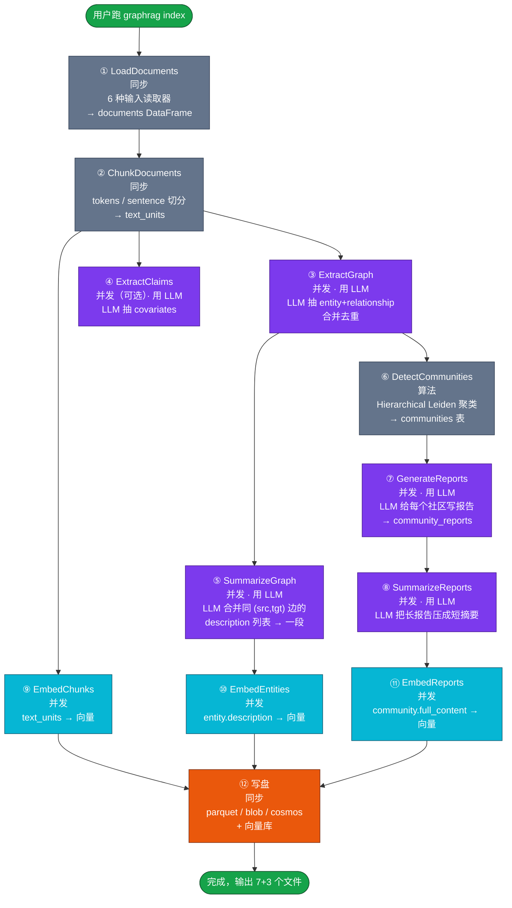
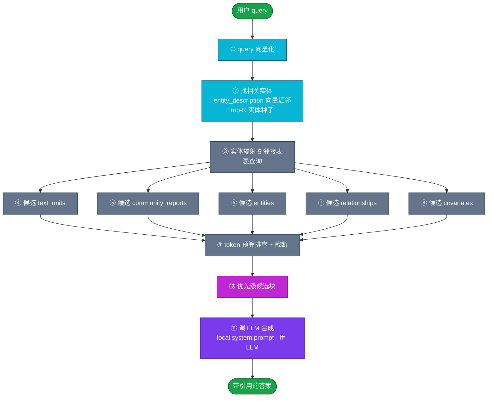
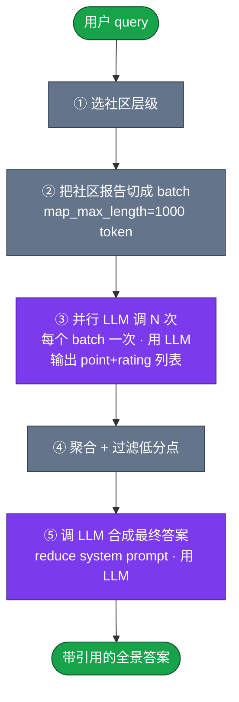
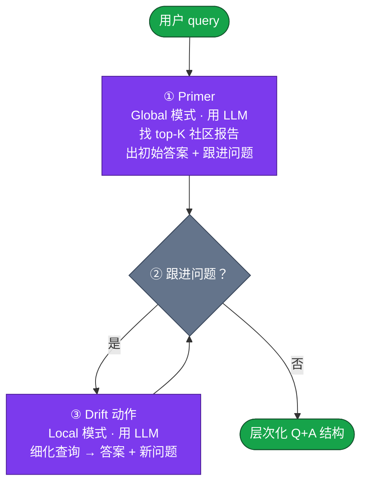
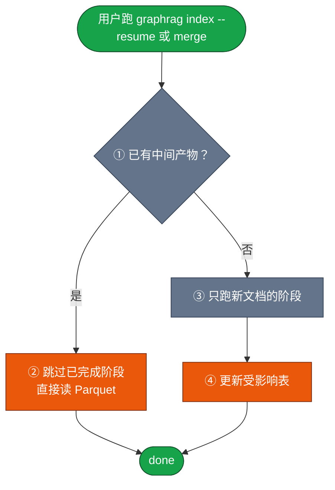
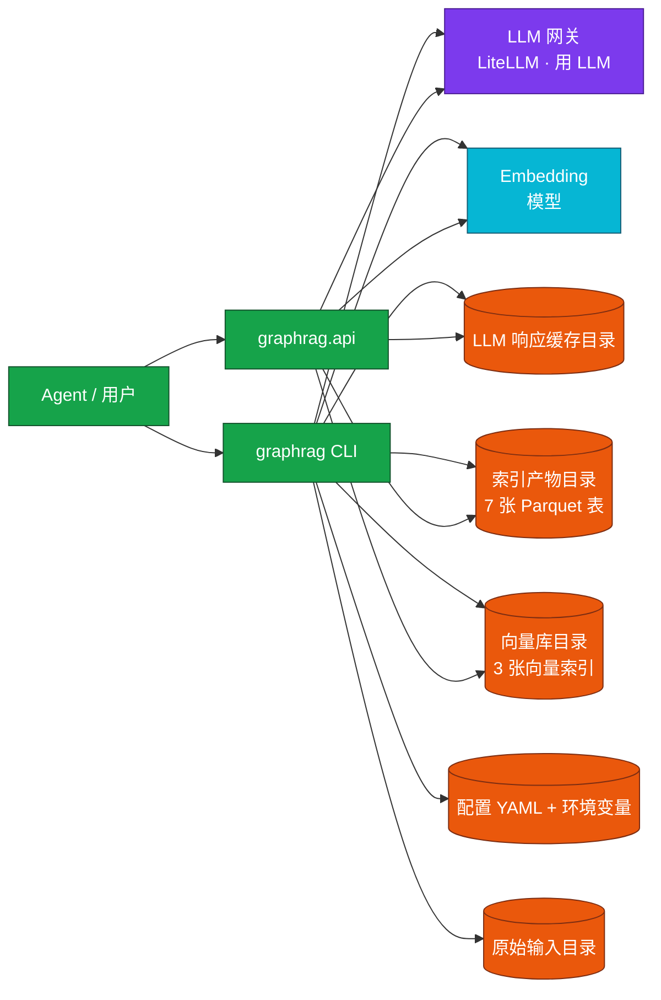

## RAG

- [项目分析 - GraphRAG（v0.1）](#项目分析---graphragv01)
  - [第一章 概述](#第一章-概述)
  - [第二章 写入流程](#第二章-写入流程)
  - [第三章 检索流程](#第三章-检索流程)
- [Local](#local)
- [Global](#global)
- [DRIFT](#drift)
  - [第四章 更新与删除](#第四章-更新与删除)
  - [第五章 存储结构](#第五章-存储结构)
  - [参考文件及作用](#参考文件及作用)
# 项目分析 - GraphRAG（v0.1）

> 参考 v0.3 章节结构撰写；与 openviking、gbrain 文章并排阅读。

## 第一章 概述

### 1.1 这个项目解决什么具体问题？

GraphRAG（Microsoft Research 出品）解决的是 **"传统 RAG 在私有叙事数据上答不出全局性问题"** 的难题。

传统向量 RAG 适合"找一段相似文字回答具体问题"（local question，例如"洋甘菊有什么功效？"）。但在私有语料（公司会议纪要、新闻稿、犯罪小说、警方档案……）上还有大量"**whole-dataset question**"，比如：

- "数据集里的前 5 大主题是什么？"
- "按时间顺序这些角色之间发生了什么？"
- "把所有犯罪手法按时间线串起来讲一遍。"

这类问题的特点是 **答案散落在全文各处、需要先建立"语料整体结构"才能回答**。传统 RAG 没有这份"整体结构"视图——向量近邻只能找到语义相似的片段，找不到"主题"。

GraphRAG 的解法是 **用 LLM 把整个语料先转成结构化的知识图谱，再在图谱上做检索**：
- **第一步（index）**：用 LLM 从每段文本中抽出实体（人 / 组织 / 地点 / 事件）和它们之间的关系，再对实体图跑 Leiden 层次化社区检测，把整张图分组成"主题"，最后让 LLM 给每个社区写一份"主题报告"。
- **第二步（query）**：在主题报告上做 map-reduce，能直接告诉用户"整本小说有 5 大主题，它们是……"。

### 1.2 设计思路是什么？

四条核心设计原则：

1. **"知识图谱即记忆"（Knowledge Graph as Memory）**：用 LLM 把所有非结构化文本转成一张 typed graph（节点带类型：人 / 组织 / 事件 / 地理；边带类型：关系 / 主张），然后把"答案"建立在图查询之上。
2. **"主题即检索粒度"（Communities as Retrieval Granularity）**：用 Leiden 社区检测把图分成层次化社区（顶层 1 个含全图的社区，下层 N 个细分社区），给每个社区用 LLM 生成摘要报告。**检索不再找"段"，找"主题报告"**。
3. **"LLM 在写入端重，查询端轻"**：所有重 LLM 推理（实体抽取、关系抽取、claim 抽取、社区报告）都集中在离线索引阶段；查询阶段只是把社区报告 + 文本块塞进 prompt 调一次 LLM。代价是一次性高 LLM 账单（官方明确警告"indexing can be expensive"），收益是查询极快、质量稳定。
4. **"可插拔一切"（Provider / Factory 模式）**：所有子系统——LLM、输入读取器、Chunker、向量库、表存储、缓存、报告、Logger——都通过工厂模式注册。**7 个独立子包**（chunking / input / vectors / storage / cache / common / llm），可以单独 pip install + 单独替换。

### 1.3 这个项目的亮点是什么？有什么优势？

| 亮点 | 说明 |
|------|------|
| **三个互补的检索范式** | 同一份索引支持 Local（实体为中心）、Global（社区报告 map-reduce）、DRIFT（社区报告引导 + 多轮 Local 精化），覆盖"具体问题 / 全局问题 / 混合问题"三大类查询。 |
| **层次化社区 + 主题报告** | Hierarchical Leiden 社区检测（`graph-leiden` 算法）+ LLM 总结 → 把整本语料压缩成 5-20 份"主题报告"，每份有人话摘要 + 5-10 条 findings + 排名解释。 |
| **声明式知识模型（Knowledge Model）** | 7 张表（documents / text_units / entities / relationships / covariates / communities / community_reports）拼出整个数据流；**多后端**（parquet 文件 / Azure Blob / CosmosDB）落盘，应用层用同一套 API。 |
| **Pydantic 化的数据结构** | 每个表对应一个 Pydantic 模型（`Entity` / `Relationship` 等），自动校验 + 序列化；**LLM 输出解析失败会自动重试**。 |
| **可重用的子包** | `graphrag-vectors` / `graphrag-storage` / `graphrag-cache` / `graphrag-chunking` / `graphrag-input` 都是独立可 pip install 的库，**可以独立用到非 GraphRAG 项目里**。 |
| **向量库 + 关系表双后端** | LanceDB（本地）/ Azure AI Search（云端）/ CosmosDB（云端 NoSQL）三选一；关系表走 parquet 文件 / Azure Blob。 |
| **社区报告解决"全局问答"** | 传统 RAG 完全不能答"这本小说讲什么"这类问题；GraphRAG 的 Global Search 通过 LLM 对全社区报告做 map-reduce 给出**有据可查的全景答案**。 |
| **DRIFT Search 平衡深度和广度** | 2024 年新加的"动态推理"：先用 Global 模式做"广泛"扫描，再多轮 Local 模式做"深入"挖掘，比纯 Local 多用社区上下文，比纯 Global 便宜。 |
| **完整的 Prompt 调优** | 官方把 LLM prompt 全部抽到独立模块，提供 **Auto Prompt Tuning** 工具（用你 5-10 个示例文本反向生成领域适配的 prompt）。 |

---

## 第二章 写入流程

### 2.1 写入后的产物长什么样？给出实际例子

GraphRAG 的写入产物是 **一组 7 张的 Parquet / 表 + 1 个向量库**，描述同一份语料的不同视角。下面是一份 ~50KB 的 Operation Dulce 小说语料经过完整索引后的产物：

**输出表（每个 1 份 Parquet 文件或云端表）**

| 表 | 估算行数 | 关键字段 |
|----|----------|----------|
| `documents` | 输入文档数 | `id` `title` `text` `text_unit_ids[]` `metadata` |
| `text_units` | 几十~几百 | `text` `n_tokens` `document_id` `entity_ids[]` `relationship_ids[]` |
| `entities` | 几百~几千 | `title` `type`（person/organization/geo/event…）`description` `text_unit_ids[]` `frequency` `degree` |
| `relationships` | 几千~几万 | `source` `target` `description` `weight` `combined_degree` `text_unit_ids[]` |
| `covariates` | 几百~几千（可选） | `covariate_type='claim'` `type` `subject_id` `object_id` `status`(TRUE/FALSE/SUSPECTED) `start_date` `end_date` |
| `communities` | 几十~几百 | `community` `parent` `children[]` `level` `title` `entity_ids[]` `relationship_ids[]` `text_unit_ids[]` `size` `period` |
| `community_reports` | 几十~几百 | `community` `level` `title` `summary` `full_content` `rank` `rating_explanation` `findings[5-10 个]` `size` `period` |

**向量库（默认 LanceDB）**

3 张向量表，每张一个 IVF_FLAT（基于倒排文件的近似最近邻索引）索引：

| 索引名 | 嵌入对象 | 维度（默认） |
|--------|----------|--------------|
| `text_unit_text` | 文本块正文 | 3072 |
| `entity_description` | 实体描述 | 3072 |
| `community_full_content` | 社区报告全文 | 3072 |

**目录布局（默认 file 存储）**

```
项目根/
├── input/                              ← 原始输入
│   └── 一本示例小说
├── 环境变量文件                          ← API key
├── 配置 YAML 文件                        ← 流水线配置
├── 缓存目录                              ← LLM 响应缓存（避免重复花钱）
├── 索引产物目录                           ← 7 张知识模型表 + 向量库
│   ├── 7 张 Parquet 表（每张一张）
│   ├── 一份 GraphML 完整图（可导入 Gephi 可视化）
│   ├── 默认向量库目录
│   │   ├── 文本块向量索引
│   │   ├── 实体描述向量索引
│   │   └── 社区报告向量索引
│   ├── 索引运行报告
│   └── 索引统计 JSON
└── 日志目录                              ← 运行日志
```

**`community_reports` 里一条记录实际长这样**：

```json
{
  "community": 12,
  "level": 1,
  "title": "Meetings between Turner and Reyes",
  "summary": "This community captures the recurring backchannel meetings...",
  "full_content": "## Executive Overview\n\nThe community describes...",
  "rank": 7.5,
  "rating_explanation": "The impact rating reflects...",
  "findings": [
    {"summary": "Turner and Reyes met 7 times in Q1 2026", "explanation": "..."},
    {"summary": "All meetings occurred at the same off-site location", "explanation": "..."}
  ],
  "size": 28,
  "period": "2026-05-20T00:00:00"
}
```

### 2.2 数据怎么进？入口在哪？支持哪些数据源？

**入口有四类**：

| 入口 | 调用方式 | 用途 |
|------|----------|------|
| `graphrag init` | CLI | 在项目目录生成环境变量文件 + 配置 YAML + 输入目录模板 |
| `graphrag index` | CLI / `python -m graphrag index` | **主入口**：跑完整 6 阶段索引流水线 |
| `graphrag index --config <path>` | CLI | 指定自定义配置 |
| **Python API** | `await graphrag.index(...)` | 程序化调用，**支持自己传 DataFrame 绕过输入读取器** |
| Prompt Tuning | `graphrag prompt-tune` | 调优所有 prompt 模板 |
| `graphrag query "..."` | CLI | 跑检索（Local / Global / DRIFT / Basic） |

**支持的数据源**（共 6 种，由 `InputType` 枚举管控）：

| 格式 | 处理方式 | 适用 |
|------|----------|------|
| `text`（纯文本） | 整文件作为一个文档 | 小说、论文、长报告 |
| `csv` | 每行一个文档，列名映射到 `text` / `title` / `id` | 结构化数据、新闻条目 |
| `json` | 每个 JSON 对象一个文档（支持单对象或对象数组） | 结构化数据 |
| `jsonl` | 每行一个 JSON 对象 | 流式数据 |
| `parquet` | 读 Parquet 表转文档 | 大规模结构化数据 |
| `markitdown` | **用微软的 markitdown 把任意格式转 Markdown** | **PDF / Word / PPT / 图片 / 音频** 等几乎所有格式 |

**Markdown / PDF / 网页 / 数据库 怎么进**：
- **PDF / Word / PPT / 图片 / 音频**：走 `markitdown` 输入类型，自动转换。
- **网页**：转成 text / json 后走对应输入类型；没有原生"网页"读取器。
- **数据库**：没有原生"数据库表"输入类型；用户写脚本 SELECT 出 DataFrame 后调 Python API 直接传。

### 2.3 完整写入流程分几阶段？每阶段产什么？



**各阶段详解**：

1. **LoadDocuments**（**无 LLM**）：根据 `input.type` 选输入读取器，把文件读成 `documents` DataFrame。每行含 `id`（SHA-512 截断哈希）/ `text` / `title` / `creation_date` / `metadata`。
2. **ChunkDocuments**（**无 LLM**）：按 `chunking.type`（`tokens` 或 `sentence`）把每个文档切成 text_units。**token chunker** 用 tokenizer 编码再按 `chunk_size` 切片，**有 overlap**。**sentence chunker** 用 NLTK（自然语言处理工具包）的 PunktSentenceTokenizer 切句再聚合到目标大小。
3. **ExtractGraph**（**LLM 调一次**）：对每个 text_unit 调 LLM 抽实体 + 关系。**并发执行**（默认 32 个协程），进度条显示。Prompt 模板里有"成功 / 部分成功 / 失败"三档错误处理。
4. **ExtractClaims**（**LLM 调一次，可选**）：对每个 text_unit 抽"声明"，存到 `covariates` 表。**默认关**，因为 prompt 难调。
5. **SummarizeGraph**（**LLM 调一次**）：把所有指向同 `(source, target)` 边的 `description` 列表合并成一段。
6. **DetectCommunities**（**无 LLM**，算法）：跑 Hierarchical Leiden 社区检测，从最小簇开始递归合并到目标粒度，输出层次化 `communities` 表（顶层 1 个含全图，下层 N 个细分社区）。
7. **GenerateReports**（**LLM 调一次**）：对每个社区调 LLM 生成包含 `title` / `summary` / `full_content` / `findings[]` / `rank` / `rating_explanation` 的完整报告。**这是最贵的一步**。
8. **SummarizeReports**（**LLM 调一次**）：把长报告压成 1-2 句"短摘要"，存到社区报告的 `summary` 字段，给 Global Search 用。
9. **EmbedChunks / EmbedEntities / EmbedReports**（**embedding，并发**）：分别对 text_units / entity.description / community.full_content 调 embedding 模型，向量写入向量库。
10. **写盘**：所有 Parquet 表落到 `output/`，向量库落到 `lancedb/`（或 Azure AI Search / CosmosDB）。

**关键观察**：

- **5 步 LLM + 3 步 embedding + 1 步算法 + 1 步 IO**。LLM 是绝对瓶颈。
- **LLM 响应全缓存**（默认 JSON 文件 + 命中比对 prompt + 调参）：同一组 prompt 第二次跑就**零成本**。
- **6 步全可重入**（基于 Parquet 中间产物 + 缓存）：跑挂了从断点续跑。
- **并发**默认 32 协程；`concurrent_coroutines` 可调。

### 2.4 Agent 怎么操作这个工具写入？每个工具的作用是啥？具体的参数是什么？

GraphRAG 主要走 **CLI** 入口，**没有内置 MCP 服务**（但 Python API 足够灵活，用户可以包成 MCP 工具）。下面是核心 CLI 命令：

#### `graphrag init` ← **初始化**
**作用**：在当前目录生成环境变量文件 + 配置 YAML + 输入目录模板。**交互式问 chat / embedding 模型**。

| 参数 | 作用 |
|------|------|
| `--root <path>` | 目标目录 |
| `--force` | 覆盖已有配置 |

#### `graphrag index` ← **主入口**
**作用**：跑完整 6 阶段索引流水线（实际有 11 步，见 2.3 图）。

| 参数 | 作用 |
|------|------|
| `--config <path>` | 自定义 settings 路径 |
| `--root <path>` | 项目根目录 |
| `--verbose` | 详细日志 |
| `--resume` | 断点续跑（基于已有 Parquet 中间产物） |
| `--reembed` | 跳过 LLM 步骤，只重跑 embedding |
| `--emit` | 跑完后可选输出 Gephi 可视化图格式 |
| `--community-levels <N>` | 限制 Leiden 跑的层次深度 |
| `--dry-run` | 验证配置不跑实际 |

**配置**通过 YAML 配置文件持久化（重要键）：

```yaml
input:
  type: text                  # text / csv / json / jsonl / parquet / markitdown
  storage:
    type: file
    base_dir: input
chunks:
  size: 1200                  # 块大小（token）
  overlap: 100                # 块 overlap
  encoding_model: cl100k_base # tiktoken 编码名
  prepend_metadata: [title]   # 把元数据前缀到每块
extract_graph:
  model_id: default_completion_model
  concurrent_coroutines: 32
  entity_types: [person, organization, geo, event]
extract_claims:
  enabled: false              # 默认关
community_detection:
  algorithm: leiden
  max_cluster_size: 10        # 叶子社区最多 10 个实体
summarize_descriptions:
  max_length: 500
generate_community_reports:
  model_id: default_completion_model
vector_store:
  default_vector_store:
    type: lancedb             # lancedb / azure_ai_search / cosmosdb
    db_uri: 索引产物/默认向量库
    index_schema:
      text_unit_text:
        vector_size: 3072
      entity_description:
        vector_size: 3072
      community_full_content:
        vector_size: 3072
```

#### `graphrag prompt-tune` ← **Prompt 调优**
**作用**：用你 5-10 个示例文本反向生成领域适配的 prompt 模板。**强烈推荐**先跑这一遍再 index。

| 参数 | 作用 |
|------|------|
| `--config <path>` | 配置路径 |
| `--root <path>` | 项目根 |
| `--output <path>` | 输出 prompt 目录 |
| `--domain <text>` | 领域提示（"医学 / 法律 / 金融"） |
| `--no-entity-types` | 跳过自动实体类型发现 |

#### `graphrag merge` ← **增量索引**（v1+ 引入）
**作用**：把新数据并入已有索引，保留原图 + 加新节点 / 边。

#### `graphrag verify` ← **索引健康检查**
**作用**：检查每张表的 schema 和行数。

#### `graphrag init` / **`python -m graphrag index`** / **`await graphrag.api.index(...)`** ← **Python API**
```python
from graphrag.api import index
result = await index(
    documents=df,                          # 自带 DataFrame，绕过 input reader
    config=config_obj,                     # 配置对象
    method="standard",                     # 标准流水线
    is_update=False,                       # 增量模式
)
```

**对 Agent 的提示**：

- 写一份新语料时：`init` → `prompt-tune` → `index` 三步走。
- GraphRAG 没有内置 MCP 服务，但有 `python -m graphrag serve` 命令可以启动一个轻量 HTTP 服务（v3.x 实验性），暴露索引状态。
- **LLM 烧钱警告**（官方明确）：一次 1M token 语料的完整索引要 ~$5-$50（取决于模型）。

### 2.5 chunk 怎么切？大小？overlap？语义切分还是规则切分？

**两种 chunk 策略**（由 `ChunkerType` 枚举管控）：

| 策略 | 切法 | 默认参数 | overlap | 适用 |
|------|------|----------|---------|------|
| `tokens` | **Token-based**（基于 tokenizer 编码后切） | `size=1200` token，`overlap=100` token | **100 token** | 通用默认 |
| `sentence` | **Sentence-based**（NLTK PunktSentenceTokenizer 切句） | 累积到 ~1200 token | 无强制 overlap（按 token 边界） | 句子边界敏感场景 |

**token chunker 实现细节**：

```
输入: 一段文本
  ↓ encode(text) → [token_1, token_2, ..., token_N]
  ↓ 按 size 切： [0:1200], [1100:2300], [2200:3400], ...
  ↓ decode 回文本
  ↓ 创建 TextChunk(text, position)
  ↓ 附加可选 transform（prepend metadata）
输出: list[TextChunk]
```

**sentence chunker 实现细节**：
- 用 NLTK 的 PunktSentenceTokenizer 切句（CJK 支持需要 bootstrap 资源包）。
- 累积句子到目标 token 大小，最后一块可以 < 目标大小。
- 无 overlap 但保留整句。

**两条可选增强**：

1. **`prepend_metadata`**：把文档的 `metadata` 字段（如 `title`、`author`、`date`）前缀到每个 text chunk 的开头。**不计入 chunk size**。解决"新闻标题只在第一块、后续块失去上下文"的问题。
2. **`encoding_model`**：默认 `cl100k_base`（tiktoken 编码名，对应 GPT-4 / GPT-3.5-turbo 词表）。可换成其它编码名。

**与 GraphRAG 的"图谱"取向结合**：因为每段都要让 LLM 抽实体和关系，**块过小 → 实体/关系跨块断裂；块过大 → LLM 一次塞不下 + 关系扩散严重**。1200 token 是经验平衡点（默认 300-500 段 GPT-4 一次能看完）。

### 2.6 用 embedding 了吗？什么时候用的？用的什么模型？

**用了，3 处**：

1. **写入阶段 ⑨ EmbedChunks**：对每个 `text_unit.text` 调 embedding 模型，写入 `text_unit_text` 向量索引。
2. **写入阶段 ⑩ EmbedEntities**：对每个 `entity.description`（已用 LLM 合并过的实体描述）调 embedding，写入 `entity_description` 向量索引。
3. **写入阶段 ⑪ EmbedReports**：对每个 `community_reports.full_content` 调 embedding，写入 `community_full_content` 向量索引。

**检索阶段**：3 张向量表都被用到——
- **Local Search**：用 `entity_description` 向量找"query 相关实体"作为入口。
- **Global Search**：不用向量（用 community_reports 表直接扫）。
- **DRIFT Search**：第一阶段（primer）用 `community_full_content` 向量找 top-K 社区报告。

**向量库后端**（可插拔，由 `VectorStoreType` 管控）：

| 后端 | 适用 |
|------|------|
| **LanceDB**（默认） | 本地文件，开发和小规模 |
| **Azure AI Search** | 云端，托管 |
| **Azure Cosmos DB** | 云端 NoSQL，vector search 索引 |

**embedding 模型**：
- 通过 YAML 配置文件的 `embedding_models` 段配置，**走 LiteLLM**（统一 100+ provider 接口）。
- 默认 `text-embedding-3-large`，**3072 维**（也是默认 `vector_size`）。
- **用户可换 OpenAI / Azure / Cohere / Voyage / 自托管**，只要 LiteLLM 支持。

**写入流程中有哪些部分用了 LLM，prompt 是啥？**

| 阶段 | 用 LLM？ | 作用 |
|------|----------|------|
| ① LoadDocuments | ❌ | 文件 IO + DataFrame |
| ② ChunkDocuments | ❌ | tokenizer / NLTK |
| ③ ExtractGraph | ✅ | 抽 `entity[]` + `relationship[]`；prompt 强制 JSON 输出 + 多重重试 |
| ④ ExtractClaims | ✅ | 抽 `covariate[]`（claim 格式：subject / object / status / start_date / end_date） |
| ⑤ SummarizeGraph | ✅ | 合并重复边的 description 列表 → 一段 |
| ⑥ DetectCommunities | ❌ | Hierarchical Leiden 算法 |
| ⑦ GenerateReports | ✅ | **最贵**：每个社区生成 `title` `summary` `full_content` `findings[]` `rank` `rating_explanation` |
| ⑧ SummarizeReports | ✅ | 压长报告为短摘要 |
| ⑨⑩⑪ Embed | ❌ | embedding 模型，不算 LLM |

**prompt 关键约束**（来自文档）：
- 全部 prompt 输出强制 **JSON 模式**（`response_format_json_object`）。
- LLM 失败自动**重试**，最多 3 次（指数退避）。
- 所有 LLM 调用**全缓存**（默认 JSON 文件）——同一组 prompt 第二次跑**零成本**。
- **Prompt Tuner 工具**可以基于你提供的 5-10 个示例文本反向生成领域适配的 prompt，**强烈推荐先跑再 index**。

**核心 prompt 模板位置**（按职责）：
- `extract_graph` prompt：要求 LLM 列出 entity（name / type / description）和 relationship（source / target / description）。
- `summarize_descriptions` prompt：要求 LLM 把同 (source, target) 的多条 description 合并为一段连贯描述。
- `extract_claims` prompt：要求 LLM 列出 claim（subject / type / status / start_date / end_date / description / source_text）。
- `generate_community_report` prompt：要求 LLM 输出 `title` `summary` `full_content` `findings[]` `rank` `rating_explanation`。

---

## 第三章 检索流程

### 3.1 query 到结果分几阶段？每个阶段干了什么？产出了什么？

GraphRAG 提供 **4 种检索模式**：`local` / `global` / `drift` / `basic`。下面分别展示：

#### **Local Search**（"具体实体"问题）



**Local Search 各阶段**：

1. **query 向量化**：用与索引时相同的 embedding 模型把 query 变向量。
2. **找相关实体**：在 `entity_description` 向量表里做余弦近邻，**top-K 实体**作种子。
3. **辐射 5 类邻接**：从种子实体出发，**1-跳邻接**（或 K 跳）找：
   - **text_units**：实体出现在哪些块里
   - **community_reports**：实体在哪些社区报告里
   - **entities**：邻接实体本身
   - **relationships**：邻接边
   - **covariates**：邻接 claim（如果开了）
4. **token 预算排序 + 截断**：每类候选有**占比参数**（默认 text_unit 占比 0.4、community_report 0.1、entity 0.2、relationship 0.15、covariate 0.15），按相关性排序后塞入 token 预算。
5. **调 LLM 合成**：用 local system prompt 模板（`LOCAL_SEARCH_SYSTEM_PROMPT`）格式化候选块 + 用户 query，**调一次 LLM 出答案**。

#### **Global Search**（"全语料"问题）



**Global Search 各阶段**（Map-Reduce）：

1. **选社区层级**：根据 `community_level`（默认 0，最高一层）选一份社区报告子集。
2. **把报告切 batch**：每 batch 控制在 `map_max_length=1000` token 之内。
3. **并行 LLM（map）**：对每个 batch 调一次 LLM（**默认并发 32 协程**），prompt 要求输出"point + numerical rating"列表。JSON 模式强制。
4. **聚合 + 过滤**：把所有 batch 的 points 收集，按 rating 排序，**只保留 rating > 阈值**的点（默认通过 prompt 决定，LLM 自评 0-100）。
5. **调 LLM 合成（reduce）**：用 reduce system prompt + 聚合的 points 调一次 LLM 出**最终答案**。

#### **DRIFT Search**（"混合"问题）

DRIFT 把 Global 当 **primer（启动器）**，用 Local 当 **迭代精化器**：



**DRIFT Search 三阶段**：

1. **Primer（启动器）**：用 Global 模式找到与 query 最相关的 top-K 社区报告，LLM 出"初始答案 + 一组跟进问题"。
2. **Drift Loop（迭代精化）**：对每个跟进问题，调 Local 模式找具体实体 + 文本块，得"新答案 + 新跟进问题"。每个节点带 **置信度评分**，低于阈值就停。
3. **Output Hierarchy**：最终返回**层次化的 Q+A 树**，根节点是 primer 答案，子节点是 drift 答案，**按相关性排序**。

#### **Basic Search**（"最简"问题）

一个 naive 的纯向量 RAG：query 向量 → text_unit_text 表 top-K → 塞进 prompt → LLM 答。**用于对比基线**，不推荐生产用。

### 3.2 召回策略用了哪些？每个策略的作用是啥？参数怎么选？

| 策略 | 出现在哪 | 作用 | 关键参数 |
|------|----------|------|----------|
| **向量召回（HNSW / IVF_FLAT）** | Local、DRIFT primer、Basic | 语义近邻：找相关实体 / 文本 / 社区 | `top_k=10`（默认）；LanceDB `ef` / `nprobes` |
| **图遍历（1-跳）** | Local | 从种子实体辐射到所有邻接 | `top_k_relationships`、`top_k_mapped_entities` |
| **优先级 token 预算** | Local | 5 类候选按比例 + 截断 | `text_unit_prop=0.4` `community_prop=0.1` `entity_prop=0.2` `relationship_prop=0.15` `covariate_prop=0.15` |
| **社区报告 map-reduce** | Global、DRIFT primer | 把全社区报告切成 batch 并行 LLM | `map_max_length=1000` `reduce_max_length=2000` `concurrent_coroutines=32` `max_data_tokens=8000` |
| **社区层级选择** | Global、DRIFT primer | 顶层报告太宽，下层太细 | `community_level=0`（顶层）到 `level=N-1`（底层） |
| **Top-K（每类）** | Local、DRIFT | 控制每类候选的条数 | `top_k=10` |
| **社区报告 ranking** | Global | 报告生成时 LLM 自评 rank | `rank` 字段（0-10 浮点） |
| **Point rating** | Global reduce | LLM 对每个 point 自评 0-100 | prompt 强约束 |
| **FastGraphRAG** | Index 端 | 用 NLP 替代 LLM 抽 entity/relationship，**省 80% 成本** | 需用户显式开 |
| **来源-aware 答案生成** | Reduce | reduce 阶段 prompt 要求每个 point 附 `source_id` 引用 | `citation` 字段 |

**Local vs Global vs DRIFT 选哪个**：

| 问题类型 | 用什么模式 |
|----------|------------|
| "X 是什么 / X 和 Y 有什么关系" | Local（实体为中心） |
| "整本数据的主题 / 趋势 / 总览" | Global（map-reduce 社区报告） |
| "X 是怎么演化的 / X 怎么和 Y 关联" | DRIFT（社区起点 + 多轮 Local 精化） |
| 调试 / 性能基准对比 | Basic（纯向量 RAG） |

### 3.3 检索流程中有哪些部分用了 LLM，prompt 是啥？

| 阶段 | 用 LLM？ | 作用 |
|------|----------|------|
| **Local Search 实体找种子** | ❌ | 纯向量近邻 |
| **Local Search 候选组装** | ❌ | 表查询 + 排序 + 截断 |
| **Local Search 答案生成** | ✅ | `LOCAL_SEARCH_SYSTEM_PROMPT` + 候选块 + query，调一次 LLM |
| **Global Search map 阶段** | ✅ | `MAP_SYSTEM_PROMPT` + 一个 batch 的社区报告，输出 point+rating 列表 |
| **Global Search reduce 阶段** | ✅ | `REDUCE_SYSTEM_PROMPT` + 聚合的 points，输出最终答案 |
| **Global Search 通用知识** | ✅（可选） | 当 `allow_general_knowledge=True` 时，reduce prompt 附加 `GENERAL_KNOWLEDGE_INSTRUCTION` |
| **DRIFT primer** | ✅ | 类似 Global map，输出"intermediate answer + follow_up_queries" |
| **DRIFT drift 动作** | ✅ | 类似 Local search，输出"intermediate answer + score + follow_up_queries" |

**核心 prompt 模板结构**：

#### Local Search System Prompt
```
---ROLE---
You are a helpful assistant responding to questions about data in the tables provided.

---SAMPLE RESPONSE FORMAT---
{sample_response_format}

---DATA TABLES---
{context_data}

---QUESTION---
{query}

---RESPONSE---
```

#### Global Search Map Prompt
```
---ROLE---
You are a helpful assistant responding to questions about a dataset by generating a series of bullet points.

---GOAL---
Generate a response consisting of a list of bullet points that answer the user's question. Each bullet point should be accompanied by a numerical rating indicating how important it is on a scale of 0 to 100.

---QUESTION---
{query}

---CONTEXT DATA (community reports batch)---
{context_data}

---RESPONSE FORMAT---
{
  "points": [
    {"description": "...", "score": 85},
    {"description": "...", "score": 72}
  ]
}
```

#### Global Search Reduce Prompt
```
---ROLE---
You are a helpful assistant synthesizing multiple analysts' responses to a question about a dataset.

---GOAL---
Generate a well-structured final response that synthesizes all the analyst points.

---QUESTION---
{query}

---ANALYSTS' POINTS---
{aggregated_points}

---RESPONSE FORMAT---
{final_response_format}
```

**关键约束**：
- **JSON 模式强制**：map 阶段 `response_format_json_object=True`，用 Pydantic 解析 `points` 列表。
- **失败重试**：map 阶段解析失败 → 重试 N 次（默认 3）→ fallback 用 raw text。
- **`allow_general_knowledge=False` 默认**：避免 LLM 用自己语料里的知识污染答案。

### 3.4 检索结果怎么拼到 LLM prompt 里？给实际拼接好的 prompt 例子

#### Local Search 实际 prompt 拼接

```text
SYSTEM:
---ROLE---
You are a helpful assistant responding to questions about data in the tables provided.

---SAMPLE RESPONSE FORMAT---
A multiple paragraph response that:
- Begins with a direct, concise answer to the question.
- Provides supporting evidence from the context, with citations.
- Considers the broader context if relevant.

---DATA TABLES---

### Entities

| Entity | Description |
|--------|-------------|
| Turner | A senior intelligence operative... (multi-paragraph) |
| Reyes  | A covert asset operating in... (multi-paragraph) |

### Relationships

| Source | Target | Description | Weight |
|--------|--------|-------------|--------|
| Turner | Reyes  | "Allies in the Q1 backchannel..." | 8.5 |
| Turner | OASIS  | "Operative for the OASIS project..." | 9.2 |

### Community Reports

| Community | Title | Summary |
|-----------|-------|---------|
| 12 | "Turner-Reyes backchannel" | "Recurring covert meetings between two senior operatives..." |

### Text Units

| ID | Text |
|----|------|
| tu_abc123 | "...Turner and Reyes met at the dockside warehouse on March 3rd..." |
| tu_def456 | "...Reyes confirmed the second drop would occur at the same location..." |

### Covariates (Claims)

| Subject | Type | Status | Description |
|---------|------|--------|-------------|
| Reyes | contact | TRUE | "Confirmed meeting at the dockside warehouse" |

---QUESTION---
When did Turner and Reyes first meet, and what was the topic?

---RESPONSE---


USER: When did Turner and Reyes first meet, and what was the topic?
```

**关键观察**：
- 候选按 5 类分块（entities / relationships / community_reports / text_units / covariates），**每类之间用 Markdown 表**隔开。
- 引用规则：**每个事实必须能追溯到一张具体表 + 一行**——LLM 被 prompt 强制"带引用"。
- 上下文**总 token 数控制在 1 个 context window 内**（默认 8000 token）。

#### Global Search Reduce 实际 prompt 拼接

```text
SYSTEM:
---ROLE---
You are a helpful assistant synthesizing multiple analysts' responses...

---QUESTION---
What are the main themes of this dataset?

---ANALYSTS' POINTS---

- "The story centers on a covert operation led by Turner" (score: 92)
- "Reyes is the primary antagonist but with sympathetic backstory" (score: 87)
- "The Q1 timeline has 7 major events" (score: 75)
- "Multiple betrayals occur between chapter 3 and 5" (score: 81)
- "There is a moles-and-double-agents pattern throughout" (score: 69)
- ...

---RESPONSE---
```

**prompt 拼接策略总结**：
- **system prompt**：角色 + 输出格式约束 + 上下文数据（5 类候选）。
- **user prompt**：用户原始 query（不重复上下文）。
- 上下文数据按"先结构化（实体 / 关系）→ 后非结构化（社区报告 / 文本块）"的顺序。

### 3.5 Agent 怎么操作这个工具检索？每个工具的作用是啥？具体的参数是什么？

GraphRAG 主要走 **CLI 入口** + **Python API**，没有内置 MCP 服务。

#### `graphrag query "..."` ← **CLI 主入口**

| 参数 | 作用 |
|------|------|
| `"<query>"`（必填） | 用户问题 |
| `--method` | 检索模式：`local` / `global` / `drift` / `basic`，**默认 `local`** |
| `--community-level` | 社区层级（Global / DRIFT 模式用），默认 0（顶层） |
| `--config <path>` | 自定义配置 |
| `--root <path>` | 项目根 |
| `--response-type` | 期望输出格式（`Multiple Paragraphs` / `Multi-Page Report` / 自由文本） |
| `--streaming` | 流式输出 |

#### `graphrag query --method local` 示例

```
> What are the healing properties of chamomile?

[output]: 基于实体"洋甘菊"→ 辐射到相关 text_unit、relationship、community report，
          LLM 合成带引用的答案。
```

#### `graphrag query --method global` 示例

```
> What are the top 5 themes in this story?

[output]: Map 阶段跑 32 个协程对所有社区报告批量 LLM 评 point；
          Reduce 阶段把所有 point 聚合成 5 大主题。
```

#### `graphrag query --method drift` 示例

```
> How did the protagonist's motivations change over time?

[output]: Primer 阶段找 top-K 社区报告 → 出"初始答案 + 跟进问题"；
          多轮 Drift 细化 → 层次化 Q+A 树。
```

#### **Python API**（推荐用于 Agent 集成）

```python
from graphrag.api import local_search, global_search, drift_search, basic_search

# Local
result = await local_search(
    config=config,
    query="What are the healing properties of chamomile?",
    community_level=2,
    response_type="multiple paragraphs",
    conversation_history=history,  # 多轮对话支持
    streaming=False,
)

# Global
result = await global_search(
    config=config,
    query="What are the top 5 themes?",
    community_level=0,
    dynamic_community_selection=False,  # 动态选社区层级
    response_type="multi-page report",
)

# DRIFT
result = await drift_search(
    config=config,
    query="How did the protagonist evolve?",
    community_level=1,
    response_type="multi-page report",
    streaming=False,
)
```

返回 `SearchResult`：
```python
@dataclass
class SearchResult:
    response: str                       # 答案文本
    context_data: list[...]             # 实际用到的候选块
    context_text: str                   # 渲染后的 prompt 上下文
    completion_time: float              # 完成时间
    llm_calls: int                      # LLM 调用次数
    prompt_tokens: int                  # 输入 token
    output_tokens: int                  # 输出 token
    llm_calls_categories: dict          # 每阶段 LLM 调用分布
```

**对 Agent 的提示**：
- **简单 entity 问题** → `local`（快、便宜）。
- **整本数据 / 主题 / 总览** → `global`（贵、慢）。
- **复杂 / 演化类问题** → `drift`（最贵但最全面）。
- **MCP 集成**：用 Python API 包装，**自己写一层 MCP server**（几十行代码），暴露 `local_search` / `global_search` / `drift_search` 三个工具即可。

---

## 第四章 更新与删除

### 4.1 更新的整体流程是怎样的？

GraphRAG **不擅长频繁更新**——官方把"合并新数据"和"全量重建"都当成"重新跑索引"来处理。



**两种更新模式**：

1. **断点续跑**（`--resume`）：检查每张 Parquet 是否已存在 → 跳过已完成的阶段 → 从最早的缺失阶段开始。所有中间产物都有时间戳和 schema 校验。
2. **增量合并**（`graphrag merge`，v1+ 引入）：把新数据并入旧索引。需要用户提供新旧两份 Parquet。**比全量重建便宜 50%+**，但**社区结构可能被打乱**（Leiden 不会重新跑）。

### 4.2 更新的触发条件是啥？更新会更新哪些存储介质？

| 触发 | 更新范围 | 跑哪个工具 |
|------|----------|-----------|
| 新增几个文档 | 重跑 text_units → entities → relationships → communities → community_reports → embeddings（**全量重做**） | `graphrag index`（**默认**） |
| `--resume` 模式 | 只重做缺失的中间产物 | `graphrag index --resume` |
| 改 YAML 配置（如换 LLM） | 跑 prompt-tune 改 prompt → 重跑 LLM 阶段 | `graphrag prompt-tune` → `graphrag index --resume` |
| 嵌入模型换 | 跑 `--reembed` 跳过 LLM | `graphrag index --reembed` |
| `merge` 模式（v1+） | 增量合并新旧索引 | `graphrag merge` |
| 清理缓存 | 删 LLM 响应缓存目录 | 手动 |

**更新会改这些存储**：

| 存储 | 更新时机 |
|------|----------|
| 文档表 | 任何新增/删除文档 |
| 文本块表 | chunk 改大小时 |
| 实体表 / 关系表 | LLM 重跑抽 |
| 声明表 | extract_claims 重跑 |
| 社区表 | Leiden 重跑 |
| 社区报告表 | LLM 重跑报告 |
| **向量库**（LanceDB / Azure AI Search / CosmosDB） | embedding 改 / 内容改 |
| LLM 响应缓存 | 任何 prompt 改 |
| 运行日志 | 任何运行 |

### 4.3 Agent 怎么操作这个工具更新删除？每个工具的作用是啥？具体的参数是什么？

| 工具 | 作用 | 关键参数 |
|------|------|----------|
| `graphrag index` | 主入口（含全量 / `--resume` / `--reembed` 三种模式） | `--resume` `--reembed` `--root` `--config` |
| `graphrag merge` | 增量合并新旧索引（v1+） | `--old-output <path>` `--new-input <path>` |
| `graphrag prompt-tune` | 重新生成 prompt 模板 | `--root` `--output` `--domain` |
| `graphrag verify` | 检查索引健康 | `--root` |
| `graphrag init` | 重新生成配置（**会覆盖**） | `--force` |
| **删除文档** | ⚠️ **GraphRAG 不支持单文档删除**！只能删掉输入目录里对应文件 + `graphrag index` 全量重建 | — |
| **删除索引** | 删索引产物目录 / 删向量库 | 手动 |

**关键约束**：
- **无单文档更新**——GraphRAG 假设"全量重建"或"批量合并"。**频繁增删场景不适用**。
- **改 schema 不支持热更**——`community_levels` / `chunk_size` / `entity_types` 一改，整个索引需要重做。
- **`merge` 模式仍不便宜**——Leiden 社区检测必须在新老图上重跑（**保留旧社区需要手动复制**）。

**`graphrag verify` 返回的结构化报告**：

```python
{
  "index_files_exist": True,
  "tables": {
    "documents": {"row_count": 1, "columns_ok": True},
    "text_units": {"row_count": 247, "columns_ok": True},
    "entities": {"row_count": 156, "columns_ok": True},
    "relationships": {"row_count": 412, "columns_ok": True},
    "communities": {"row_count": 23, "columns_ok": True},
    "community_reports": {"row_count": 23, "columns_ok": True}
  },
  "vector_store": {"indexes": ["text_unit_text", "entity_description", "community_full_content"]}
}
```

---

## 第五章 存储结构

### 5.1 用了哪几种存储？各存什么？数据结构是啥？有什么用处？

| 存储类型 | 后端 | 存什么 | 数据结构 | 用途 |
|----------|------|--------|----------|------|
| **关系表** | Parquet 文件（默认）/ Azure Blob / CosmosDB | 7 张知识模型表 | 每张 1 份 Parquet | 主存储、查询输入 |
| **向量库** | LanceDB（默认）/ Azure AI Search / CosmosDB | 3 张向量索引 | IVF_FLAT 索引 + 元数据列 | 向量近邻检索 |
| **缓存** | JSON 文件（默认）/ 内存 / None | LLM 响应缓存 | 嵌套 JSON | 重复跑省钱 |
| **日志 / 报告** | 文件 / Azure Blob | 索引运行状态 | 文本 / JSON | 调试 + 监控 |
| **配置** | YAML / JSON / TOML | 流水线配置 | 分层键值 | 持久化 settings |
| **输入目录** | 文件系统 | 原始输入 | 文件夹 + 文件 | 摄入源 |
| **LLM Provider** | LiteLLM 网关 | 模型路由 | API 客户端 | 100+ 模型统一接口 |

**7 张核心表**（知识模型）：

| 表 | 关键字段 | 一行 = | 作用 |
|----|----------|--------|------|
| `documents` | `id` `title` `text` `text_unit_ids[]` `metadata` | 一个输入文档 | 文档级元数据 + 块指针 |
| `text_units` | `id` `text` `n_tokens` `document_id` `entity_ids[]` `relationship_ids[]` `covariate_ids[]` | 一段文本块 | LLM 处理的最小单位 + 图节点指针 |
| `entities` | `id` `title` `type` `description` `text_unit_ids[]` `frequency` `degree` | 一个图节点（实体） | 知识图谱顶点 |
| `relationships` | `id` `source` `target` `description` `weight` `combined_degree` `text_unit_ids[]` | 一条图边 | 知识图谱边 |
| `covariates` | `id` `covariate_type='claim'` `type` `subject_id` `object_id` `status` `start_date` `end_date` `source_text` `text_unit_id` | 一条事实声明 | 主体-客体断言（可选） |
| `communities` | `id` `community` `parent` `children[]` `level` `title` `entity_ids[]` `relationship_ids[]` `text_unit_ids[]` `period` `size` | 一个社区节点 | Leiden 聚类结果 |
| `community_reports` | `id` `community` `parent` `children[]` `level` `title` `summary` `full_content` `rank` `rating_explanation` `findings[5-10 个 dict]` `full_content_json` `period` `size` | 一份社区报告 | LLM 写的主题摘要 |

**3 张向量索引**：

| 索引 | 嵌入对象 | 默认维度 | 字段 |
|------|----------|----------|------|
| `text_unit_text` | text_unit.text | 3072 | `id` `vector` `text` `document_id` ... |
| `entity_description` | entity.description | 3072 | `id` `vector` `title` `type` `description` `frequency` `degree` ... |
| `community_full_content` | community_report.full_content | 3072 | `id` `vector` `title` `summary` `rank` ... |

### 5.2 存储之间的数据流怎么走？



**数据流走向**：

**索引时**：

```
input/ 文件
  ↓ InputReader（markitdown / text / csv / json / jsonl / parquet）
documents DataFrame
  ↓ Chunker（tokens / sentence）
text_units DataFrame
  ↓ Embedder
  ↓ → 文本块向量索引
LLM 调（entity/relationship 抽取）
  ↓ 合并去重
entities / relationships DataFrame
  ↓ Embedder
  ↓ → 实体描述向量索引
LLM 调（claim 抽取，可选）
  ↓ → covariates DataFrame
Leiden 算法
  ↓ → communities DataFrame
LLM 调（社区报告生成）
  ↓ → community_reports DataFrame
  ↓ Embedder
  ↓ → 社区报告向量索引
  ↓ 全部写盘
索引产物目录（7 张 Parquet 表 + 3 张向量索引）
```

**查询时**：

```
graphrag query "..." --method local
  ↓ Embedder（query 向量化）
实体描述向量索引 余弦近邻
  ↓ top-K 实体
  ↓ 1-跳图遍历
entities / relationships / text_units / community_reports / covariates 候选
  ↓ token 预算 + 排序
上下文 prompt
  ↓ LLM 调
最终答案 + 引用 + token 计数
```

**缓存**：

- 任何 LLM 调用前查缓存目录：prompt hash + 参数 → 命中即返回，不调 LLM。
- 任何 LLM 调用后写缓存目录：新结果持久化。

**多后端**：

- **Parquet / Blob / CosmosDB 表存储**——所有 Parquet 文件可换 Azure Blob / CosmosDB。
- **LanceDB / Azure AI Search / CosmosDB 向量库**——任选。
- **Cache：JSON / Memory / Noop**——任选。
- **Factory 模式**：每个子系统都能替换实现。

**子包与存储的对应关系**：

| 子包 | 职责 |
|------|------|
| `graphrag-chunking` | tokens / sentence 切分器 |
| `graphrag-input` | 6 种输入读取器 |
| `graphrag-cache` | LLM 响应缓存（json / memory / noop） |
| `graphrag-storage` | 表存储后端（file / blob / cosmosdb） |
| `graphrag-vectors` | 向量库后端（lancedb / azure_ai_search / cosmosdb） |
| `graphrag-llm` | LLM 客户端（LiteLLM 网关 + 缓存） |
| `graphrag-common` | 共享工具（Factory、hasher、config loader） |
| `graphrag`（主包） | 流水线编排 + 4 种搜索模式 + 知识模型定义 |

---

## 参考文件及作用

> 本章列出参考过的源码 / 文档作用，**不展开代码**。

### 核心索引（写入端）

- **`packages/graphrag/graphrag/index/`**：索引流水线编排；6 阶段 / 11 步 workflow 注册和执行。
- **`packages/graphrag/graphrag/index/text_splitting/`**：切分器包装，**调子包 `graphrag-chunking`**。
- **`packages/graphrag-chunking/`**：独立子包；`TokenChunker` + `SentenceChunker` + 工厂；默认 size=1200 / overlap=100。
- **`packages/graphrag-input/`**：6 种输入读取器（text / csv / json / jsonl / parquet / markitdown）；markitdown 走微软的 markitdown 库转任意格式。
- **`packages/graphrag/graphrag/graphs/`**：图算法；`hierarchical_leiden`（层次化社区检测）、`modularity`、`connected_components`、`edge_weights`。
- **`packages/graphrag/graphrag/index/typing/state.py`**：索引运行状态 schema。

### 知识模型（数据结构）

- **`packages/graphrag/graphrag/model/`**：7 张表对应的 Pydantic 模型：`Document` / `TextUnit` / `Entity` / `Relationship` / `Covariate` / `Community` / `CommunityReport`。
- **`packages/graphrag/graphrag/index/validate_config.py`**：配置 + 索引运行校验。

### 检索（查询端）

- **`packages/graphrag/graphrag/query/structured_search/local_search/`**：Local Search 主体；`search.py` + `mixed_context.py`（5 类候选组装）。
- **`packages/graphrag/graphrag/query/structured_search/global_search/`**：Global Search 主体；`search.py` + `community_context.py`（map-reduce）。
- **`packages/graphrag/graphrag/query/structured_search/drift_search/`**：DRIFT Search 主体；`search.py` + `primer.py` + `drift_context.py` + `state.py` + `action.py`。
- **`packages/graphrag/graphrag/query/structured_search/basic_search/`**：Basic Search（naive 向量 RAG）。
- **`packages/graphrag/graphrag/query/context_builder/`**：上下文组装；`builders.py` + `entity_extraction.py` + `dynamic_community_selection.py` + `conversation_history.py` + `rate_relevancy.py` 等。
- **`packages/graphrag/graphrag/query/question_gen/`**：问题生成（生成 follow-up 候选问题）。
- **`packages/graphrag/graphrag/query/llm/text_utils.py`**：JSON 解析容错。

### 存储 / 向量 / 缓存

- **`packages/graphrag-storage/`**：表存储后端；`file` / `memory` / `blob` / `cosmosdb`。
- **`packages/graphrag-vectors/`**：向量库后端；`lancedb` / `azure_ai_search` / `cosmosdb`；`VectorStore` 抽象 + 工厂。
- **`packages/graphrag-cache/`**：缓存后端；`json` / `memory` / `noop`。
- **`packages/graphrag-common/`**：共享工具；Factory 模式 + hasher + config loader。

### LLM / Provider

- **`packages/graphrag-llm/`**：LLM 客户端抽象；completion + tokenizer + 缓存；底层调 LiteLLM（100+ 模型）。
- **`packages/graphrag/graphrag/config/models/`**：模型配置 schema（completion_models + embedding_models）。

### Prompt 模板

- **`packages/graphrag/graphrag/prompts/`**：所有 LLM prompt 模板；`extract_graph` / `summarize_descriptions` / `extract_claims` / `generate_community_report` / `local_search_system_prompt` / `global_search_map_system_prompt` / `global_search_reduce_system_prompt` / `drift_*_system_prompt` / `entity_extraction` 等。

### 文档

- **`docs/index/architecture.md`**：架构总览（工厂模式、knowledge model、缓存）。
- **`docs/index/default_dataflow.md`**：6 阶段数据流详解。
- **`docs/index/inputs.md`**：6 种输入格式 + chunking + metadata prepend。
- **`docs/index/outputs.md`**：7 张表的完整 schema。
- **`docs/index/methods.md`**：标准 vs FastGraphRAG vs 增量索引方法对比。
- **`docs/query/local_search.md`**：Local Search 数据流 + 配置。
- **`docs/query/global_search.md`**：Global Search 数据流 + 配置。
- **`docs/query/drift_search.md`**：DRIFT Search 三阶段详解。
- **`docs/config/yaml.md`**：settings.yaml 全部配置项。
- **`docs/config/models.md`**：LLM 模型配置。
- **`docs/prompt_tuning/`**：auto / manual prompt tuning 指南。
- **`docs/get_started.md`**：入门 5 步走。
- **`README.md`**：高层概览 + ArXiv 论文链接。
- **`RAI_TRANSPARENCY.md`**：Responsible AI 透明度文档。
