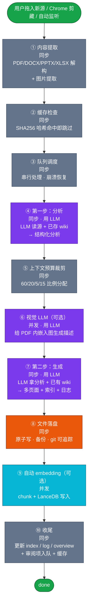
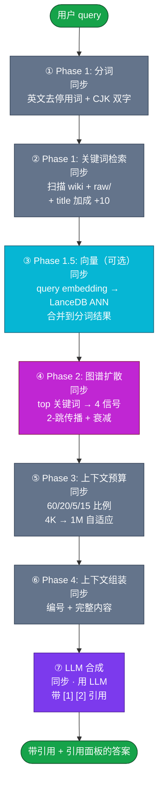
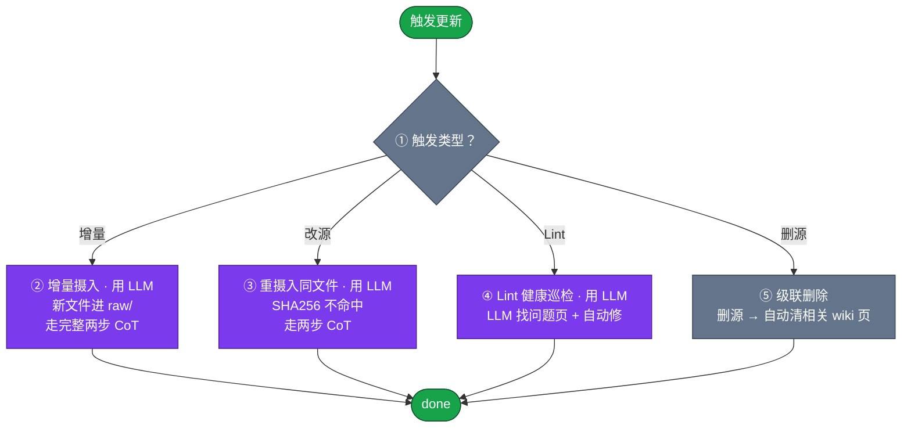
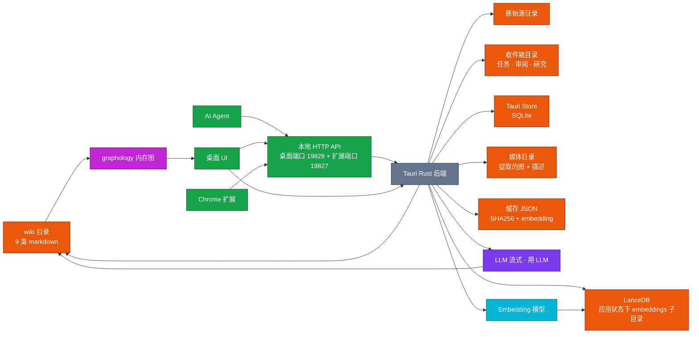

## RAG

- [项目分析 - LLM Wiki（v0.1）](#项目分析---llm-wikiv01)
  - [第一章 概述](#第一章-概述)
  - [第二章 写入流程](#第二章-写入流程)
- [Andrej Karpathy](#andrej-karpathy)
  - [Summary](#summary)
  - [Connections](#connections)
  - [Key Quotes](#key-quotes)
  - [References](#references)
  - [[2026-05-20] ingest | 2026-attention（论文）](#2026-05-20-ingest-2026-attention论文)
- [目的](#目的)
  - [这是什么 wiki](#这是什么-wiki)
  - [给谁看](#给谁看)
  - [关注什么](#关注什么)
  - [不关注](#不关注)
  - [风格](#风格)
- [写入规则](#写入规则)
  - [目录 → 类型](#目录-类型)
  - [frontmatter 必填](#frontmatter-必填)
  - [引用规则](#引用规则)
  - [去重规则](#去重规则)
  - [长度](#长度)
  - [Compiled Truth / Timeline 格式](#compiled-truth-timeline-格式)
  - [必创建的页(每次摄入)](#必创建的页每次摄入)
- [Index](#index)
  - [Sources (8)](#sources-8)
  - [Entities (14)](#entities-14)
  - [Concepts (18)](#concepts-18)
  - [Comparisons (4)](#comparisons-4)
  - [Synthesis (3)](#synthesis-3)
  - [Findings (散点)](#findings-散点)
  - [Theses (我自己的学派)](#theses-我自己的学派)
  - [Methodology (操作方法)](#methodology-操作方法)
  - [Hot / Cold (LLM 内部标记,人不一定看)](#hot-cold-llm-内部标记人不一定看)
  - [Recent connections (上次摄入的边)](#recent-connections-上次摄入的边)
  - [第三章 检索流程](#第三章-检索流程)
- [Andrej Karpathy](#andrej-karpathy)
  - [Connections](#connections)
- [Persistent Wiki](#persistent-wiki)
  - [Methodology](#methodology)
- [Karpathy's LLM Wiki Pattern](#karpathys-llm-wiki-pattern)
  - [第四章 更新与删除](#第四章-更新与删除)
  - [第五章 存储结构](#第五章-存储结构)
  - [参考文件及作用](#参考文件及作用)
# 项目分析 - LLM Wiki（v0.1）

> 参考 v0.3 章节结构撰写；与 openviking、gbrain、graphrag 文章并排阅读。

## 第一章 概述

### 1.1 这个项目解决什么具体问题？

LLM Wiki（基于 Karpathy 的 LLM Wiki 模式，由社区实现的桌面应用）解决的是 **"AI Agent 的长期知识库维护负担"** 问题。

传统 RAG 系统（包括 GraphRAG 等）每次回答问题时都要"从原始文档重新发现知识"——没有累积。问一个需要综合 5 篇文档的问题，Agent 每次都要重新找 5 篇、重新拼装、重新生成答案。**什么都没被永久记住**。人类的知识库也是同样问题：写下来容易、维护难——更新交叉引用、保持摘要时效、标注矛盾、维持一致性，这些"苦力活"成本增长快于价值，所以人类的 wiki 都会逐渐废弃。

LLM Wiki 的解法：**让 LLM 当"知识库管理员"，人类当"内容策展人"**。

- **人类**负责：选源（论文、文章、播客、邮件、笔记…）、提出问题、关注方向。
- **LLM**负责：读源、抽实体、写页面、维护交叉引用、检测矛盾、更新综合、归档、巡检健康。
- **持久化载体**：一个**真实存在于文件系统**的 wiki（Markdown + `[[wikilink]]` 双链 + YAML frontmatter），**同时也是合法 Obsidian 仓库**——用户用 Obsidian 打开就是普通笔记，LLM 维护完后人用 Obsidian 浏览。
- **核心理念**：知识被"编译一次、保持更新"，而不是"每次查询重新派生"。**问第二次相同问题时，答案更快、更准，因为知识图谱已经长好**。

### 1.2 设计思路是什么？

四条核心设计原则：

1. **三层架构（Raw → Wiki → Schema）**：**原始源**（不可变）→ **wiki**（LLM 维护）→ **schema**（规则 + 约定）。原始源里加新文件 → LLM 自动读 → 自动更新 10-15 个相关 wiki 页。schema 文件告诉 LLM 怎么当"称职的 wiki 管理员"。
2. **两步思维链摄入（Chain-of-Thought Ingest）**：不是"读一次同时写"，而是**先分析再生成**——第一次 LLM 调用读源出"结构化分析"（关键实体、概念、与已有知识的关联、矛盾、推荐结构），第二次调用拿分析出"完整 wiki 页"（摘要页 + 实体页 + 概念页 + 索引更新 + 日志条目 + 审阅项 + 搜索查询）。质量显著高于单步。
3. **4 信号相关性图谱（4-Signal Relevance Graph）**：传统"wikilink 计数"太弱。这套系统用 4 个加权信号建图——`直接链接 ×3.0` + `共同源 ×4.0` + `Adamic-Adar 邻居权重 ×1.5` + `页面类型亲和 ×1.0`，再跑 **Louvain 社区检测**找"自然聚类"。查询时不是"返回 10 个 chunk"而是"返回 5 个知识聚类 + 它们的代表页"。
4. **可选向量 + 必选图谱双轨检索**：基础模式是"分词 + 图谱扩散"（不花 embedding 钱，召回率 58.2%）。开启向量后走"分词 + 向量近邻 + 图谱扩散"（召回率 71.4%）。**默认关向量是出于"无 API key 也能跑"的考虑**。

### 1.3 这个项目的亮点是什么？有什么优势？

| 亮点 | 说明 |
|------|------|
| **可永久保存的 Obsidian 兼容 wiki** | 整个 wiki 就是个普通 Obsidian 仓库——人类用 Obsidian 编辑、LLM 用文件系统修改、git 版本控制、跨设备同步全部免费。 |
| **两步 CoT 摄入，质量优于单步** | 先分析后生成，第二次 LLM 调用能基于"已识别的实体和矛盾"做更连贯的页面，避免幻觉扩散。 |
| **4 信号图谱 + Louvain 社区** | 不靠向量相似度，而靠"真正的知识关系"——同一原始源的页面天然相关、wikilink 邻居的邻居也相关。比纯向量 RAG 在长程依赖问题上强很多。 |
| **Graph Insights（自动知识洞察）** | 自动发现"惊讶连接"（跨社区边）、"知识空洞"（孤立页 / 内聚度低的社区）、"桥接节点"（连接 3+ 集群的关键页），一键触发 Deep Research。 |
| **多模态图像摄入** | 从 PDF / PPT 提取嵌入图片 → 视觉 LLM 生成事实描述 → 入索引 → 检索结果带图片预览和"跳回原文"按钮。 |
| **Deep Research 闭环** | LLM 从 Graph Insights 找缺口 → 自动生成"领域适配"的搜索主题 + 查询 → Tavily / SerpApi / SearXNG 拉真源 → LLM 合成研究页 → 自动入 wiki。 |
| **本地 HTTP API + MCP + AI Agent Skill** | 内置 127.0.0.1:19828 JSON API + 独立 MCP server（hybrid search / file read / graph traversal / source rescan）+ 配套 AI Agent skill（`npx skills add` 一行装到 Claude Code / Codex）。 |
| **持久化摄入队列** | 任务序列化、崩溃恢复、取消、重试、进度可视化——4K 文档批量导入不丢任务。 |
| **源文件夹自动监听** | 用户在 wiki 仓库外用其它工具改了源，桌面应用能感知到并自动同步摄入 / 删除。 |
| **零 LLM 知识图谱（autolink + 4 信号）** | 写入时 LLM 决定"抽哪些实体 / 写哪些页面"；**图的边 = 4 信号 + LLM 写的 wikilink**——wikilink 由 LLM 决定，4 信号由数据本身统计，**不调 LLM**。 |
| **目录即模式（Path-as-Schema）** | `wiki/entities/*` → entity 类型、`wiki/concepts/*` → concept 类型……9 个内置类型 + 自定义目录。LLM 按目录推断页面类型。 |
| **跨平台桌面** | Tauri v2 一份代码 → macOS（ARM + Intel）/ Windows 安装包 / Linux 安装包。 |

---

## 第二章 写入流程

### 2.1 写入后的产物长什么样？给出实际例子

LLM Wiki 的写入产物是 **真实存在于文件系统的目录树**——同时也是合法 Obsidian 仓库、合法 git 仓库。下面是一份 ~50KB 论文集被摄入后形成的项目结构：

**项目根目录布局**（用通用名描述）：

```
项目根/
├── 用户目标文件                 ← 用户写的"wiki 之魂"：目标 / 关键问题 / 主题
├── 写入规则约定文件              ← 用户 + LLM 共演进
├── 内容目录文件                 ← 全 wiki 内容目录（LLM 每摄入后自动更新）
├── 操作日志文件                  ← 时间线操作记录（LLM 自动 append）
├── 综合摘要文件                  ← 全 wiki 综合摘要（LLM 每摄入后自动更新）
├── 原始源目录                    ← 原始源（不可变，LLM 只读不改）
│   └── 来源子目录
│       ├── 论文子目录
│       └── 文章子目录
├── wiki 根目录                  ← LLM 维护的 wiki（9 种页面类型）
│   ├── 源摘要子目录
│   ├── 实体子目录
│   ├── 概念子目录
│   ├── 综合子目录
│   ├── 发现子目录
│   ├── 论点子目录
│   ├── 方法论子目录
│   ├── 问题答案子目录
│   └── 对比子目录
├── 收件箱目录                    ← 待处理任务 + 审阅项
│   ├── 任务子目录
│   ├── 审阅子目录
│   └── 研究子目录
├── Obsidian 配置目录             ← Obsidian 配置（自动生成）
├── 应用状态目录                  ← 应用内部状态
│   ├── 聊天子目录
│   ├── 审阅持久化子目录
│   ├── 项目配置子目录
│   └── 可选向量库子目录
└── 媒体目录                      ← 提取的图片 + 视觉 LLM 描述
    └── 源 ID 子目录
        ├── 提取的图片
        └── 视觉 LLM 生成的描述
```

**一个"实体"页实际长这样**：

```markdown
---
type: entity
title: "Andrej Karpathy"
sources:
  - "raw/sources/articles/karpathy-gist.md"
created: 2026-05-20
tags: [researcher, ai]
---

# Andrej Karpathy

## Summary
Former Tesla AI Director, current OpenAI co-founder. Known for advocating
"LLMs as programmers" and "small models + good data > big models + bad data".

## Connections
- Authored [[llm-wiki-pattern]] which became the basis for this project
- Discusses [[chain-of-thought]] extensively
- See also [[persistent-wiki]] (the methodology Karpathy advocates)

## Key Quotes
> "The wiki is a persistent, compounding artifact. Knowledge is compiled
> once and kept current, not re-derived on every query."

## References
- [[raw/sources/articles/karpathy-gist]]
```

**操作日志文件 LLM 自动 append 的一行样例**：

```markdown
## [2026-05-20] ingest | 2026-attention（论文）
- Source: 论文目录/2026-attention（约 52KB）
- Pages updated: 1 source summary + 3 entities + 2 concepts + 1 synthesis
- Tokens used: 18,500 (input) + 4,200 (output)
- New entities: attention-mechanism, kv-cache
- Review items: 2
- Cross-refs added: 7
- Duration: 23s
```

### 2.2 数据怎么进？入口在哪？支持哪些数据源？

**入口有五类**：

| 入口 | 调用方式 | 用途 |
|------|----------|------|
| **桌面应用 UI** | 拖拽 / 文件选择器 / 应用内 "Import" 按钮 | **最常用**：选源 → 走两步 CoT 摄入 |
| **源文件夹拖入** | 把原始源目录里放新文件 | 自动触发文件监听 → 走两步 CoT 摄入 |
| **Chrome Web Clipper 扩展** | 一键把网页变 Markdown → 走桌面 API → 自动入 wiki | 浏览器内捕获 |
| **CLI** | 启动 Tauri dev / build 模式后调用 | 开发 / 调试 |
| **HTTP API（127.0.0.1:19828）** | JSON API / MCP server | AI Agent / 外部集成 |

**支持的数据源**（共 7+ 种）：

| 格式 | 处理方式 | 库 |
|------|----------|-----|
| **Markdown** | 直接读 | — |
| **PDF** | 文本 + 嵌入图片提取 | pdf-extract（Rust） |
| **DOCX** | 标题 / 加粗 / 斜体 / 列表 / 表格 → 结构化 Markdown | docx-rs（Rust） |
| **PPTX** | 逐幻灯片提取 + 标题/列表结构 | ZIP + XML 解析（Rust） |
| **XLSX / XLS / ODS** | 多 sheet 支持 + 正确单元格类型 + Markdown 表格 | calamine（Rust） |
| **图片**（PNG / JPG / GIF / WEBP / SVG） | 原生预览 + 视觉 LLM 生成事实描述 | 视觉 LLM |
| **音视频** | 内置播放器预览，**不入 wiki**（只浏览） | Tauri 系统播放器 |
| **网页（HTML）** | Mozilla Readability 提主体 + Turndown 转 Markdown | 浏览器扩展 |
| **JSON / 纯文本** | 直接读 | — |

**Markdown / PDF / 网页 / 数据库 怎么进**：
- **Markdown**：直接拖到原始源目录或用 UI 选。
- **PDF**：UI 选 → Rust pdf-extract 提文本 + 嵌入图片 → 两步 CoT 摄入。
- **网页**：装 Chrome 扩展 → 一键剪藏 → Readability + Turndown 转 Markdown → 走桌面 HTTP API → 自动入 wiki。
- **数据库**：**没有原生 DB 输入**；写脚本 SELECT 出文本 / Markdown 后走普通流程。

### 2.3 完整写入流程分几阶段？每阶段产什么？



**各阶段详解**：

1. **内容提取**（**无 LLM**）：根据文件类型调对应 Rust 解析器。PDF 走 pdf-extract 提文本 + 嵌入图；DOCX 走 docx-rs 保结构；PPTX / XLSX 走对应解析器。**图片单独提取**到 `media/<source-id>/`。
2. **缓存检查**（**无 LLM**）：算 `SHA256(content + size + mtime)`，命中缓存表 → **整次摄入跳过**，不花 LLM token。这是 0 成本增量。
3. **队列调度**（**无 LLM**）：入持久化任务队列（写到 inbox 任务子目录），串行处理（避免 LLM 限流）。崩溃可恢复；UI 可取消 / 重试。
4. **第一步 LLM - 分析**（**关键**）：给 LLM 看 **(已提取的源全文 + 当前 wiki 概况 + 用户目标文件 + 写入规则约定文件)**，输出"结构化分析"——关键实体、关键概念、与已有 wiki 的关联、矛盾点、推荐结构。这是和单步模式的**唯一区别**。
5. **上下文预算裁剪**（**无 LLM**）：把"分析结果"按 token 预算（默认 8K / 128K / 256K / 512K 四档自适配）裁剪——按 `60% wiki pages / 20% chat history / 5% index / 15% system prompt` 比例分配。
6. **视觉 LLM**（**可选，紫**）：如果源里有嵌入图（PDF/PPTX），且用户开了多模态功能，并发调视觉 LLM 给每张图生成事实描述。**纯描述性**，不入向量索引（可选，**有"是否给图片做向量化"开关**）。
7. **第二步 LLM - 生成**（**关键**）：给 LLM 看 **(第一步分析结果 + 裁剪后的已有 wiki 子集 + 模板 + 输出语言指示)**，输出**完整的多文件写入清单**——源摘要页 + 实体页 + 概念页 + 比较页 + 索引更新 + 日志追加 + 审阅项 + 搜索查询（用于后续 Deep Research）。
8. **文件落盘**（**无 LLM**）：原子写（先写临时文件再重命名），生成 frontmatter（含 sources 字段链回原始文件 + created + tags）。**所有变更都是普通 markdown 文件**，git 可追踪。
9. **自动 embedding**（**可选，青**）：开了向量搜索时，对每个新 wiki 页 → 文本切分 → 调 embedding 模型 → 写入 LanceDB。**8 条强制设计约束**（见 2.5）。
10. **收尾**（**无 LLM**）：更新内容目录文件（加新条目）、操作日志文件（加时间线条目）、综合摘要文件（重新综合）、写入审阅子目录（审阅项入队）、写研究子目录（Deep Research 查询入队）、写缓存。

**关键观察**：
- **两次 LLM 必调（步 ④ 和 ⑦）**，可选第三次（步 ⑥ 视觉）。
- **分析步只读、不改任何文件**——完全可重做。
- **生成步的输出是"完整文件清单"**——LLM 不直接写盘，应用层校验后才落盘（防 LLM 写出畸形 markdown）。
- **整体是同步串行**——避免 LLM 限流，UI 显示进度。

### 2.4 Agent 怎么操作这个工具写入？每个工具的作用是啥？具体的参数是什么？

LLM Wiki 提供 **三层 Agent 集成**：

#### **HTTP API**（`127.0.0.1:19828`）
**作用**：桌面应用内置的本地 JSON API。AI Agent 可通过 HTTP 调用。

| 端点 | 作用 | 关键参数 |
|------|------|----------|
| `POST /ingest` | 提交新源入 wiki | `project_path` `source_path` `language` |
| `POST /search` | 触发检索 | `query` `top_k` `include_content` |
| `GET /file` | 读 wiki 页 | `path` |
| `POST /rescan` | 重扫源文件夹 | `project_path` |

#### **MCP Server**（独立 npm 包）
**作用**：符合 MCP（Model Context Protocol）协议，Claude Code / Codex / Cursor 等 Agent 直接集成。

| 工具 | 作用 | 关键参数 |
|------|------|----------|
| `hybrid_search(query, top_k, include_content)` | 混合检索：分词 + 向量 + 图谱扩散 | `query` `top_k` |
| `read_file(path)` | 读 wiki 页内容 | `path` |
| `traverse_graph(seed_slug, depth, direction)` | 知识图谱 BFS | `seed_slug` `depth` |
| `rescan_sources()` | 重扫源文件夹 | — |

#### **AI Agent Skill**
**作用**：通过 `npx skills add <skill-url>` 一行装到 Claude Code / Codex。

| 文件 | 作用 |
|------|------|
| skill 描述文件 | 教 Agent 怎么用 LLM Wiki 作为"长期记忆后端" |

#### **桌面应用 UI**（主要给人类用）
- **拖拽文件到主窗口** → 走完整两步 CoT 摄入
- **源文件夹监听** → 文件变化自动入
- **Chrome 扩展剪藏** → 走 HTTP API → 自动入
- **活动面板**（Activity Panel）→ 实时显示每文件处理进度

**对 Agent 的提示**：
- **直接挂 MCP** —— 一次性集成后，Agent 把 LLM Wiki 当"外部大脑"用：`hybrid_search` 找候选 + `read_file` 读全文。
- **批量化** —— Agent 收到 100 个源时，**不要 100 次 MCP 调用**；用 HTTP API 一次发批量任务，应用层串行处理。
- **状态查询** —— HTTP API 有 `/status` 端点，可查"某个任务在不在队列里"。

### 2.5 chunk 怎么切？大小？overlap？语义切分还是规则切分？

**唯一 chunker**（专为 embedding 设计的 Markdown-aware 递归切分器）：

| 参数 | 默认值 | 含义 |
|------|--------|------|
| `targetChars` | 1000 | 目标 chunk 字符数 |
| `maxChars` | 1500 | 硬上限（超过也只标 `oversized: true`） |
| `minChars` | 200 | 短于此的 chunk 被合并到邻居 |
| `overlapChars` | 200 | 相邻 chunk 重叠字符数 |

**8 条强制设计约束**：

1. **每个 chunk 带 `headingPath` 面包屑**（"## Intro > ### Usage"），让短 chunk 单独看时不丢失结构上下文。
2. **递归切分优先级**（Markdown-aware Recursive Character Splitter）：
   - (a) 标题定义的小节（`##` / `###` / `####`）
   - (b) 段落边界（`\n\n`）
   - (c) 换行（`\n`）
   - (d) 句号终止符（`.` / `。` / `!` / `！` / `?` / `？` / `;` / `；`）
   - (e) 空白（` ` / `　` / `\t`）
   - (f) 硬字符切片（最后手段）
3. **永不在 ` ``` ` 代码块内切** —— 代码块超长就一个 oversized chunk，不撕裂。
4. **永不在表格内切**（行首 `|`） —— 表超长也保完整。
5. **先剥 YAML frontmatter** —— 元数据不入 embedding。
6. **同节内相邻 chunk 应用 overlap** —— 防止"想法在段间断开"。
7. **太小的 chunk（< minChars）合并到邻居** —— 避免 50 字符的"零信号"碎片塞满向量库。
8. **纯函数 + 确定性** —— 同输入必出同输出，无随机、无 I/O、无单例。

**安全带**：embedding 模型返回 "input too long" 错误时，**自动把 chunk 减半重试**，最多 3 次。

**与"9 种页面类型"结合**：每种类型的页面**有独立的切分参数**——`source`（源摘要）默认大块（1200 / 200）、`entity` / `concept` 整页较短不需要切。

### 2.6 用 embedding 了吗？什么时候用的？用的什么模型？

**用了，但完全可选**（**默认关**！）。

**两处使用**：

1. **写入阶段 ⑨**（仅当用户在 Settings 开启"向量搜索"）：对每个新 wiki 页 → 文本切分 → 调 embedding → 写 LanceDB。
2. **检索阶段 1.5**：query 进库前调同一 embedding 模型向量化 → LanceDB 近似最近邻（ANN）→ 合并到关键词搜索结果。

**embedding 模型**：
- **任意 OpenAI 兼容的 `/v1/embeddings` endpoint**。
- 官方推荐：OpenAI `text-embedding-3-small` / `text-embedding-3-large` / `voyage-3` / `bge-m3`（自托管）。
- **不锁定 provider**——用户填 endpoint URL + API key + 模型名即可。
- **Tauri Rust 后端**直接 HTTP 调 embedding 服务，绕过 CORS（Cross-Origin Resource Sharing，浏览器跨域限制）。

**LanceDB 存储**：
- **嵌入式 Rust 库**（无需独立 server），存于应用状态目录下的 embeddings 子目录。
- 索引 = `(page_id, chunk_index, text, heading_path, vector)`。
- 向量检索后用**组内 max-pool**（page 粒度取最高分）+ 关键词 hit 加权合并。

**默认关的理由**：90% 个人知识库 < 100 源时，分词 + 图谱扩散足够；不花 embedding API 钱也能跑。**官方 benchmark：开启向量后召回率 58.2% → 71.4%**。

**写入流程中有哪些部分用了 LLM，prompt 是啥？**

| 阶段 | 用 LLM？ | 作用 |
|------|----------|------|
| ① 内容提取 | ❌ | Rust 解析器 |
| ② 缓存检查 | ❌ | SHA256 比对 |
| ③ 队列调度 | ❌ | 任务调度 |
| ④ 第一步：分析 | ✅ | 抽实体 / 概念 / 矛盾 / 关联；prompt 强制 JSON |
| ⑤ 上下文预算 | ❌ | 字符计数 + 比例分配 |
| ⑥ 视觉 LLM（可选） | ✅ | 图像生成事实描述 |
| ⑦ 第二步：生成 | ✅ | 多文件输出；prompt 强制 JSON + 模板填充 |
| ⑧ 文件落盘 | ❌ | 原子写 |
| ⑨ 自动 embedding | ❌ | embedding 模型，不算 LLM |
| ⑩ 收尾 | ❌ | 索引/日志/审阅项更新 |

**核心 prompt 结构**：

#### prompt 里喂的 3 个"上下文文件"长啥样

写入流程里有 3 个用户/系统层文件,直接喂给 LLM 当上下文;它们是 wiki 的"方向 + 规则 + 地图":

**1. `purpose.md`(用户目标文件,系统的"wiki 之魂")**

100-300 字,告诉 LLM 这个 wiki **给谁、关注什么、风格**。例(读 LLM 论文这个领域):

```markdown
# 目的

## 这是什么 wiki
- 这是个人读 LLM 论文 / 读 ML 综述的**第二大脑**,不是学术库
- 目的:**3 个月后回看,记得每个概念和我当时怎么理解的**

## 给谁看
- 第一读者:未来的我(回看 / 复习 / 引用)
- 第二读者:跟我讨论 ML 的朋友(允许"非正式"语气)

## 关注什么
- **机制(mechanism) > 公式(formula)**——"为什么这样设计"比"长什么样"重要
- **横向对比 > 单论文深读**——看 attention / Mamba / MoE 之间取舍
- **我自己的 take**——"我觉得这论文哪里强 / 哪里骗"
- **时代背景**——这论文解决 2024 年的什么痛点

## 不关注
- SOTA 数字排名
- 公式逐行推导
- 实现细节(除非影响设计取舍)
- 任何"我以后再读"的内容——现在不感兴趣就跳过

## 风格
- 准学术,但允许有"我觉得"
- 中文为主,英文术语保留(attention head / KV cache / speculative decoding)
```

**2. `schema.md`(写入规则约定,用户 + LLM 共演进)**

1-3 页,告诉 LLM **怎么当称职的 wiki 管理员**——9 个目录 → 9 个 type、frontmatter 必填项、wikilink 引用规范、去重规则、Compiled Truth / Timeline 格式、长度上限。**这是第二步 prompt(生成 prompt)的核心**:

```markdown
# 写入规则

## 目录 → 类型
| 目录 | type | 何时放这里 |
|---|---|---|
| `wiki/sources/<name>.md` | source | 一份新论文/文章的**摘要**页(必创建) |
| `wiki/entities/<name>.md` | entity | 一个人 / 公司 / 实验室 / 模型 / 数据集 |
| `wiki/concepts/<name>.md` | concept | 一个抽象概念(attention / KV cache / Mamba SSM) |
| `wiki/comparisons/<name>.md` | comparison | 2+ 概念的对比(attention vs Mamba) |
| `wiki/queries/<name>.md` | query | 我问过、答案值得归档的问题 |
| `wiki/synthesis/<name>.md` | synthesis | 多源综合(读完 5 篇 RAG 论文后写一篇) |
| `wiki/findings/<name>.md` | finding | 单点发现(一个数字 / 一段引文) |
| `wiki/thesis/<name>.md` | thesis | 我自己的学派 / 长线观点 |
| `wiki/methodology/<name>.md` | methodology | 操作方法(怎么读论文 / 怎么复现) |

## frontmatter 必填
---
type: source | entity | concept | comparison | ...
title: "注意力机制"           # 中文或英文都行,跟正文主语一致
sources:                     # 链回原始文件,**这个 type 必有**
  - raw/sources/papers/2026-attention.pdf
created: 2026-05-20          # ISO 日期
tags: [mechanism, transformer]  # 2-5 个,小写
---

## 引用规则
1. 概念必须用 `[[wikilink]]` 链:写"注意力"要写 `[[attention-mechanism]]`
2. **优先链到概念 / 实体,不要链到 source**(链到 source 是噪音)
3. 第一次出现的缩写,正文中要全展开:KV cache(Key-Value cache)
4. 引文 / 数据 / 时间戳用 `> blockquote` 框出来,标注源

## 去重规则
- 概念已存在 → **更新**而不是新建:读 `wiki/concepts/<name>.md` 当前内容,把新信息 merge 进 Compiled Truth,在 Timeline 追加证据
- 实体已存在 → 同样更新,不要因"同名不同人"建 `person-2.md`
- 判断矛盾时:**不直接覆盖**——在 Timeline 写 `## contradiction: <对方页> says X, this page says Y`,留作 review

## 长度
- entity: 200-500 字
- concept: 500-1500 字
- source: 800-2000 字(摘要 + 关键论点)
- comparison: 1000-3000 字
- synthesis: 1500-5000 字

## Compiled Truth / Timeline 格式
- 上方:`## Compiled Truth`(当前我对这个概念的理解,**会被重写**)
- 下方:`## Timeline`(`### YYYY-MM-DD | <来源>` 倒序,append-only,**永不修改**)

## 必创建的页(每次摄入)
- 至少 1 个 source 摘要
- 至少 1 个 concept / entity(论文里的关键机制或团队)
- 至少 1 个 connection(用 wikilink 链到**至少 3 个**已有页)
- 矛盾时:**不强行解决**,写 review_item
```

**3. `index.md`(全 wiki 内容目录,LLM 自动维护)**

**结构化目录,不是自由文本**——LLM 每次摄入后**增量更新**(不重建),喂给 LLM 当"导航地图"用,核心是让 LLM 知道"哪些页已存在,不要重建"。truncated 到 ~5K tokens 喂进 prompt:

```markdown
# Index

> Last updated: 2026-05-20 by ingest:raw/sources/papers/2026-attention.pdf
> Total: 47 pages (8 sources / 14 entities / 18 concepts / 4 comparisons / 3 synthesis)

## Sources (8)
- [[2026-attention]] — Attention Is All You Need (2026) [2026-05-20]
- [[2025-mamba]] — Mamba: Linear-Time Sequence Modeling (2025) [2026-04-12]
- [[2025-mixture-of-depths]] — MoD (2025) [2026-03-08]
- [[2024-rag-survey]] — RAG Survey (Gao et al., 2024) [2026-02-15]
- ... (4 more)

## Entities (14)
- [[vaswani-ashish]] — Vaswani, Ashish (Google Brain) [2026-05-20]
- [[albert-gu]] — Gu, Albert (CMU → Cartesia) [2026-04-12]
- [[openai]] — OpenAI [2026-01-20]
- [[anthropic]] — Anthropic [2026-01-20]
- ... (10 more)

## Concepts (18)
- [[attention-mechanism]] — Attention Mechanism [2026-05-20, **hot**]
- [[kv-cache]] — Key-Value Cache [2026-05-20, **hot**]
- [[mamba-ssm]] — Mamba State Space Model [2026-04-12, hot]
- [[speculative-decoding]] — Speculative Decoding [2026-03-08]
- [[rope]] — Rotary Position Embedding [2026-02-28]
- [[flash-attention]] — Flash Attention [2026-02-15]
- ... (12 more)

## Comparisons (4)
- [[attention-vs-mamba]] — Attention vs Mamba: long-context tradeoff [2026-05-08]
- [[rag-vs-long-context]] — RAG vs Long Context [2026-04-22]
- [[full-finetune-vs-lora]] — Full FT vs LoRA [2026-03-15]
- ... (1 more)

## Synthesis (3)
- [[2026-q2-reading-summary]] — 2026 Q2 reading: 长上下文路线之争 [2026-05-18]
- [[llm-inference-stack-2026]] — LLM inference stack (server side) [2026-04-30]
- [[rag-2026-state-of-art]] — RAG in 2026: what works [2026-03-22]

## Findings (散点)
- [[finding-attention-is-all-you-need-2017-citation-count]] — 2026-05 update [2026-05-20]
- ... (5 more)

## Theses (我自己的学派)
- [[thesis-mechanism-beats-benchmark]] — 机制比 SOTA 数字重要 [2026-04-01]
- [[thesis-local-first-llm]] — 个人 LLM 应该本地为主 [2026-02-20]

## Methodology (操作方法)
- [[method-paper-reading-flow]] — 我读 ML 论文的 4 步流程 [2026-03-10]

## Hot / Cold (LLM 内部标记,人不一定看)
- hot = 最近 30 天有更新 / 引用过 3+ 次
- cold = 90 天未触碰

## Recent connections (上次摄入的边)
- 2026-05-20 ingest: [[2026-attention]] → [[attention-mechanism]] (extends), [[vaswani-ashish]] (authored)
- 2026-05-20 ingest: [[2026-attention]] ↔ [[2025-mamba]] (related)
- 2026-05-20 review_item: attention scaling law 与 mamba scaling law 表述不一致 — 待查
```

**3 个文件的关系**:

```
purpose.md  ─┐
              ├─→ 喂进 system prompt → 决定 LLM 立场 + 范围
schema.md   ─┤
index.md    ─┘   喂进 user prompt   → 决定 LLM 去重 + 链接 + 写入位置
```

- **purpose.md** 是"我是谁 / 我要看什么"——人文层面
- **schema.md** 是"怎么放 / 怎么引用 / 怎么去重"——工程层面
- **index.md** 是"已经有什么 / 别重复造"——存量层面

跟两步 prompt 的对应:
- 第 1 步(分析)只用 `purpose.md` + `index.md`(摘要生成 + 去重判断)
- 第 2 步(生成)才用 `purpose.md` + `schema.md` + `index.md` + `language_directive`(知道**写什么样**的页 + 链到**哪**)

#### 第一步 - 分析 prompt
```
SYSTEM:
  You are a knowledge analyst. Read the source and produce a structured
  analysis that will drive wiki page generation.

USER:
  <purpose>
  {purpose.md content}
  </purpose>

  <current_index>
  {index.md content (truncated to 5K tokens)}
  </current_index>

  <recent_log>
  Last 20 log.md entries
  </recent_log>

  <source>
  {extracted source text (up to context budget)}
  </source>

  Output JSON:
  {
    "summary": "...",
    "key_entities": [{"name": "...", "context": "..."}],
    "key_concepts": [{"name": "...", "definition": "..."}],
    "connections": [{"to": "<existing_page>", "type": "related|contradicts|extends"}],
    "contradictions": ["..."],
    "recommended_pages": [{"type": "entity|concept|comparison|...", "title": "..."}],
    "review_items": [{"action": "create_page|deep_research", "title": "..."}],
    "search_queries": ["...", "..."]
  }
```

#### 第二步 - 生成 prompt
```
SYSTEM:
  You are a wiki maintainer. Generate the next set of wiki page updates
  using the analysis below. Each page MUST be valid Markdown with YAML
  frontmatter and [[wikilink]] cross-references.

USER:
  <purpose>{purpose.md}</purpose>
  <schema>{schema.md}</schema>
  <index>{index.md (truncated)}</index>
  <language_directive>{english or chinese}</language_directive>

  <analysis>
  {step 1 output}
  </analysis>

  Output JSON:
  {
    "writes": [
      {
        "path": "wiki/sources/2026-attention.md",
        "type": "source",
        "title": "Attention Is All You Need (2026)",
        "content": "---\ntype: source\n...",
        "sources": ["raw/sources/papers/2026-attention.pdf"]
      },
      {
        "path": "wiki/entities/attention-mechanism.md",
        "type": "entity",
        "content": "..."
      }
    ],
    "index_update": "...",
    "log_entry": "## [2026-05-20] ingest | ..."
  }
```

---

## 第三章 检索流程

### 3.1 query 到结果分几阶段？每个阶段干了什么？产出了什么？

LLM Wiki 提供 **一条主检索链 + 4 阶段** + **可选向量**。下图为完整 pipeline：



**各阶段详解**：

1. **分词**（**无 LLM**）：英文按空格分词 + 去停用词（the / is / a / an / what / how / are / in / on / at / to / for / of / with / by 等）；中文用 **CJK 双字组合**（如"每个"→ ["每个", "个?"]，再加单字兜底）。
2. **关键词检索**（**无 LLM**）：扫描整个 wiki 根目录 + 原始源目录下的所有 markdown 文件，按 token 命中数 + 标题加成 +10 打分，返回 top-K 候选页。
3. **向量检索**（**可选，青**）：仅当 Settings 开启时。query embedding → LanceDB ANN → top-K 页面 → 合并到关键词结果（**boost 已有匹配 + 加新发现**）。
4. **图谱扩散**（**品红**）：以 top 关键词结果为种子 → 用 **4 信号相关性模型**找相关页 → 2-跳 BFS 遍历 + 边权重衰减。**纯统计计算，不调 LLM**。
5. **上下文预算**（**无 LLM**）：按用户配置的 `maxContextSize`（4K → 1M）按比例分配——60% 给 wiki 页、20% 给聊天历史、5% 给 index、15% 给 system prompt。页面按"关键词分 + 图谱相关分"综合排序后塞入。
6. **上下文组装**（**无 LLM**）：每个被选中的页**完整内容**（不只是摘要）按 `[1] [2] [3]...` 编号，**告诉 LLM 哪些编号引用了哪些页**。
7. **LLM 合成**（**紫**）：system + user 完整 prompt → 调流式 LLM → 出带 `[1] [2]` 引用的答案 + 同步生成"引用面板"（哪些 wiki 页被用 + 按类型分组 + 跳转链接）。

**关键观察**：
- **4 阶段里只有 1 个 LLM**（最后），其它都是规则 + 统计。
- **图谱信号是离线算好的**——所有权重在写入时（或 lint 时）算好，查询时只是用现成数据。
- **流式响应** —— LLM 一边吐字一边推前端，UI 滚动跟。

### 3.2 召回策略用了哪些？每个策略的作用是啥？参数怎么选？

| 策略 | 出现在哪 | 作用 | 关键参数 |
|------|----------|------|----------|
| **分词关键词检索** | Phase 1 | 字面命中：人名 / 标识符 / 精确短语 | `top_k=20`（默认）；停用词表；CJK 双字 |
| **标题加成** | Phase 1 | query 是 title 子串时 +10 | 硬编码 |
| **向量 ANN（可选）** | Phase 1.5 | 语义近邻：同义 / 跨语言 | `top_k=60`（×3 内部）；cosine；LanceDB IVF（Inverted File，倒排文件索引） |
| **4 信号相关性图** | Phase 2 | 真实知识关系 | 权重：直接链接 ×3.0 / 共同源 ×4.0 / Adamic-Adar ×1.5 / 类型亲和 ×1.0 |
| **2-跳扩散 + 衰减** | Phase 2 | 长程关系 | `depth=2`（默认） |
| **Louvain 社区** | 图谱可视化 + Graph Insights | 自然聚类 | `resolution=1`（默认） |
| **Lovian 内聚度** | Graph Insights | 发现"知识空洞" | `cohesion < 0.15` 标警告 |
| **Top-K** | 全流程 | 候选条数 | `top_k=20` 关键词 / `top_k=60` 向量 |
| **上下文 token 预算** | Phase 3 | 防 OOM（内存溢出） / 控成本 | 4K → 1M 自适应 |
| **60/20/5/15 比例** | Phase 3 | 平衡 wiki / 历史 / 索引 / 系统 | 硬编码比例 |
| **Token 排序 + 截断** | Phase 3 | 候选按分数排，超出预算截断 | 按"综合分"排 |
| **编号引用** | Phase 4 | LLM 强制带 `[1] [2]` 引用 | 编号对应"实际被引用的页" |
| **持久化引用面板** | 输出 | 用户可点跳回原页 | JSON 存 chat 消息 |

**没用的策略**（特意排除）：
- **BM25 关键词**：不直接用（用更简单的 token 命中数）。
- **HyDE / RAG-Fusion**：不实现（已经靠图谱 + 可选向量获得好召回）。
- **MMR 多样性**：不需要（wiki 页本身已经多样）。
- **Reranker**：不调（用 4 信号图谱代替 cross-encoder 重排）。
- **HyDE / 多查询扩展**：不实现。

**4 信号模型详解**：

| 信号 | 权重 | 直觉 |
|------|------|------|
| **直接链接** | ×3.0 | 显式 `[[wikilink]]` 双链 |
| **共同源** | ×4.0 | 两个页面的 `sources[]` 数组有交集（来自同一原始文件） |
| **Adamic-Adar 邻居** | ×1.5 | 共用邻居越多越相关（按邻居度数加权） |
| **类型亲和** | ×1.0 | 同类页（entity↔entity）天然相关；跨类有折扣（`entity↔query` ×0.8） |

### 3.3 检索流程中有哪些部分用了 LLM，prompt 是啥？

| 阶段 | 用 LLM？ | 作用 |
|------|----------|------|
| Phase 1 / 1.5 / 2 / 3 | ❌ | 全规则 + 统计 |
| Phase 4 上下文组装 | ❌ | 字符串拼接 |
| **最后一步** | ✅ | 出答案 + 引用编号 |

**检索 LLM prompt 结构**：

```
SYSTEM:
  You are answering a question using the user's personal knowledge base.
  Cite every claim with [1], [2], etc. matching the numbered pages below.
  If unsure, say so. Never invent information not present in the pages.
  Respond in {language}.

USER:
  <purpose>
  {purpose.md content}
  </purpose>

  <system_directive>
  15% of context budget
  </system_directive>

  <index_excerpt>
  5% of context budget
  </index_excerpt>

  <pages>
  [1] wiki/entities/andrej-karpathy.md
  ---
  {{ full content }}
  ---

  [2] wiki/concepts/persistent-wiki.md
  ---
  {{ full content }}
  ---

  [3] ...
  ---
  60% of context budget, ordered by relevance score
  </pages>

  <chat_history>
  last 10 messages
  20% of context budget
  </chat_history>

  <question>
  {user query}
  </question>
```

**关键约束**：
- **强制引用** — LLM 被 prompt 强制"每个事实带 [N] 编号"；前端用正则扫所有 `[N]` 还原成"引用面板"分组。
- **宁少勿编** — 显式 prompt "Don't invent information not in the pages"。
- **流式** — 用 SSE（Server-Sent Events，服务端推送流）或类似机制逐字推前端。
- **可选 thinking 块** — DeepSeek / QwQ 等"思考模型"会输出 `<think>...</think>` 块，UI 单独渲染成"思考过程"折叠区。
- **语言指示** — prompt 头部注入"用中文回答"等显式指令。

### 3.4 检索结果怎么拼到 LLM prompt 里？给实际拼接好的 prompt 例子

#### 实际 prompt 拼接

```text
SYSTEM:
You are answering a question using the user's personal knowledge base.
Cite every claim with [1], [2], etc. matching the numbered pages below.
If unsure, say so. Never invent information not present in the pages.
Respond in English.

---
<purpose>
This wiki tracks my research on LLM-augmented knowledge bases. Current
focus: how to build a persistent wiki that's maintained by LLMs.
</purpose>

---
<index_excerpt>
  - andrej-karpathy: Former Tesla AI Director, OpenAI co-founder
  - persistent-wiki: A methodology for LLM-maintained wikis
  - chain-of-thought: Two-step reasoning pattern
  - 2026-attention: Attention Is All You Need (paper)
  ...(20 more entries)
</index_excerpt>

---
<pages>

[1] wiki/entities/andrej-karpathy.md
---
type: entity
title: "Andrej Karpathy"
sources: [raw/sources/articles/karpathy-gist.md]

# Andrej Karpathy

Former Tesla AI Director, current OpenAI co-founder. Known for advocating
"LLMs as programmers" and "small models + good data > big models + bad data".

## Connections
- Authored [[llm-wiki-pattern]]
- Discusses [[chain-of-thought]] extensively
- See [[persistent-wiki]]
...

[2] wiki/concepts/persistent-wiki.md
---
type: concept
title: "Persistent Wiki"
sources: [raw/sources/articles/karpathy-gist.md, raw/sources/papers/2026-attention.md]

# Persistent Wiki

A wiki that is incrementally built and maintained by an LLM, not
re-derived on every query. Knowledge is compiled once and kept current.

## Methodology
1. Drop new source into raw/
2. LLM reads + extracts key info
3. LLM updates entity pages, summaries, index
4. LLM appends to log

[3] wiki/sources/2026-llm-wiki.md
---
type: source
title: "Karpathy's LLM Wiki Pattern"
sources: [raw/sources/articles/karpathy-gist.md]

# Karpathy's LLM Wiki Pattern

The foundational document. Quote: "The wiki is a persistent, compounding
artifact. Knowledge is compiled once and kept current, not re-derived on
every query."

[4] wiki/findings/cot-improves-wiki-quality.md
---
type: finding
...

</pages>

---
<chat_history>
[User, 2 messages ago]: What's the difference between RAG and persistent wiki?
[Assistant]: Brief mention of difference, asked follow-up.
</chat_history>

---
<question>
Who invented the persistent wiki pattern and how does it work?
</question>
```

**关键观察**：
- 上下文按 **4 块**组织：purpose（系统/方向） / index（导航） / pages（候选） / history（多轮）。
- 候选页**按"综合分"降序排**，最相关的页排前面。
- 候选页**带编号**（`[1]` / `[2]` / `[3]`），prompt 强制 LLM 用 `[N]` 引用。
- 每页**完整内容**进 prompt（不只摘要），因为 wiki 页本身已经是 LLM 蒸馏过的精华。
- **页数自适应** —— 4K context 塞 5 页，128K 塞 30 页，1M 塞 60 页。

**prompt 拼接策略**：
- **system prompt**：角色 + 引用格式 + 宁少勿编 + 语言指示。
- **多轮**：把历史对话作为独立 block，**不与候选页混在一起**——避免 LLM 把"对话里说过的话"误以为是"wiki 里有的话"。
- **页内 wikilink 不展开** —— 候选页里出现的 `[[other-page]]` 保留原样，**让 LLM 知道"还有这些相关页"**但不一定用。

### 3.5 Agent 怎么操作这个工具检索？每个工具的作用是啥？具体的参数是什么？

#### **MCP 工具**（推荐 Agent 用）

| 工具 | 作用 | 关键参数 |
|------|------|----------|
| `hybrid_search(query, top_k?, include_content?)` | 跑完整 4 阶段 pipeline | `query`（必填）；`top_k=20` 默认；`include_content=false` 默认（只返回路径 + 标题 + 摘要） |
| `read_file(path)` | 读 wiki 页完整内容 | `path`（必填，相对项目根） |
| `traverse_graph(seed_slug, depth?, direction?)` | 从种子节点 BFS 知识图谱 | `seed_slug`（必填）；`depth=2` 默认；`direction="outgoing"/"incoming"/"both"` |
| `rescan_sources()` | 重扫源文件夹 | — |

#### **HTTP API**（`127.0.0.1:19828`）

| 端点 | 作用 | 关键参数 |
|------|------|----------|
| `POST /search` | 触发检索 | `query` `top_k` `include_content` |
| `GET /file` | 读页 | `path` |
| `POST /traverse` | 图谱遍历 | `seed_slug` `depth` |
| `POST /ingest` | 提交新源 | `source_path` `language` |
| `GET /status` | 队列状态 | `task_id` |
| `POST /rescan` | 重扫 | — |

#### **返回结构（`hybrid_search` 示例）**

```json
{
  "mode": "hybrid",
  "results": [
    {
      "path": "wiki/entities/andrej-karpathy.md",
      "title": "Andrej Karpathy",
      "snippet": "Former Tesla AI Director, current OpenAI co-founder. Known for...",
      "titleMatch": true,
      "score": 24,
      "vectorScore": 0.82,
      "images": [
        { "url": "media/andrej-karpathy/photo.jpg", "alt": "Photo" }
      ]
    },
    ...
  ],
  "tokenHits": 8,
  "vectorHits": 12
}
```

**对 Agent 的提示**：
- **简单问题** → `hybrid_search` 返回 top-5 → `read_file` 读全文 → 够了。
- **复杂问题** → `hybrid_search` 找种子 → `traverse_graph` 扩 2-跳 → 拿一批相关页 → `read_file` 批量读。
- **多轮对话** → 每次 search 都把历史当作"补充查询词"传 query（**不**——LLM Wiki 不支持 server 端 history 注入；Agent 自行处理）。
- **流式响应** → LLM 合成是流式的，Agent 适合用 MCP 的 stream 模式。

---

## 第四章 更新与删除

### 4.1 更新的整体流程是怎样的？

LLM Wiki 的更新有 **4 种触发**：



### 4.2 更新的触发条件是啥？更新会更新哪些存储介质？

| 触发 | 更新范围 | 跑哪个流程 |
|------|----------|-----------|
| 新文件进原始源目录 | 完整两步 CoT 摄入 | 自动监听 / UI 触发 |
| 已有源文件被改 | SHA256 哈希不命中 → 重跑两步 CoT | 监听触发 |
| 用户手动 "Re-ingest" | 强制重做，跳过缓存 | UI 按钮 |
| `lint` 周期巡检 | LLM 找矛盾 / 过期 / 孤立 → 自动修 | UI 按钮 / 定时 |
| 删源文件 | 3 种匹配方法级联删 | UI / 文件监听 |
| "Save to Wiki"（聊天答案） | 走完整两步 CoT 摄入 | UI 按钮 |

**更新会改这些存储**：

| 存储 | 更新时机 |
|------|----------|
| wiki 根目录下的所有 markdown | 任何摄入 / 重摄入 / lint 修 |
| 内容目录文件 | 任何摄入后自动重生成 |
| 操作日志文件 | append-only 时间线条目 |
| 综合摘要文件 | 任何摄入后自动重综合 |
| 任务子目录状态文件 | 入队 / 出队 / 状态变更 |
| 审阅子目录状态文件 | 审阅项入队 / 用户处理 |
| 研究子目录状态文件 | Deep Research 任务入队 / 拉取 |
| 应用状态目录下的向量库 | 入库时增量加 / 删 wiki 页时增量删 |
| 媒体目录 | 嵌入图提取 |
| 聊天子目录 | 多会话聊天 |
| Obsidian 配置目录 | Obsidian 配置（生成时一次性） |

### 4.3 Agent 怎么操作这个工具更新删除？每个工具的作用是啥？具体的参数是什么？

| 工具 | 作用 | 关键参数 |
|------|------|----------|
| HTTP `POST /ingest` | 触发单条源摄入 | `source_path` `language` |
| HTTP `POST /rescan` | 重扫整个 `raw/sources/` 目录 | `project_path` |
| **文件监听自动触发** | 原始源目录变化（增 / 改 / 删）自动同步 | 无需参数 |
| **UI 手动"Re-ingest"** | 强制重做单条源 | UI 操作 |
| **UI 手动"Lint"** | 健康巡检 + 自动修 | UI 操作 |
| **级联删除（自动）** | 删源文件 → 走 3 方法匹配清相关 wiki 页 | 文件监听触发 |

**级联删除的 3 方法匹配**：

| 方法 | 怎么找 | 适合什么场景 |
|------|--------|--------------|
| **frontmatter `sources` 字段匹配** | 查 wiki 页 frontmatter 的 `sources` 字段 | 最常见 |
| **源摘要页名匹配** | 文件名和 wiki 源摘要子目录里的同名页一致 | 单文件 → 单摘要 |
| **frontmatter section 引用** | 解析 markdown frontmatter 内的 section 引用 | 复杂源（含多子部分） |

**关键约束**：
- **被多源共享的实体 / 概念页不删** —— 只把该源从 sources 字段里移除。
- **内容目录文件自动清理** —— 被删的页从目录里移除。
- **wikilink 清理** —— 删的页里 `[[X]]` 指向其它页的话，从其它页里把 `[[X]]` 移除。
- **Lint 结果可选自动修** —— "structural" 级别（孤立页 / 断链 / 无外链）可自动修；"semantic" 级别（LLM 评的矛盾）只警告。
- **删除"不可逆"** —— 删了的源文件 LLM 不会重建（除非你手动从备份 / git 恢复）。

---

## 第五章 存储结构

### 5.1 用了哪几种存储？各存什么？数据结构是啥？有什么用处？

| 存储类型 | 后端 | 存什么 | 数据结构 | 用途 |
|----------|------|--------|----------|------|
| **文件系统** | 本地目录 | 9 种 wiki 页 + 原始源 + media | 文件夹 + Markdown + YAML frontmatter | 人类 + Obsidian + git |
| **嵌入式向量库**（可选） | LanceDB（Rust） | chunk → 向量 + 元数据 | IVF（倒排文件索引） | ANN 检索 |
| **配置存储** | Tauri Store（SQLite） | Settings / 项目配置 / 多会话聊天 | 键值 JSON | 应用状态持久化 |
| **任务队列** | JSON 文件 | 待处理任务 / 审阅项 / Deep Research 队列 | JSON 数组 | 崩溃恢复 + 跨设备同步 |
| **缓存** | JSON 文件 | 摄入 SHA256 缓存 + embedding 缓存 | JSON 数组 | 增量免 LLM |
| **图表数据** | 内存 graphology（图论库） | 节点 + 边 + Louvain 社区 | 内存图 | 实时可视化 / 4 信号 |
| **HTTP API 状态** | 内存 + 文件 | 当前任务进度 / 队列状态 | 内存对象 | 给 HTTP API 用 |
| **Web 剪藏通信** | 本地 HTTP（端口 19827） | Chrome 扩展 → 桌面 app 通信 | JSON over HTTP | 浏览器剪藏 |

**9 种 wiki 页面类型**（按目录前缀决定类型）：

| 目录 | 类型 | 一行 = | frontmatter 关键字段 |
|------|------|--------|---------------------|
| `wiki/sources/<name>.md` | source | 一份源摘要 | `type: source` `title` `sources: [<raw path>]` `created` `tags` |
| `wiki/entities/<name>.md` | entity | 一个人 / 组织 / 概念实体 | `type: entity` |
| `wiki/concepts/<name>.md` | concept | 一个抽象概念 / 方法论 | `type: concept` |
| `wiki/comparisons/<name>.md` | comparison | 2+ 概念的对比 | `type: comparison` |
| `wiki/queries/<name>.md` | query | 用户问过的有价值问题 + LLM 答案归档 | `type: query` |
| `wiki/synthesis/<name>.md` | synthesis | 多源综合 | `type: synthesis` |
| `wiki/findings/<name>.md` | finding | 离散发现 / 数据点 | `type: finding` |
| `wiki/thesis/<name>.md` | thesis | 演化学派 | `type: thesis` |
| `wiki/methodology/<name>.md` | methodology | 操作方法 | `type: methodology` |
| wiki 综合摘要文件 | overview | 全 wiki 综合摘要（**特殊**） | （无 frontmatter） |
| wiki 内容目录文件 | index | 全 wiki 内容目录 | （无 frontmatter） |
| wiki 操作日志文件 | log | 时间线条目 | （无 frontmatter） |

**frontmatter 通用 schema**（每个页都带）：

```yaml
---
type: source | entity | concept | ...     # 必填
title: "..."                              # 必填
sources: [<raw 路径列表>]                # 必填，链回原始文件
created: YYYY-MM-DD                       # 必填
tags: [...]                               # 可选
---
```

**4 信号相关性图数据结构**（运行时内存中）：

```ts
type RetrievalNode = {
  id: string                // 页面 slug
  title: string
  type: string              // 页面类型
  path: string
  sources: string[]         // frontmatter 的 sources 数组
  outLinks: Set<string>     // 显式 [[wikilink]] 出边
  inLinks: Set<string>      // 反向
}

type GraphEdge = {
  source: string
  target: string
  weight: number            // 4 信号加权得分
}

type CommunityInfo = {
  id: number
  nodeCount: number
  cohesion: number          // 内聚度 = 实际边 / 理论最大边
  topNodes: string[]        // top 节点 labels
}
```

### 5.2 存储之间的数据流怎么走？



**数据流走向**：

**写入时**：

```
原始源目录新文件
  ↓ Tauri Rust 后端：内容提取（PDF/DOCX/PPTX/XLSX/图片）
  ↓ SHA256 缓存检查（命中即跳过）
  ↓ 入收件箱任务子目录队列
  ↓ 串行处理：
     LLM 调 1：分析（输入 = 源 + 已有 wiki 概况）
     LLM 调 2：生成（输入 = 分析 + 模板 + 已有 wiki 子集）
     LLM 调 3（可选）：视觉描述（PDF 内嵌入图）
  ↓ 原子写 wiki/<type>/<slug>.md
  ↓ 写入收件箱审阅子目录（审阅项）
  ↓ 写入收件箱研究子目录（Deep Research 队列）
  ↓ 自动 embedding（如果开启）→ LanceDB
  ↓ 重新生成内容目录 + 操作日志 + 综合摘要
  ↓ 缓存更新
```

**读取时**：

```
用户提问
  ↓ Phase 1: 分词（去停用词 + CJK 双字）
  ↓ 扫描 wiki 根目录 + 原始源目录所有 markdown → 关键词命中
  ↓ Phase 1.5（可选）：query embedding → LanceDB ANN
  ↓ Phase 2: 4 信号图谱扩散（2-跳 + 衰减）
  ↓ Phase 3: token 预算 + 排序 + 截断
  ↓ Phase 4: 编号 + 完整内容组装
  ↓ LLM 调 1：流式生成答案 + [N] 引用
  ↓ UI 渲染：思考块折叠 / 引用面板 / 流式滚动
```

**更新时**：

```
原始源目录文件被改 / 删
  ↓ Tauri 文件监听（轮询）
  ↓ 改：SHA256 不命中 → 走完整两步 CoT 摄入
  ↓ 删：3 方法匹配 → 级联删 wiki 页
```

**Lint 时**：

```
用户点击"健康巡检"
  ↓ 结构 lint（无 LLM）：
     - 孤立页（无入链）
     - 断链（指向不存在的页）
     - 无外链
  ↓ 语义 lint（LLM）：
     - 矛盾（不同页讲相反事）
     - 过期（新源 supersede 旧断言）
     - 缺失（应该有的页没有）
  ↓ 报告 + 一键修复
```

**关键设计**：
- **LLM Wiki 永远不会写原始源目录** —— 原始源不可变，git 可追踪。
- **LLM 写 wiki 的所有变更都通过应用层校验** —— 防止 LLM 写出畸形 markdown。
- **崩溃恢复靠 JSON 队列持久化** —— 任何中途崩溃重启后从队列恢复。
- **跨设备同步靠 git** —— 整个项目是普通 git 仓库，git pull = 跨设备同步。
- **多会话聊天不持久到 wiki** —— 单独存聊天子目录，用户"Save to Wiki"时才走完整两步 CoT 摄入。

---

## 参考文件及作用

> 本章列出参考过的源码 / 文档作用，**不展开代码**。

### 核心库

- **`src/lib/ingest.ts`**：两步 CoT 摄入主入口；调 LLM 分析 → 调 LLM 生成 → 原子写 wiki；SHA256 缓存；持久化队列串行处理。
- **`src/lib/text-chunker.ts`**：Markdown-aware 递归切分器；8 条设计约束；默认 1000/1500/200/200 字符。
- **`src/lib/embedding.ts`**：Embedding 管道；fetchEmbedding + auto-halve 重试；LanceDB 写入。
- **`src/lib/search.ts`**：Phase 1+1.5 检索；分词 + 关键词扫描 + 向量 ANN 合并。
- **`src/lib/wiki-graph.ts`**：知识图谱构建；4 信号相关性 + Louvain 社区检测。
- **`src/lib/graph-relevance.ts`**：4 信号权重定义（直接链接 ×3.0 / 共同源 ×4.0 / Adamic-Adar ×1.5 / 类型亲和 ×1.0）。
- **`src/lib/graph-search.ts`**：图谱检索；token 匹配种子节点 → 2 跳邻接。
- **`src/lib/graph-insights.ts`**：Graph Insights；惊讶连接 + 知识空洞 + 桥接节点。
- **`src/lib/wiki-page-types.ts`**：9 种页面类型枚举 + 目录推断；`inferWikiTypeFromPath`。
- **`src/lib/lint.ts`**：结构化 lint；孤立页 / 断链 / 无外链检测。

### 摄入 / 缓存 / 队列

- **`src/lib/ingest-cache.ts`**：SHA256 缓存；命中跳过 LLM。
- **`src/lib/ingest-queue.ts`**：持久化任务队列；崩溃恢复。
- **`src/lib/ingest-sanitize.ts`**：内容清洗（去 BOM、统一行尾、防注入）。
- **`src/lib/page-merge.ts`**：同名 slug 合并策略。
- **`src/lib/image-caption-pipeline.ts`**：视觉 LLM 描述管线。
- **`src/lib/extract-source-images.ts`**：从 PDF/PPTX 提取嵌入图。

### 检索 / 聊天

- **`src/lib/deep-research.ts`**：Deep Research；Tavily/SerpApi/SearXNG；自动入 wiki。
- **`src/lib/optimize-research-topic.ts`**：LLM 优化搜索主题。
- **`src/lib/web-search.ts`**：3 种搜索 provider 适配。
- **`src/lib/anytxt-search.ts`**：本地全文搜索备选。
- **`src/lib/context-budget.ts`**：上下文 token 预算计算。
- **`src/lib/llm-client.ts`**：流式 LLM 客户端（OpenAI / Anthropic / Google / Ollama / Custom）。
- **`src/lib/llm-providers.ts`**：5 种 LLM provider 适配。
- **`src/lib/azure-openai.ts`**：Azure OpenAI 特殊配置。
- **`src/lib/claude-cli-transport.ts`** / **`codex-cli-transport.ts`**：CLI 子进程调用。
- **`src/lib/context-budget.ts`**：60/20/5/15 比例分配。

### 知识图谱 / 视觉化

- **`src/components/graph/graph-view.tsx`**：sigma.js + graphology + ForceAtlas2 可视化。
- **`src/components/graph/graph-layout-worker.ts`**：布局 Web Worker（不卡 UI）。
- **`src/components/graph/graph-insights.tsx`**：Graph Insights 卡片 UI。

### 桌面应用

- **`src-tauri/`**：Rust 后端；Tauri v2 命令（文件 IO、PDF 提取、向量存储、HTTP API server）。
- **`src-tauri/src/commands/search.rs`**：Rust 端搜索（关键词 + 向量）。
- **`src-tauri/src/commands/extract_images.rs`**：Rust 端图片提取。
- **`src-tauri/src/commands/vectorstore.rs`**：LanceDB 集成。
- **`src-tauri/src/api_server.rs`**：本地 HTTP API server（端口 19828）。
- **`src-tauri/src/clip_server.rs`**：Chrome 扩展通信 server（端口 19827）。
- **`src/App.tsx`**：根组件；三栏布局。
- **`src/components/layout/`**：布局组件（侧边栏、文件树、活动面板、预览面板）。
- **`src/components/editor/`**：Milkdown 编辑器 + frontmatter 面板 + 预览。
- **`src/components/chat/`**：多会话聊天 UI。
- **`src/components/review/`**：审阅队列 UI。
- **`src/components/settings/`**：12 个设置分区 UI。

### MCP / AI Agent

- **`mcp-server/`**：独立 MCP server 包；`index.ts` + `api-client.ts`；4 个工具（hybrid_search / read_file / traverse_graph / rescan_sources）。
- **`mcp-server/README.md`**：MCP server 集成说明。

### Chrome 扩展

- **`extension/`**：Manifest V3；`Readability.js`（文章主体提取）+ `Turndown.js`（HTML→MD）；`popup.html` + `popup.js`；走 HTTP API 与桌面 app 通信。

### 文档

- **`README.md`**：项目主文档；Karpathy 模式 + 18 项特性 + 完整安装。
- **`README_CN.md`** / **`README_JA.md`** / **`README_KO.md`**：多语言 README。
- **`llm-wiki.md`**：Karpathy 的原始 LLM Wiki 模式文档（嵌入式）。
- **`plans/multimodal-images.md`**：多模态图片摄入的设计文档。
- **`i18n/en.json`** / **`i18n/zh.json`**：UI 多语言。
- **`CHANGELOG.md`**：版本变更。
