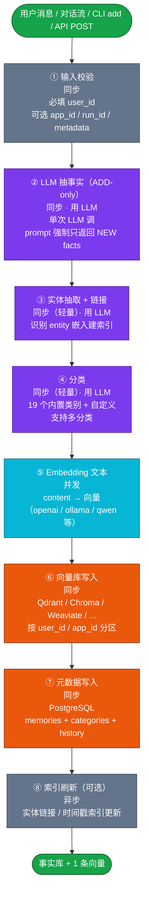
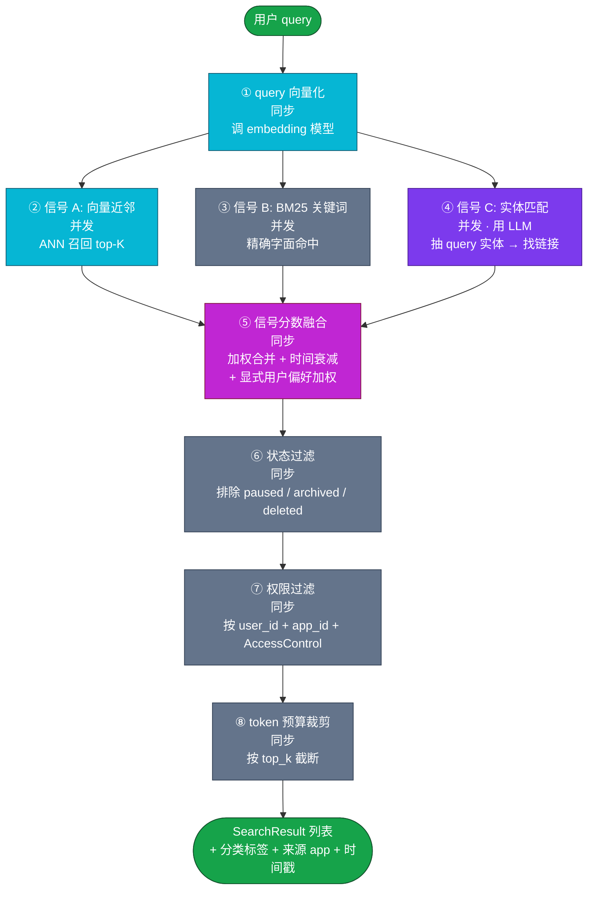
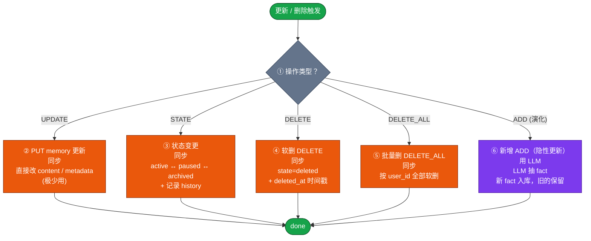
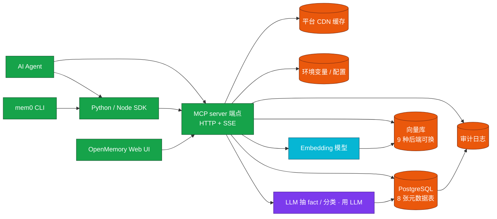

## RAG

- [项目分析 - Mem0（v0.1）](#项目分析---mem0v01)
  - [第一章 概述](#第一章-概述)
  - [第二章 写入流程](#第二章-写入流程)
  - [第三章 检索流程](#第三章-检索流程)
- [1. 检索](#1-检索)
- [2. 拼成 prompt](#2-拼成-prompt)
- [3. system prompt 注入](#3-system-prompt-注入)
- [4. 调 LLM](#4-调-llm)
- [5. 把新对话入库（累积）](#5-把新对话入库累积)
  - [第四章 更新与删除](#第四章-更新与删除)
  - [第五章 存储结构](#第五章-存储结构)
  - [参考文件及作用](#参考文件及作用)
# 项目分析 - Mem0（v0.1）

> 参考 v0.3 章节结构撰写；与 openviking、gbrain、graphrag、llm_wiki 文章并排阅读。

## 第一章 概述

### 1.1 这个项目解决什么具体问题？

Mem0 解决的是 **"AI 智能体跨会话失忆"** 的难题。

现代 AI Agent 即使上下文窗口很大，**也只在单次会话内"知道"用户**——跨会话、跨应用、跨用户后，Agent 不知道用户是谁、喜欢什么、过去说过什么。传统 RAG 把"知识"切成片段塞进 prompt，**用户层面的个性化无法累积**。Mem0 的解法：**把"用户状态"从"知识"中拆出来，做成独立的"记忆层"**。

Mem0 提供的不是知识库（documents → chunks → vectors），而是 **记忆层（messages → facts → user-state）**。每次对话，Mem0 自动从消息里抽"事实"（用户是素食主义者 / 偏好深色主题 / 在巴黎工作）→ 嵌入到向量库 → 跨会话累积。**下次对话时自动召回**。

Mem0 有 4 层记忆：

- **Conversation（对话内）**：单轮消息本身，存在当前 LLM 上下文里。
- **Session（任务内）**：本轮多步任务期间的临时状态，会话结束可清。
- **User（用户级）**：长期用户偏好、习惯，跨会话持续。
- **Organizational（组织级）**：跨用户共享的 FAQ / 政策 / 知识。

**核心抽象是"用户档案 + 应用隔离"**：每个 `user_id` 独立记忆空间，每个 `app_id` 独立应用上下文（同一用户在 chatbot / IDE / 邮件助手 3 个应用里的偏好互不干扰）。

### 1.2 设计思路是什么？

四条核心设计原则：

1. **ADD-only 提取（追加式）**：早期 Mem0 让 LLM 决定"加什么 / 改什么 / 删什么"，结果 LLM 误删频繁、回归严重。**新版算法改成纯追加**——LLM 只抽"新事实"，永不删除/覆盖旧事实。冲突通过时间戳 + 多版本共存处理。**官方 benchmark：LoCoMo 71.4 → 91.6（+20）、LongMemEval 67.8 → 94.8（+27）**。
2. **多信号融合检索（Multi-Signal）**：早期只做向量近邻，**漏召回**严重（人名 / 标识符 / 精确短语搜不到）。现在并行跑 **3 个信号**——**向量语义** + **BM25 关键词** + **实体链接（Entity Linking）**，最后**并行打分 + 融合**。
3. **四层记忆 + 显式 user_id / app_id 隔离**：用户记忆按 `user_id` 隔离；同一用户在不同应用（应用隔离）的记忆按 `app_id` 隔离；会话级记忆按 `run_id` 隔离。**所有操作强制传 `user_id`**，**防止跨用户泄露**。
4. **可插拔一切（Provider 模式）**：9 种向量库（Qdrant / Chroma / Weaviate / Redis / pgvector / Milvus / Elasticsearch / OpenSearch / FAISS）、10+ 种 LLM（OpenAI / Anthropic / Groq / Together / DeepSeek / Ollama 等）、多种 Embedder。**通过环境变量自动检测**当前部署用了哪个，不写一行代码就完成切换。

### 1.3 这个项目的亮点是什么？有什么优势？

| 亮点 | 说明 |
|------|------|
| **世界级 benchmark 表现** | LoCoMo 91.6 / LongMemEval 94.8 / BEAM-1M 64.1，超过 RAG / LangMem / Zep 等所有竞品。 |
| **ADD-only 算法 → 几乎不丢记忆** | 旧算法 UPDATE / DELETE 频繁误删；新算法只追加，**记忆持续累积**。 |
| **20+ 集成框架** | LangChain / LangGraph / CrewAI / Vercel AI SDK / AutoGen / Mastra / Dify / Flowise / LiveKit 等开箱即用。 |
| **一键 MCP 安装** | `npx @openmemory/install` 一行命令给 Claude Code / Codex / Cursor 配 MCP server。 |
| **Agent Skills** | `npx skills add` 安装 3 类技能（参考 / 集成 / 端到端），让 Claude Code 直接"懂"怎么用 mem0。 |
| **CLI + SDK + Server + Cloud Platform 四种形态** | 测试用 pip/npm 库；团队用自托管服务；想零运维用托管平台。**3 套代码库 = 1 套数据模型**。 |
| **完整时间感知（Temporal Reasoning）** | "用户现在喜欢 X" vs "用户以前喜欢 X"——能根据时间戳排序返回正确版本。 |
| **实体级记忆链接** | 抽"用户提到 Acme" + "Acme 是供应商" → 实体级图谱增强，召回时跨事实互相关联。 |
| **Agent 上下文工程生态** | 不是单一库，而是一整套"AI Agent 记忆工程"工具链——CLI、Skill、MCP、Cookbook、Platform 5 大产品线协同。 |
| **双部署 + 自动迁移** | 同一套 SDK 既能跑在自托管 Qdrant + 本地 Ollama 上，也能无缝切到云端托管；官方提供迁移工具。 |
| **多用户多应用权限隔离** | `user_id` + `app_id` + `AccessControl`（allow / deny 规则）三层隔离，**生产可用**。 |
| **细粒度分类** | 记忆自动分类到 19 个内置类别（Personal / Health / Work / Finance …），支持自定义。 |

---

## 第二章 写入流程

### 2.1 写入后的产物长什么样？给出实际例子

Mem0 的写入产物是 **一条"事实"**（memory）记录 + **一条向量索引**（在向量库里）。一条 memory 实际包含：用户 ID、应用 ID、事实文本、向量、状态、分类、时间戳。下面是一个真实用例——用户和 chatbot 聊了 5 句后，Mem0 自动产出的"事实库"：

**Memory 表里的实际记录**（典型 JSON 形态）：

| 字段 | 值（示例） |
|------|-----------|
| `id` | UUID 自动生成 |
| `user_id` | "alice"（用户标识） |
| `app_id` | "trip-planning"（应用标识） |
| `content` | "Alice prefers boutique hotels in Paris" |
| `vector` | 1536 维浮点数（OpenAI text-embedding-3-small） |
| `state` | "active"（active / paused / archived / deleted） |
| `metadata.categories` | `["Travel", "Preferences"]` |
| `metadata.source_app` | "trip-planning" |
| `created_at` | "2026-05-20T18:30:00Z" |
| `updated_at` | "2026-05-20T18:30:00Z" |

**典型一次对话触发的事实提取**（用户发了 5 条消息，Mem0 自动产出 ~10 条 facts）：

```
1. "User is Alex and prefers boutique hotels"           [Travel, Preferences]
2. "User plans a 5-day trip to Paris in Q3 2026"      [Travel, Goals]
3. "User has dietary preference: vegetarian"            [Health, Preferences]
4. "User is allergic to peanuts"                       [Health]
5. "User works as a freelance designer"                 [Work]
6. "User previously stayed at Hotel Le Marais (May 2024)"  [Travel, History]
7. "User prefers window seats for flights"             [Preferences, Travel]
8. "User's travel companion is his partner Sam"       [Relationships, Travel]
9. "User's passport expires 2028-03"                   [Travel, Legal]
10. "User mentioned trip budget cap of €3000"          [Finance, Travel]
```

**User 表 / App 表**（多用户多应用隔离）：

```
users:
  alice → {user_id: "alice", name: "Alice", email: "alice@ex.com", apps: [trip-planning, code-assistant]}
  bob   → {user_id: "bob",   name: "Bob",   email: "bob@ex.com",   apps: [trip-planning]}

apps:
  trip-planning (owner: alice)  → memories: [Alice 10 条旅行 facts + Bob 0 条]
  code-assistant (owner: alice) → memories: [Alice 5 条编程偏好 facts]
```

**Mem0 + OpenMemory 自托管服务的实际存储布局**（默认 Qdrant + Postgres）：

```
自托管栈（Docker Compose）：
├── 应用层（FastAPI 后端 + Next.js 前端）
├── 主存储
│   └── PostgreSQL（含 pgvector 扩展）
│       ├── users 表
│       ├── apps 表
│       ├── memories 表（事实 + 向量 + 分类 + 状态）
│       ├── memory_status_history 表（状态变更审计）
│       ├── memory_access_logs 表（访问日志）
│       ├── access_controls 表（权限规则）
│       ├── categories 表
│       └── configs 表（运行时配置）
└── 向量库（可独立部署）
    └── Qdrant / Chroma / Weaviate / Redis / pgvector / Milvus / Elasticsearch / OpenSearch / FAISS
        （存 memories.content 的嵌入）
```

**Mem0 Platform（云托管）的存储**（**租户隔离**）：

```
平台后端：
├── 元数据 PostgreSQL（用户 / 应用 / 权限 / 分类）
├── 平台自有向量库（生产规模）
├── 审计日志（access_logs / status_history）
├── Webhook 系统（memory 创建 / 更新 / 删除触发外部动作）
├── 异步分类 LLM 调用
└── 多租户隔离
```

### 2.2 数据怎么进？入口在哪？支持哪些数据源？

**入口有四类**：

| 入口 | 调用方式 | 用途 |
|------|----------|------|
| **Python SDK** | `pip install mem0ai` | **最常用**：AI Agent 集成 |
| **Node.js SDK** | `npm install mem0ai` | JS / TS 集成 |
| **HTTP API（自托管 OpenMemory 或云平台）** | REST 端点 | 跨语言集成 |
| **CLI** | `mem0 add` / `mem0 search` | 终端管理记忆 |
| **MCP server** | `npx @openmemory/install` 注入 Claude Code 等 | Agent 长期记忆后端 |

**支持的数据源**：

Mem0 **不是文档知识库**——它**只接"消息流"**（对话 / 事件）。支持：

| 来源 | 形式 |
|------|------|
| **对话消息数组** | `[{"role": "user", "content": "..."}, {"role": "assistant", "content": "..."}]` |
| **单条消息字符串** | `"I prefer dark mode"` |
| **事件 / 工具调用记录** | 任意能被 LLM 抽事实的文本 |
| **任意 LLM 流式输出** | 流式转录后批量送入 |

**Markdown / PDF / 网页 / 数据库 怎么进**：
- **Markdown / PDF / 网页 / 数据库**：**Mem0 不直接处理**——这些是"知识库"场景，属于 GraphRAG / LLM Wiki / OpenViking 这类系统的范围。Mem0 **只关心"消息 + 状态"**。如果要让 Mem0 知道 PDF 内容，先用其它工具（markitdown / pdf-extract）转成文本，按消息形式送入。

### 2.3 完整写入流程分几阶段？每阶段产什么？



**各阶段详解**：

1. **输入校验**（**无 LLM**）：强制 `user_id`（记忆归属谁），可选 `app_id`（哪个应用）/ `run_id`（哪个会话）/ `agent_id`（哪个 agent 产生）/ `metadata`（自定义标签）。**没有 `user_id` 直接拒绝**——这是防跨用户泄露的硬边界。
2. **LLM 抽事实（ADD-only）**（**关键，紫**）：**单次 LLM 调用**（v3 之前是 UPDATE/DELETE 多轮），prompt 严格规定：
   - "**只返回 NEW facts**"（不返回已存在的）
   - "**不 UPDATE / DELETE 现有事实**"
   - "**每条 fact 自包含**"（不依赖上下文）
   - "**返回 JSON 列表**"
3. **实体抽取 + 链接**（**轻量紫**）：从抽出的 fact 里识别实体（人 / 公司 / 地点 / 时间）→ 嵌入到独立实体向量空间 → 检索时可"实体级"互相关联。**比 LLM 抽 fact 快**（只针对少量 token）。
4. **分类**（**轻量紫**）：把每条 fact 分到 19 个内置类别（Personal / Health / Travel / Work / Finance …）或用户自定义类别。**支持多分类**（一条 fact 可同时是 Travel + Preferences）。
5. **Embedding**（**青**）：对每条 fact 文本 → 调 embedding 模型 → 向量。默认 `text-embedding-3-small`（1536 维）。官方推荐 **至少 Qwen 600M / 同级模型**获得最佳混合检索效果。
6. **向量库写入**（**橙**）：把向量 + 元数据（user_id / app_id / categories / state）写到向量库。**9 种后端可换**。向量库按 user_id / app_id 做逻辑分区，**保证隔离**。
7. **元数据写入**（**橙**）：PostgreSQL 写 `memories` 行 + `categories` 关联 + `memory_status_history` 审计行（如有状态变更）。
8. **索引刷新**（**可选，灰**）：异步更新实体链接 / 时间戳索引。

**关键观察**：
- **LLM 是绝对瓶颈**——单次调用决定所有事实提取质量。
- **ADD-only 杜绝回归**——LLM 没有"删除/覆盖"权限，所有事实永远累积。
- **embedding 一次**——后续检索都靠这次写的向量。
- **元数据 + 向量分离存储**——PG 存结构化数据，向量库存语义。

### 2.4 Agent 怎么操作这个工具写入？每个工具的作用是啥？具体的参数是什么？

Mem0 提供 **4 层 Agent 集成**：

#### **Python SDK（主要）**
**作用**：直接 Python import，最灵活。

| API | 作用 | 关键参数 |
|------|------|----------|
| `memory.add(messages, user_id, ...)` | 写入 / 抽取事实 | `messages`（消息数组或字符串，必填）；`user_id`（必填）；`app_id` / `run_id` / `agent_id` / `metadata` / `infer`（是否自动 LLM 抽取，默认 True）/ `output_format`（v1.1+） |
| `memory.search(query, user_id, ...)` | 检索相关事实 | `query`；`user_id`（必填）；`app_id` / `run_id`；`top_k`（默认 10）；`filters`（按 category / date 过滤） |
| `memory.get(memory_id)` | 按 ID 取单条 | `memory_id` |
| `memory.get_all(user_id, ...)` | 列某用户所有记忆 | `user_id`；`app_id` / `run_id`；`page` / `page_size`（分页） |
| `memory.update(memory_id, data)` | 更新单条 | `memory_id`；`data`（新内容） |
| `memory.delete(memory_id)` | 软删 | `memory_id` |
| `memory.delete_all(user_id, ...)` | 批量软删 | `user_id`；`app_id` |
| `memory.history(memory_id)` | 看状态变更 | `memory_id` |
| `memory.add(messages, user_id, ..., output_format={"type": "v1.1"})` | **v1.1 格式** | 输出结构化事实列表（带 `id` / `event` / `memory` 字段） |

#### **HTTP API（OpenMemory 自托管 + 云平台）**
**作用**：跨语言 / 跨平台集成。

| 端点 | 方法 | 作用 |
|------|------|------|
| `/api/v1/memories/` | GET | 列某用户记忆（分页 + 过滤） |
| `/api/v1/memories/` | POST | 创建记忆（带事实抽取） |
| `/api/v1/memories/{id}` | GET | 取单条 |
| `/api/v1/memories/{id}` | PUT | 更新 |
| `/api/v1/memories/{id}` | DELETE | 软删 |
| `/api/v1/memories/categories` | GET | 列所有分类 |
| `/api/v1/apps/` | GET/POST | 管理应用 |
| `/api/v1/users/` | GET/POST | 管理用户 |

#### **CLI**
**作用**：终端管理 / 调试。

| 命令 | 作用 |
|------|------|
| `mem0 init` | 初始化配置 |
| `mem0 add "<text>" --user-id alice` | 加一条 |
| `mem0 search "<query>" --user-id alice` | 搜 |
| `mem0 identify` | 看当前身份 |
| `mem0 config` | 配置 LLM / 向量库 |
| `mem0 agent-mode` | 一键配 Agent 模式 |

#### **MCP Server（AI Agent 长期记忆后端）**
**作用**：让 Claude Code / Codex / Cursor / Windsurf 等工具"自带"Mem0 长期记忆。

```bash
npx @openmemory/install local http://localhost:8765/mcp/<client-name>/sse/<user-id> --client <client-name>
```

| MCP 工具 | 作用 |
|------|------|
| `add_memories` | 加记忆 |
| `search_memories` | 搜记忆 |
| `get_memories` | 取单条 |
| `delete_memories` | 删 |
| `list_memories` | 列 |

#### **Agent Skills（Agent 提示词工程）**
**作用**：教 Claude Code 怎么把 Mem0 集成到自己的项目。

```bash
npx skills add https://github.com/mem0ai/mem0 --skill mem0-integrate
npx skills add https://github.com/mem0ai/mem0 --skill mem0-test-integration
```

**对 Agent 的提示**：
- **集成到现有项目** → `/mem0-integrate` 跑完整 TDD 流程（先写测试 → 集成 → 验证）。
- **快速测试** → 直接 `memory.add` + `memory.search`。
- **多用户多应用** → 每次调都传 `user_id` + `app_id`，**绝不复用**。

### 2.5 chunk 怎么切？大小？overlap？语义切分还是规则切分？

**Mem0 不切分**（**不按 token 切 chunk**）。

Mem0 的"事实提取单元"是**单条 fact（一句话）**——LLM 直接产出"Alice 喜欢精品酒店"这种自包含句子，**不需要分块**。每条 fact 独立成 memory。

**为什么不用 chunk 切分**：
- **chunk 是为"大文档 → 多片段检索"设计的**（传统 RAG）。
- **Mem0 是为"对话 → 多事实"设计的**——LLM 一次抽取就是 atomic fact 列表，**每条 fact 不需要再切**。
- 跨多条 fact 之间的关联由 **entity linking**（实体链接）处理，**不是用 overlap**。

**如果 fact 太长怎么办**：
- **LLM 抽 fact 时 prompt 强制"每条 fact 自包含"**——不要用"它" / "他"等代词，要完整主谓宾。
- 经验长度 **30-200 token**。太长 LLM 会拆，太短上下文丢失。
- **没有"overlap"概念**——**事实之间不重叠**。

**实体抽取 vs fact 抽取的"二级切分"**：
- **第一级（粗）**：LLM 抽 fact（整段对话 → 多个 fact）。
- **第二级（细）**：从 fact 里抽 entity（人 / 物 / 地 / 时间），entity 单独嵌入到实体向量空间。**这部分 token 量很小**（每个 entity 1-3 个 token），不做切分。

**唯一例外**：`memory.add` 单次接收**完整消息数组**——可以是几千 token 的长对话。**内部处理**是先调 LLM 抽 fact（LLM 处理能力范围内），再把每条 fact 嵌入。**LLM prompt 上下文窗口** 决定"一次能处理多少消息"，默认按 token 预算自动截断。

### 2.6 用 embedding 了吗？什么时候用的？用的什么模型？

**用了，2 处**：

1. **写入阶段 ⑤**：每条 fact 文本 → 调 embedding 模型 → 向量写入向量库。
2. **检索阶段 ①**：query 进库前调同一 embedding 模型向量化 → 向量库 ANN 近邻。

**embedding 模型**：
- **默认**：`text-embedding-3-small`（OpenAI，1536 维）。
- **推荐**：至少 **Qwen 600M / 同级** 获得最佳混合检索效果（`gte-Qwen2-1.5B-instruct`）。
- **可换**：OpenAI / Ollama / 自托管 / 任何 OpenAI 兼容 `/v1/embeddings` endpoint。

**支持矩阵**：

| Embedder | 配置方式 |
|----------|----------|
| OpenAI | `EMBEDDER_PROVIDER=openai` + `EMBEDDER_MODEL=text-embedding-3-small` + `OPENAI_API_KEY` |
| Ollama | `EMBEDDER_PROVIDER=ollama` + `EMBEDDER_MODEL=nomic-embed-text` + `OLLAMA_BASE_URL` |
| 自托管 | 任何 OpenAI 兼容 API endpoint |

**OpenMemory 自托管自动检测**：根据环境变量自动选 embedder，**零配置**。

**Mem0 Platform**：**托管，零配置**——平台自有 embedding 服务。

**写入流程中有哪些部分用了 LLM，prompt 是啥？**

| 阶段 | 用 LLM？ | 作用 |
|------|----------|------|
| ① 输入校验 | ❌ | 校验 user_id 必填 |
| ② 抽 fact（**单次必调**） | ✅ | "ADD-only 事实抽取"prompt |
| ③ 实体抽取 + 链接 | ✅ | 轻量级（输入小、输出小） |
| ④ 分类 | ✅ | 19 个内置类别 |
| ⑤ Embedding | ❌ | embedding 模型，不算 LLM |
| ⑥ 向量库写入 | ❌ | 直接写 |
| ⑦ 元数据写入 | ❌ | SQL INSERT |
| ⑧ 索引刷新 | ❌ | 后台任务 |

**核心 prompt 结构**：

#### ADD-only 事实抽取 prompt
```
SYSTEM: You are a Personal Information Extractor. Your job is to extract
  NEW, distinct facts about the user from the conversation.

  RULES:
  - Only return NEW facts. Do not repeat existing facts.
  - Do NOT update, delete, or modify any existing fact.
  - Each fact should be a self-contained sentence (no pronouns like "he/she/it").
  - Facts should be in third person ("User prefers..." not "I prefer...").
  - Return JSON list of strings.
  - If no new facts, return [].

USER:
  <conversation>
  {messages array}
  </conversation>

  Output JSON: ["fact 1", "fact 2", ...]
```

#### 分类 prompt
```
SYSTEM: Assign each memory to one or more categories from:
  - Personal, Relationships, Preferences, Health, Travel, Work,
    Education, Projects, AI/ML/Tech, Technical Support, Finance,
    Shopping, Legal, Entertainment, Messages, Customer Support,
    Product Feedback, News, Organization, Goals
  (or create new categories if needed)

USER:
  Memory: "{fact text}"
  Output JSON: {"categories": ["Travel", "Preferences"]}
```

**关键约束**：
- **ADD-only 绝对刚性** —— LLM 拒不改 / 删任何已有事实。
- **JSON 模式强制** —— 用 Pydantic 解析 facts 列表。
- **失败重试** —— LLM 解析失败 → 指数退避重试 → 失败的事实用降级（直接原文入库，不分类）。
- **缓存** —— 同一 (user_id, message_hash) 命中即跳过 LLM（v3 算法重要优化）。

---

## 第三章 检索流程

### 3.1 query 到结果分几阶段？每个阶段干了什么？产出了什么？

Mem0 检索采用 **3 信号并行 + 融合**架构，下图展示完整 pipeline：



**各阶段详解**：

1. **query 向量化**（**青**）：用与索引时相同的 embedding 模型把 query 变向量（1536 维）。
2. **信号 A：向量近邻**（**青，并发**）：ANN（Approximate Nearest Neighbor，近似最近邻）在向量库里找 top-K 相似 fact。**适合"语义近"查询**（"用户的工作" → 命中"Alice 是设计师"）。
3. **信号 B：BM25 关键词**（**灰，并发**）：BM25 算法做精确字面匹配。**适合"字面命中"查询**（"Alice 的护照号" → 命中含护照号的 fact）。**装了 `mem0ai[nlp]` 后启用**（默认用 spaCy）。
4. **信号 C：实体匹配**（**灰+紫，并发**）：从 query 抽实体（人 / 物 / 地）→ 查实体向量空间 → 找相关 fact。**适合"间接关联"查询**（"Acme 怎么样" → 通过 Acme 实体链接到"用户和 Acme 合作过"）。
5. **信号融合**（**品红**）：3 个信号并行打分 → 加权合并 + **时间衰减**（旧 fact 排序后置）+ **用户显式偏好加权**（用户标记 important 的 fact 优先）。**核心创新点**——不是简单 RRF，是**时间感知 + 偏好感知**融合。
6. **状态过滤**（**灰**）：排除 `paused` / `archived` / `deleted` 状态的 fact。
7. **权限过滤**（**灰**）：按 `user_id` + `app_id` + `AccessControl` 规则过滤——**任何 query 都必须传 user_id**，**绝不允许跨用户**。
8. **token 预算裁剪**（**灰**）：按 `top_k` 截断（默认 10）。

### 3.2 召回策略用了哪些？每个策略的作用是啥？参数怎么选？

| 策略 | 出现在哪 | 作用 | 关键参数 |
|------|----------|------|----------|
| **向量 ANN** | 信号 A | 语义近邻 | `top_k=10`（默认）；向量库 IVF / HNSW（Hierarchical Navigable Small World，分层导航小世界图索引） |
| **BM25 关键词** | 信号 B | 字面命中 | `top_k=10`；spaCy tokenizer（装了 nlp extras 后启用） |
| **实体链接** | 信号 C | 跨 fact 间接关联 | 实体向量空间 ANN |
| **时间衰减** | 融合 | "用户现在喜欢 X" vs "以前喜欢 X" | 半衰期可配 |
| **显式偏好加权** | 融合 | 用户标 important 的 fact 优先 | `metadata.priority` |
| **3-信号加权融合** | 融合 | 多路召回合并 | 权重可调（默认等权） |
| **状态过滤** | 后过滤 | 排除失效 fact | 默认排除 paused / archived / deleted |
| **权限过滤** | 后过滤 | 跨用户隔离 | 强制 `user_id` + `app_id` |
| **Top-K** | 全流程 | 候选条数 | `top_k=10`（默认） |
| **分类过滤** | 检索 | "只看 Travel 类" | `filters.categories` |
| **时间范围过滤** | 检索 | "最近 30 天的事实" | `from_date` / `to_date` |
| **应用范围过滤** | 检索 | "只看这个 app 的" | `app_id` |
| **reranker（可选）** | Mem0 Platform | 平台提供的 cross-encoder 精排 | 自动启用 |

**特意排除的策略**：
- **MMR 多样性**：Mem0 默认 top_k=10 + 多信号融合，**已隐式多样**。
- **HyDE / RAG-Fusion**：没实现——ADD-only + 多信号已足够好（benchmark 数据为证）。
- **query 改写**：没实现——multi-signal 已覆盖 paraphrase 场景。

**模式选择**：

| 用例 | 推荐模式 |
|------|----------|
| 通用 chatbot 记忆 | `top_k=5~10` + BM25 + 向量 |
| 客户支持（高召回） | `top_k=20` + 加 `nlp` extras |
| 个人推荐（高精准） | `top_k=3` + 时间衰减权重高 |
| 多模态（Mem0 Platform） | 平台自动 rerank |

### 3.3 检索流程中有哪些部分用了 LLM，prompt 是啥？

| 阶段 | 用 LLM？ | 作用 |
|------|----------|------|
| ① query 向量化 | ❌ | embedding 模型 |
| ② 向量近邻 | ❌ | ANN |
| ③ BM25 关键词 | ❌ | 算法计算 |
| ④ 实体匹配 | ❌（v3） | 预计算实体索引 |
| ⑤ 融合 | ❌ | 加权 + 衰减 |
| ⑥ ⑦ 过滤 | ❌ | SQL/向量库过滤 |
| ⑧ 裁剪 | ❌ | 数组截断 |

**全流程 LLM 0 调用**——**Mem0 检索比写入便宜得多**。这是设计哲学：写入端"重"（保证记忆质量），读取端"轻"（保证响应速度）。

**为什么检索不调 LLM**：
- **成本**：每次检索调 LLM 太贵（用户问 100 次问题 = 100 次 LLM）。
- **延迟**：LLM 1-3 秒，但用户期望 < 500ms。
- **一致性**：LLM 检索结果有随机性，不能保证可重现。
- **3 信号已足够**：官方 benchmark 显示 3 信号 + 时间衰减已经达 91.6 / 94.8。

**唯一例外**：
- **Mem0 Platform 云端**（可选）——可以用平台提供的 reranker（cross-encoder）精排 top-K。
- **self-hosted** 也能加 reranker，但**默认不开**。

### 3.4 检索结果怎么拼到 LLM prompt 里？给实际拼接好的 prompt 例子

Mem0 **不直接拼 prompt**——它返回**结构化数据**，由调用方（chatbot / Agent）自己拼。

#### 实际返回结构

```json
{
  "results": [
    {
      "id": "mem_abc123",
      "memory": "User is Alex and prefers boutique hotels",
      "categories": ["Travel", "Preferences"],
      "metadata": {
        "source_app": "trip-planning",
        "priority": 0.7,
        "created_at": "2026-05-20T18:30:00Z"
      },
      "score": 0.92,
      "vector_score": 0.88,
      "bm25_score": 0.5,
      "entity_score": 0.0
    },
    {
      "id": "mem_def456",
      "memory": "User has dietary preference: vegetarian",
      "categories": ["Health", "Preferences"],
      "score": 0.81,
      ...
    }
  ]
}
```

#### 调用方拼 prompt 例子（典型 chatbot）

```python
# 1. 检索
memories = memory.search("hotel preferences for Paris trip", user_id="alex", top_k=3)

# 2. 拼成 prompt
memories_str = "\n".join(
    f"- [{m['id']}] {m['memory']} (categories: {', '.join(m['categories'])})"
    for m in memories["results"]
)

# 3. system prompt 注入
system_prompt = f"""You are a helpful travel assistant.
Use the user's memories to personalize responses.
If a memory is relevant, reference it by its [id] in square brackets.

User Memories:
{memories_str if memories_str else "No relevant memories yet."}
"""

# 4. 调 LLM
messages = [
    {"role": "system", "content": system_prompt},
    {"role": "user", "content": "Find me a hotel for next week in Paris"}
]
response = openai_client.chat.completions.create(model="gpt-4o-mini", messages=messages)

# 5. 把新对话入库（累积）
memory.add(
    messages + [{"role": "assistant", "content": response.choices[0].message.content}],
    user_id="alex",
    app_id="trip-planning"
)
```

#### 实际拼接好的 prompt

```text
SYSTEM:
You are a helpful travel assistant.
Use the user's memories to personalize responses.
If a memory is relevant, reference it by its [id] in square brackets.

User Memories:
- [mem_abc123] User is Alex and prefers boutique hotels (categories: Travel, Preferences)
- [mem_def456] User has dietary preference: vegetarian (categories: Health, Preferences)
- [mem_ghi789] User plans a 5-day trip to Paris in Q3 2026 (categories: Travel, Goals)

---

USER: Find me a hotel for next week in Paris
```

**关键观察**：
- **Mem0 返回结构化 JSON**，不返回拼好的 prompt——**拼 prompt 是调用方的责任**（灵活）。
- **推荐拼接方式**：用 `id` + 内容 + 分类三件套，**最小化 token 浪费**。
- **`[id]` 引用**：让 LLM 在答案里 cite 记忆 ID，用户可点跳查看。
- **没找到记忆** → 显式 `No relevant memories yet.`，**不注入空字符串**。
- **`top_k` 不要太大**：5-10 最佳，再多反而稀释 prompt 注意力。

### 3.5 Agent 怎么操作这个工具检索？每个工具的作用是啥？具体的参数是什么？

#### **Python SDK（主要）**

| API | 作用 | 关键参数 |
|------|------|----------|
| `memory.search(query, user_id, ...)` | 检索相关事实 | `query`；`user_id`（**必填**）；`app_id` / `run_id`；`top_k=10` 默认；`filters={"categories": ["Travel"]}` |
| `memory.get_all(user_id, ...)` | 列用户所有记忆 | `user_id`；`app_id`；`page=1` `page_size=100` |
| `memory.get(memory_id)` | 按 ID 取单条 | `memory_id` |
| `memory.history(memory_id)` | 状态变更历史 | `memory_id` |

#### **HTTP API（自托管 / 云）**

| 端点 | 方法 | 作用 |
|------|------|------|
| `/api/v1/memories/` | GET | 列（含 `search_query` / `categories` / `from_date` / `to_date` 过滤 + 分页） |
| `/api/v1/memories/{id}` | GET | 取单条 |
| `/api/v1/memories/categories` | GET | 列所有分类 |

#### **MCP 工具**

| 工具 | 作用 |
|------|------|
| `search_memories` | 检索 |
| `get_memories` | 取单条 |
| `list_memories` | 列 |

#### **CLI**

```bash
mem0 search "hotel preferences" --user-id alice --top-k 5
```

**对 Agent 的提示**：
- **首选 Python SDK** — 最灵活、可流式、可批量。
- **生产用 HTTP API** — 跨语言、跨进程隔离。
- **Agent 集成首选 MCP** — 让 Claude Code / Codex 自带长期记忆。
- **多用户场景** —— 每个 `user_id` 单独记忆空间，**调用时必传**。
- **多应用场景** —— 同时传 `user_id` + `app_id`，**让同一用户在不同 app 的偏好隔离**。
- **检索后立即 add** —— 每次对话后**马上把消息入库**，**别等会话结束**（防崩溃丢）。

---

## 第四章 更新与删除

### 4.1 更新的整体流程是怎样的？

Mem0 的更新是**纯追加**，**没有"修改已有 fact"的 API**。但有**状态变更**和**少量特殊更新**：



### 4.2 更新的触发条件是啥？更新会更新哪些存储介质？

| 触发 | 操作 | 改哪些存储 |
|------|------|-----------|
| 修一条 fact 的 content / metadata | `PUT /api/v1/memories/{id}` | PostgreSQL `memories` 表 + 向量库（同条 fact 的向量**重 embed**） |
| 暂存一条 fact（"别再召回"） | `update_state(id, paused)` | `memories.state` + `memory_status_history` |
| 归档一条 fact | `update_state(id, archived)` | `memories.state` + `archived_at` + history |
| 恢复一条 fact | `update_state(id, active)` | 同上 |
| 软删一条 | `DELETE /api/v1/memories/{id}` | `memories.state='deleted'` + `deleted_at` + history |
| 批量软删某用户某应用全部 | `delete_all(user_id, app_id)` | 同上（按 user/app 范围） |
| 演化（"我改主意了"） | **不删旧 + 加新 fact** | 新加一行 memory（旧 fact 留作历史） |
| 元数据 | `metadata` JSON 字段更新 | `memories.metadata` + 索引 |

**更新会改这些存储**：

| 存储 | 更新时机 |
|------|----------|
| PostgreSQL `memories` 表 | 任何状态变更 / PUT / 软删 |
| PostgreSQL `memory_status_history` 表 | 任何状态变更 |
| PostgreSQL `memory_access_logs` 表 | 每次检索（读） |
| PostgreSQL `access_controls` 表 | 权限规则变更 |
| 向量库 | PUT content 时重 embed / 软删时软删除 |
| OpenMemory FastAPI 后端 | 元数据缓存失效 |
| Mem0 Platform 缓存层 | 多区域失效 |

### 4.3 Agent 怎么操作这个工具更新删除？每个工具的作用是啥？具体的参数是什么？

#### **Python SDK**

| API | 作用 | 关键参数 |
|------|------|----------|
| `memory.update(memory_id, data)` | 更新 content / metadata / categories | `memory_id`；`data={"content": "...", "metadata": {...}}` |
| `memory.delete(memory_id)` | 软删单条 | `memory_id` |
| `memory.delete_all(user_id, app_id=None)` | 批量软删 | `user_id`（必填）；`app_id`（可选） |
| **状态变更**（v1.1+ `output_format`） | `memory.add(..., output_format={"type": "v1.1"})` 之后，返回结构化结果（含 `event`: `ADD` / `UPDATE` / `DELETE` / `NONE`） | — |

#### **HTTP API**

| 端点 | 方法 | 作用 |
|------|------|------|
| `/api/v1/memories/{id}` | PUT | 改 content / metadata / categories |
| `/api/v1/memories/{id}` | DELETE | 软删 |
| `/api/v1/memories/{id}/state` | PUT | 改 state（active / paused / archived） |

**关键约束**：

- **没有"硬删"API**——所有删除都是软删（state=deleted）。**Mem0 故意不物理删除**——记忆层设计为"积累型"，**软数据不丢失**。
- **没有"覆盖"API**——`PUT memory` 是修当前行的 content，**不修改 fact 的语义**。想"修改一个事实"，**应该新增一条 fact** 描述新状态（旧 fact 留作历史）。
- **状态可恢复**——`paused` / `archived` 任何时候可改回 `active`。
- **删除"可逆"**（90 天窗口）—— 软删数据可由运维恢复（不开放给用户，但 Mem0 Platform 后台有兜底）。
- **批量删**按 `user_id` 必填——**不会误删其他用户**。

---

## 第五章 存储结构

### 5.1 用了哪几种存储？各存什么？数据结构是啥？有什么用处？

| 存储类型 | 后端 | 存什么 | 数据结构 | 用途 |
|----------|------|--------|----------|------|
| **关系数据库** | PostgreSQL 14+（含 pgvector 扩展） | **结构化元数据**：`users` / `apps` / `memories` / `categories` / `access_controls` / `memory_status_history` / `memory_access_logs` / `configs` | 标准 SQL 表 | 主存储 / 审计 / 权限 |
| **嵌入式向量库** | Qdrant（默认）/ Chroma / Weaviate / Redis / pgvector / Milvus / Elasticsearch / OpenSearch / FAISS | 每条 fact 的向量 + 元数据 | IVF / HNSW 索引 | 语义检索 / 实体检索 |
| **关系数据库内的向量** | pgvector（PostgreSQL 扩展，可选） | 同一份向量（如果不用独立 Qdrant） | ivfflat / hnsw 索引 | 单数据库部署 |
| **Web 缓存** | Mem0 Platform 边缘 CDN | 查询结果 + 频繁访问的 memory | Redis-like KV | 加速读取 |
| **审计日志** | JSON 日志文件 / Mem0 Platform 集中式日志 | 每次状态变更 / 权限检查 | 时间序列 | 合规 / 调试 |
| **配置文件** | 环境变量 / JSON / YAML | LLM / 向量库 / embedder / 业务规则 | 键值 | 部署配置 |
| **MCP 协议端点** | HTTP + SSE | 自托管服务的 stdio / SSE 端点 | JSON-RPC over HTTP | AI Agent 集成 |
| **Web 端会话** | Cookie / Session | OpenMemory 自托管前端登录态 | 标准 web session | 用户管理 |

**核心 9 张表**（PostgreSQL schema）：

| 表 | 关键字段 | 一行 = | 作用 |
|----|----------|--------|------|
| `users` | `id` `user_id` `name` `email` `metadata` `created_at` `updated_at` | 一个用户 | 多用户隔离 |
| `apps` | `id` `owner_id` `name` `description` `is_active` `metadata` | 一个应用 | 多应用隔离 + 归属 |
| `memories` | `id` `user_id` `app_id` `content` `vector` `metadata` `state`(active/paused/archived/deleted) `created_at` `updated_at` `archived_at` `deleted_at` | 一条 fact | 记忆层核心 |
| `categories` | `id` `name` `created_at` | 一个分类 | 19 内置 + 用户自定义 |
| `memory_categories` | `memory_id` `category_id` | 多对多关联 | 一条 fact 可多分类 |
| `access_controls` | `subject_type` `subject_id` `object_type` `object_id` `effect`(allow/deny) | 一条权限规则 | 跨用户 / 跨应用精细 ACL |
| `memory_status_history` | `memory_id` `old_state` `new_state` `changed_by` `changed_at` | 一次状态变更 | 完整审计 |
| `memory_access_logs` | `memory_id` `accessed_by` `access_type` `accessed_at` | 一次访问 | 读审计 / 调试 |
| `configs` | `key` `value` (JSON) | 一条配置 | 运行时配置 |

**Memory 状态机**：

```
active ←→ paused    （用户手动暂存 / 恢复）
  │
  ↓
archived  （归档，可恢复）
  │
  ↓
deleted   （软删，admin 可恢复）
```

### 5.2 存储之间的数据流怎么走？



**数据流走向**：

**写入时**：

```
memory.add(messages, user_id, app_id)
  ↓ LLM 调 1：抽 fact（ADD-only prompt）
  ↓ LLM 调 2：抽 entity
  ↓ LLM 调 3：分类
  ↓ Embedding：每条 fact → 向量
  ↓ PostgreSQL INSERT INTO memories
  ↓ PostgreSQL INSERT INTO memory_categories
  ↓ 向量库 UPSERT (vector + metadata)
  ↓ INSERT INTO memory_status_history (init)
  ↓ 触发 webhook（Platform）
```

**读取时**：

```
memory.search(query, user_id, app_id, top_k)
  ↓ Embedding：query → 向量
  ↓ 并发：
     信号 A: 向量库 ANN top-K
     信号 B: BM25 关键词 top-K
     信号 C: 实体向量空间 top-K
  ↓ 3 信号融合 + 时间衰减 + 偏好加权
  ↓ 状态过滤（排除 paused / archived / deleted）
  ↓ 权限过滤（user_id + app_id + ACL）
  ↓ token 预算裁剪 top-K
  ↓ INSERT INTO memory_access_logs
  ↓ 返回 SearchResult JSON
```

**更新 / 删除时**：

```
PUT /api/v1/memories/{id}
  ↓ 校验 user_id + app_id 权限
  ↓ 如改 content → 重 embed
  ↓ UPDATE PostgreSQL
  ↓ UPDATE 向量库
  ↓ INSERT INTO memory_status_history

DELETE /api/v1/memories/{id}
  ↓ 校验权限
  ↓ UPDATE memories SET state='deleted', deleted_at=now()
  ↓ 软删向量库对应条目
  ↓ INSERT INTO memory_status_history
```

**关键设计**：
- **元数据 + 向量分离**——PG 存结构化，向量库存语义，**两边独立扩缩容**。
- **软删是默认**——所有删除都是 `state='deleted'`，**事实永不消失**。
- **审计全留痕**——`memory_status_history` + `memory_access_logs` 两表覆盖所有写 + 读事件。
- **跨用户硬边界**——任何 API 调用都强制 `user_id`，**没有它直接 422/404**。
- **Platform 加 CDN**——云平台额外加一层边缘缓存，**热门 query 0ms 返回**。

---

## 参考文件及作用

> 本章列出参考过的源码 / 文档作用，**不展开代码**。

### 核心库

- **核心库（PyPI `mem0ai`）**：Python SDK；`Memory` 主类；`add` / `search` / `get` / `get_all` / `update` / `delete` / `delete_all` / `history` API；ADD-only 抽 fact；multi-signal 检索。
- **核心库（npm `mem0ai`）**：Node.js SDK；与 Python 版同 API。
- **ADD-only 抽 fact prompt 模块**：核心系统提示词 + 解析器；新版本算法核心。

### OpenMemory 自托管

- **`openmemory/api/app/`**：FastAPI 后端；`routers/`（memories / apps / users / config / stats / backup）；`models.py`（SQLAlchemy ORM）；`schemas.py`（Pydantic）；`database.py`（连接）；`utils/memory.py`（Mem0 客户端管理 + 9 种向量库自动检测）。
- **`openmemory/api/app/utils/prompts.py`**：19 个内置分类 prompt。
- **`openmemory/api/app/utils/categorization.py`**：分类 + 实体抽取 + 链接。
- **`openmemory/api/app/utils/permissions.py`**：`AccessControl` 规则检查。
- **`openmemory/api/app/mcp_server.py`**：MCP server（stdio + SSE 端点）。
- **`openmemory/compose/`**：9 种向量库 Docker Compose（qdrant / chroma / weaviate / redis / pgvector / milvus / elasticsearch / opensearch / faiss）。
- **`openmemory/ui/`**：Next.js + React Web UI；用户管理 + 记忆浏览 + 应用管理 + 统计。

### CLI

- **`cli/python/src/mem0_cli/`**：Python CLI；`init` / `add` / `search` / `config` / `agent-mode`。
- **`cli/node/src/commands/`**：Node.js CLI；同功能。
- **`cli/CLI_SPECIFICATION.md`**：CLI 行为规范。
- **`cli/cli-spec.json`**：CLI 命令定义。

### Agent 集成

- **`mem0-plugin/`**：Claude Code / Cursor / Codex 插件；hooks + MCP 配置。
- **`.claude-plugin/` / `.codex-plugin/` / `.cursor-plugin/`**：各 AI 工具的市场配置。
- **`docs/integrations/`**：LangChain / LangGraph / CrewAI / Vercel AI SDK / AutoGen / Mastra / Dify / Flowise / LiveKit 等 20+ 集成指南。
- **Agent Skills**：通过 `npx skills add` 安装的 3 类技能（mem0 / mem0-cli / mem0-integrate / mem0-test-integration）。

### 平台

- **`docs/platform/`**：云平台文档；`overview` / `quickstart` / `agent-signup` / `cli` / `mem0-mcp` / `webhooks` / `timestamp` 等。
- **`docs/core-concepts/memory-types.mdx`**：4 层记忆（conversation / session / user / org）详解。
- **`docs/components/`**：`llms/` / `embedders/` / `vectordbs/` / `rerankers/` 配置参考。

### 评估

- **`evaluation/src/`**：`rag.py` / `langmem.py` / `zep/` 对比基线。
- **`evaluation/metrics/`**：LLM-as-judge 评分器。
- **`evaluation/prompts.py`** + **`run_experiments.py`**：LoCoMo / LongMemEval / BEAM 评测驱动。
- **`docs/research`**：v3 新算法的 benchmark 报告（91.6 / 94.8 / 64.1）。

### 文档

- **`README.md`**：项目主文档；3 种部署模式（Library / Self-Hosted / Cloud Platform）+ 4 步 quickstart。
- **`LLM.md`**：Agent 专用上下文（项目地图 + 关键模式）。
- **`AGENTS.md`**：AI Agent 协作规范。
- **`docs/introduction.mdx`**：文档站首页。
- **`docs/open-source/overview.mdx`**：开源版本说明。
- **`docs/open-source/configuration.mdx`**：配置参考（LLM / embedder / 向量库）。
- **`docs/migration/`**：v2 → v3 迁移指南。
- **`docs/changelog/`**：版本变更日志。