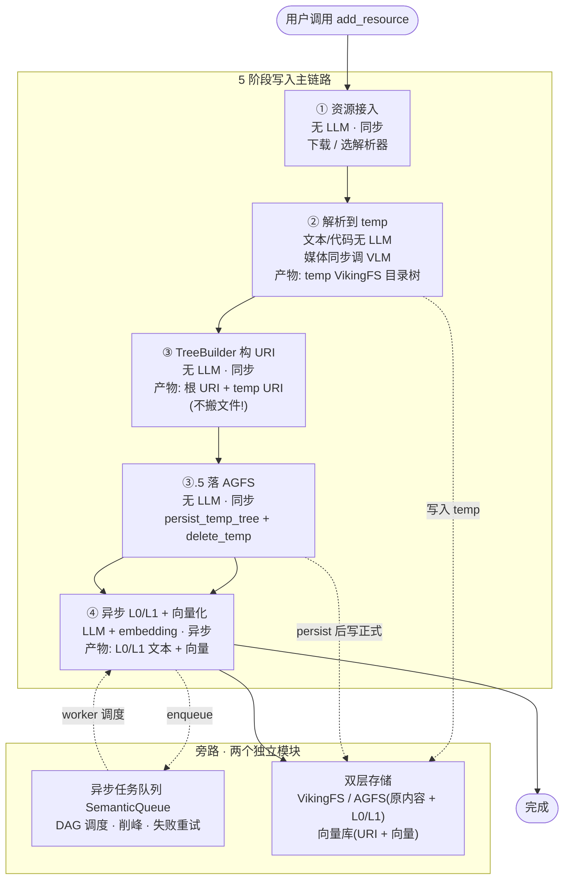
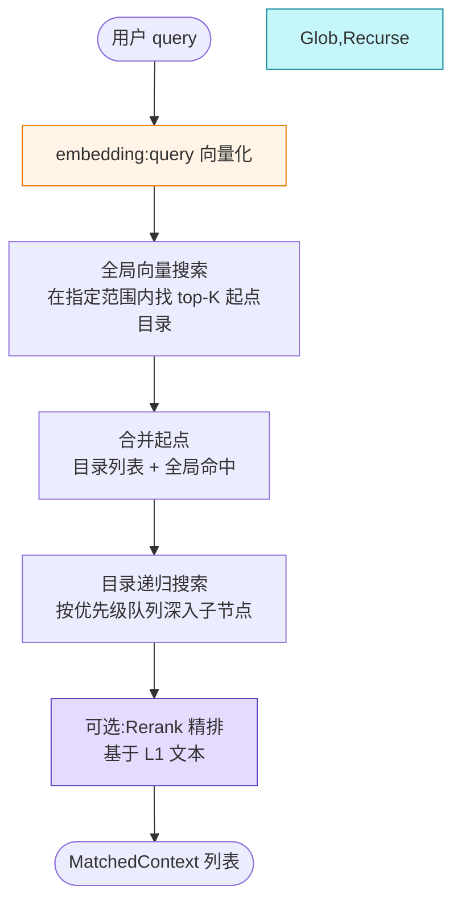
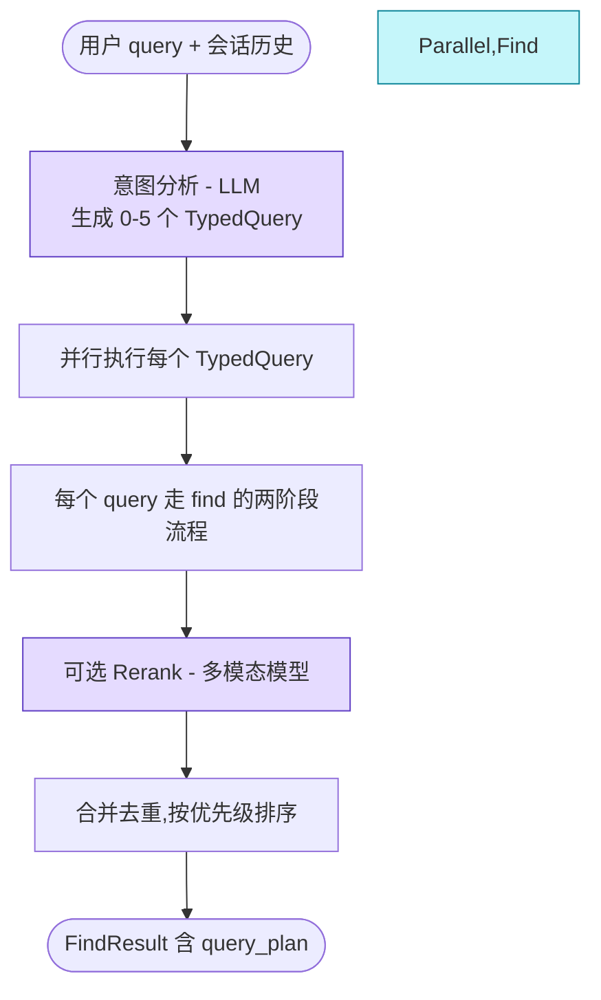
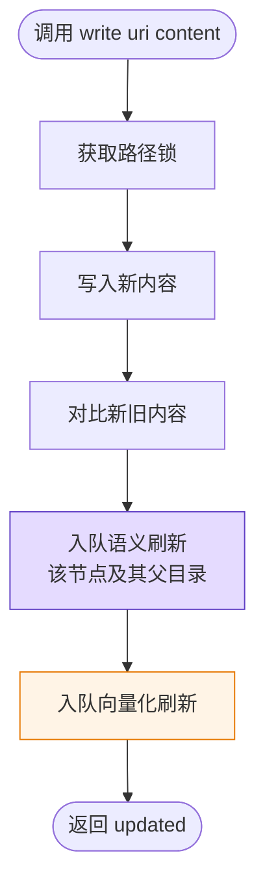
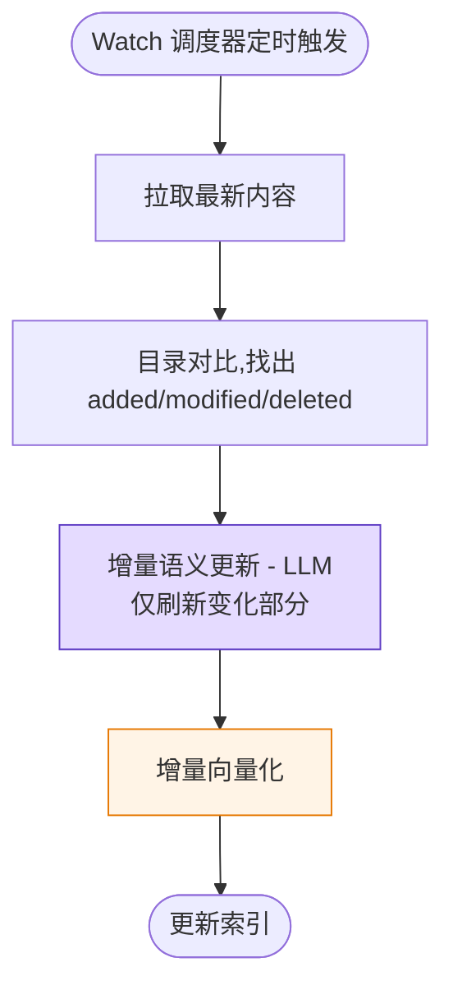
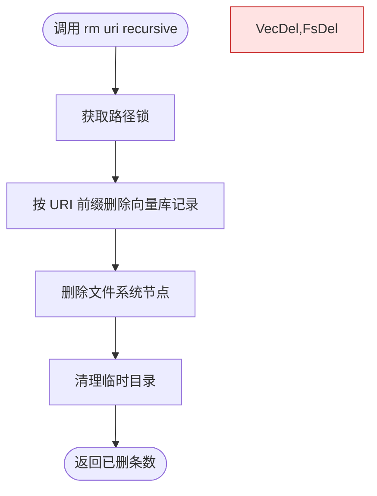
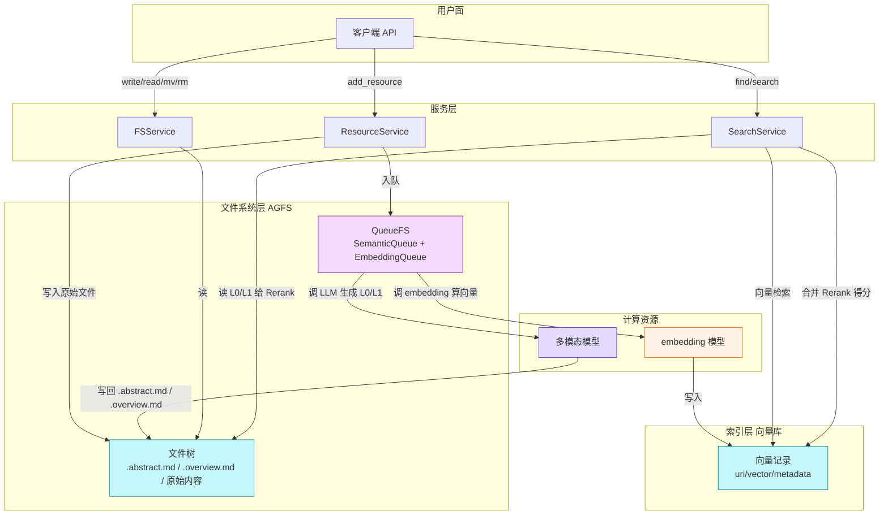

## RAG

- [项目分析 - OpenViking（v0.1）](#项目分析---openvikingv01)
  - [第一章 概述](#第一章-概述)
  - [第二章 写入流程](#第二章-写入流程)
  - [第三章 检索流程](#第三章-检索流程)
  - [第四章 更新与删除](#第四章-更新与删除)
  - [第五章 存储结构](#第五章-存储结构)
  - [参考文件及作用](#参考文件及作用)
# 项目分析 - OpenViking（v0.1）

## 第一章 概述

### 1.1 这个项目解决什么具体问题？

OpenViking 解决的是 **AI Agent 的上下文管理难题**。Agent 在长任务中需要持续读取三类东西：
1. **资源（Resource）**：文档、代码库、规范等外部知识；
2. **记忆（Memory）**：从用户交互中学到的偏好、事件、经验；
3. **技能（Skill）**：可调用的能力定义（脚本、MCP 工具等）。

传统 RAG 把这三类东西散落在向量库、关系库、KV 里，开发者要在多个系统间搬运数据；同时传统 RAG 的检索是"扁平化"的，没有全局视角，Agent 拿不到完整上下文。OpenViking 用一个统一的 **文件系统范式**（把一切当成文件和文件夹）把这三类上下文组织起来，再叠加层级加载和目录递归检索。

### 1.2 设计思路是什么？

三条核心设计原则：

1. **文件系统范式取代碎片化存储**：所有上下文都是 `viking://` 下的文件/目录，读写用统一的文件操作接口。
2. **三层信息模型 L0/L1/L2**：每个节点都有"摘要—概览—详情"三种粒度，按需加载，节省 Token。
3. **目录递归检索 + 重排**：先全局向量检索定位起点目录，再按目录树逐层往下钻，配合 Rerank 精排。

### 1.3 这个项目的亮点是什么？有什么优势？

| 亮点 | 说明 |
|------|------|
| **文件系统范式** | 开发者用 `ls/read/write/mv/rm` 这类直觉接口就能操作上下文，不用关心底层是向量还是 KV |
| **三层粒度（L0/L1/L2）** | 检索时先看 L0 摘要，过滤后再读 L1 概览，仅在需要时打开 L2 全文，显著降低 Token 消耗 |
| **目录递归检索** | 利用目录结构作为天然的分层索引，避免"扁平 RAG"丢失上下文的问题 |
| **可观察的检索轨迹** | 记录每一步的命中率、分数、Rerank 前后变化，便于调优 |
| **三类上下文统一管理** | Resource、Memory、Skill 共享同一套检索与存储机制 |
| **会话自迭代** | 自动压缩对话历史，提取长期记忆，让 Agent "越用越聪明" |
| **多种存储后端可插拔** | 文件部分支持本地/S3/内存；向量部分支持本地/Qdrant/Volcengine VikingDB |

---

## 第二章 写入流程

### 2.1 写入后的产物长什么样？

写入完成后，文件系统里出现一个**树形目录**，每个目录节点都自动带上三件套（隐式存在）：

```
viking://resources/my-doc/                 ← 资源根节点
├── .abstract.md                          ← L0：~100 词的极简摘要（向量检索用）
├── .overview.md                          ← L1：~1-2k 词的导航文档（Rerank 用）
├── chapter-1.md                          ← L2：原始章节内容（按需读取）
└── chapter-2/
    ├── .abstract.md
    ├── .overview.md
    └── section-a.md
```

> **注意：`.relations.json` 不在这个自动产物里**。目录节点只会自动生成 `.abstract.md` 和 `.overview.md` 两个派生文件,关联表需要用 `link()` / `unlink()` 显式维护(见 2.3 工具表)。

- **L0 / .abstract.md**：一句话讲清这个节点是什么、谁该用、核心关键词。这是向量检索时实际比对的文本。
- **L1 / .overview.md**：结构化 Markdown，含目录导航 + 各子节点的简要描述。这是 Rerank 阶段比对的文本。
- **L2 / 原始文件**：完整内容，结构由解析器决定（如 Markdown 解析器按标题切章节；代码解析器保留源码；PDF 解析器按页切分）。
- **`.relations.json`**(可选,手动):目录级关联表,扁平 list 格式,只在调过 `link()` 后才存在(见 2.3 `link` 工具)。

每个节点的元数据（URI、上下文类型、向量、稀疏向量、父 URI、创建时间等）同时落到向量库，**向量库不存文件内容，只存引用**。

### 2.2 数据怎么进？入口在哪？支持哪些数据源？

**入口**有两类：
1. **本地调用**：`client.add_resource(path, ...)`，path 可以是本地路径、URL 或 Git 仓库地址。
2. **HTTP 接口**：`POST /api/v1/resources` 或 `openviking-server`。

支持的数据源很广，分四大类：

| 类别 | 典型格式 | 处理方式 |
|------|----------|----------|
| 文档类 | PDF / Markdown / Word / HTML / EPUB / TXT | 按标题/段落切分为目录树 |
| 表格演示 | Excel / PowerPoint | 按工作表/幻灯片切分 |
| 代码类 | 各种代码文件 / Git 仓库 / GitHub URL | AST 骨架提取（≥100 行）或 LLM 摘要 |
| 媒体类 | 图片 / 视频 / 音频 | 多模态模型理解后转文字 |
| 云文档 | 飞书 docx / wiki / sheets / bitable | 通过飞书 API 拉取后转 Markdown |

### 2.3 Agent 怎么操作这个工具？

OpenViking 把核心能力导出成 **MCP 工具**给 Agent 用，下面是**写入相关**的 5 个工具（`find` / `search` 是检索工具，见第 3 章）：

#### `add_resource(path, to, parent, reason, instruction, wait, build_index, summarize, ...)` ← **主入口**
**作用**：把本地文件 / URL / Git 仓库写入 `viking://` 上下文库，触发 2.4 节的写入流程。

| 参数 | 类型 | 必填 | 默认 | 作用 |
|------|------|------|------|------|
| `path` | `str` | ✅ | — | 本地路径、`http(s)://` URL 或 `git@` / `ssh://` / `git://` 仓库地址 |
| `to` | `str` | ❌ | `None` | 精确目标 URI；省略则落到 `viking://resources/{sanitized_name}`，同名时自动加唯一后缀 |
| `parent` | `str` | ❌ | `None` | 父 URI，自动生成子节点名（**与 `to` 互斥**，同时传会报错） |
| `reason` | `str` | ❌ | `""` | 处理原因，缺省时回退到 `instruction`，**透传给 L0/L1 生成**，影响摘要倾向 |
| `instruction` | `str` | ❌ | `""` | 同 `reason`，优先级更高 |
| `wait` | `bool` | ❌ | `False` | 是否阻塞到异步 L0/L1 + 向量化完成；`False` 时立刻返回 |
| `timeout` | `float` | ❌ | `None` | `wait=True` 时的最长等待时间 |
| `build_index` | `bool` | ❌ | `True` | 是否立刻建向量索引 |
| `summarize` | `bool` | ❌ | `False` | 是否生成摘要 |
| `**kwargs` | — | ❌ | — | 透传给解析器链，例如 `strict` / `ignore_dirs` / `include` / `exclude` |

#### `write(uri, content, mode="replace", wait=False, timeout=None)` ← **修改已有节点**
**作用**：直接覆盖 / 追加已有 URI 的内容，写完后会**自动重生成该节点 + 父目录的 L0/L1 并刷新向量**（详见 4.1 类型 A）。

| 参数 | 类型 | 默认 | 作用 |
|------|------|------|------|
| `uri` | `str` | — | 目标 URI（必须已存在） |
| `content` | `str` | — | 文本内容 |
| `mode` | `str` | `"replace"` | `"replace"` 覆盖 / `"append"` 追加 |
| `wait` | `bool` | `False` | 同 `add_resource`，阻塞等异步完成 |
| `timeout` | `float` | `None` | 同上 |

#### `add_skill(data, wait=False, timeout=None)` ← **写入技能定义**
**作用**：把一份技能定义（脚本 / MCP 工具描述）写入 `viking://skills/` 作用域。`data` 可以是路径或结构化数据；后续 Agent 通过 `find` / `search` 检索到技能后可以调用。

#### `link(from_uri, uris, reason="")` ← **建立资源关联**
**作用**：在 `from_uri` 目录下写一条关联,生成 `from_uri/.relations.json`(**纯 AGFS write,无 LLM,无向量化**)。`from_uri` 必须是目录;`uris` 是一个或多个目标 URI。

| 参数 | 类型 | 默认 | 作用 |
|------|------|------|------|
| `from_uri` | `str` | — | 源目录 URI,关联表写在它的 `.relations.json` 里 |
| `uris` | `str` / `list[str]` | — | 一个或多个目标 URI |
| `reason` | `str` | `""` | 关联说明,会进 JSON 字段 |

**典型流程**:鉴权(双向) → 读旧 `.relations.json`(不存在则 `[]`) → 生成 `link_N` id(不和已有重复) → append → 整 list 写回。

#### `unlink(from_uri, uri)` ← **断开资源关联**
**作用**:从 `from_uri` 的 `.relations.json` 里删掉包含 `uri` 的那条关联;如果某 entry 删空,整个 entry 也删。**幂等**——`uri` 不在表里 debug log 一行就返回,不报错。

#### `relations(uri)` ← **读关联列表**
**作用**:读 `uri/.relations.json` 里的全部关联,返回 `List[Dict]`,每条含 `id` / `uris` / `reason`。文件不存在返回 `[]`。

#### 三个关键约束(派生文件 + 导出 + 隐藏)

| 约束 | 含义 |
|------|------|
| **派生文件白名单** | `.abstract.md` / `.overview.md` / `.relations.json` 这三个用户**不能直接 `write()`**——`_validate_target_uri` 会拦。要写关联必须走 `link()` / `unlink()` |
| **ovpack 导出排除** | 导出 .ovpack 备份时**不打包** `.relations.json`(关系是本地视图,跨实例无意义) |
| **WebDAV 隐藏** | 外部 WebDAV 客户端**看不到**这个文件(防止绕过 link/unlink 直接改) |

对于 LLM Agent（如 Claude / GPT / Codex），OpenViking 可以把文件系统操作导出成 **MCP 工具**（Model Context Protocol，一种让 LLM 调用外部工具的标准协议），Agent 通过 `ls/read/write/find/search/add_resource` 等工具就能操作整个上下文库。MCP 工具定义会自动从工具描述生成。

调用时一般流程是：
```
Agent 思考 → 选择工具（find / add_resource / write） → 传参数 → OpenViking 执行 → 返回结构化结果
```

### 2.4 完整写入流程分几阶段？每阶段产什么？

写入被刻意拆成"**解析（无 LLM / 部分 VLM）+ 语义（异步有 LLM）+ 向量化（异步无 LLM）**"三段，避免阻塞用户。：



下面逐段说明。

#### 阶段 1：资源接入（**无 LLM**，同步）
- URL → 用 HTTP 下载；Git → `git clone`（默认浅克隆）；本地路径 → 直接读取。
- 数据源类型（按扩展名或 MIME 类型）决定走哪个解析器。

#### 阶段 2：解析到 temp（**文本/代码无 LLM，媒体同步调 VLM**）
- 解析器把原始内容拆成"文件树"，写到 VikingFS 的**临时目录**（`viking://temp/...`），**不直接落 AGFS**。
- **文本/代码解析器**（`MarkdownParser` / `CodeRepositoryParser`）是纯规则切分，**无 LLM**。
- **媒体解析器**（`ImageParser` / `VideoParser` / `AudioParser`）**同步调用 VLM**（多模态模型）生成图片描述 / 视频关键帧描述 / 音频转写。
- 产物：一棵写在 **temp VikingFS** 的资源目录树，文件内容完整，但还没有 L0/L1。

#### 阶段 3：TreeBuilder 构建 URI（**无 LLM**，同步）
- **TreeBuilder 不搬文件**，只构建 URI 元数据（根 URI、temp URI、候选 URI）。
- 里面只有 `_root_uri` / `temp_uri` / `_candidate_uri`，**不触发任何文件操作**。

#### 阶段 3.5：落 AGFS（**无 LLM**，同步）
- **真正把 temp 目录树搬到正式 AGFS 位置**是这一步，不是阶段 3。
- 代码调用：
  - `viking_fs.persist_temp_tree(temp_uri, root_uri, ctx)` 复制 temp 内容到正式路径
  - `viking_fs.delete_temp(parse_result.temp_dir_path, ctx)` 清理临时目录
- 顺便按 URI 粒度获取 path lock，避免并发写同一资源时冲突。
- 产物：资源目录树已经稳定地落在正式 VikingFS / AGFS 路径上，可以被外部读。

#### 阶段 4：异步 L0/L1 + 向量化（**LLM + embedding 异步**）
- 调用 `Summarizer.summarize()`，对每个资源 URI 构造 `SemanticMsg`，**入队 SemanticQueue**。
- SemanticQueue 的 worker（`SemanticProcessor`）**同一个处理流程里**：
  1. 调 LLM 生成 L0（`.abstract.md`）和 L1（`.overview.md`）
  2. 调 embedding 模型把 L0/L1 文本写成向量写进向量库
- **L0/L1 生成和向量化是同一个 worker 的两步**，不是两个独立阶段。可选 `skip_vectorization=True` 跳过第 2 步。
- 调度策略：**自底向上 DAG**（先叶子 → 父目录 → 根），每个目录节点都基于子节点的摘要生成自己的 L0/L1。并发量受配置项控制（默认 10），失败可重试，去重靠 `SemanticMsg.id`。
- 产物：L0（`.abstract.md`）+ L1（`.overview.md`）落到 AGFS，对应向量写进向量库。

> **这 5 个阶段不会创建 `.relations.json`**。关联表需要 5 阶段跑完后,由用户/Agent 显式调 `link()` / `unlink()` 单独维护(见 2.3 工具表)。

### 2.5 chunk 怎么切？大小？overlap？语义切分还是规则切分？

OpenViking **不是按 token 切片然后独立索引**的传统 RAG，而是**按"目录节点"切分**——每个文件/子目录都是一个独立的索引单元。具体规则：

| 文档类型 | 切分方式 | 大小阈值 |
|----------|----------|----------|
| Markdown | 按标题层级分章；小章节（< 512 token）合并相邻；大章节（> 1024 token）独立成子目录 | 默认段落最大 ~2048 token |
| PDF / Word | 按页/章节转 Markdown 后按上面规则处理 | — |
| 代码（AST 模式） | 文件 ≥100 行 → 提取 AST（抽象语法树，即代码的"骨架结构"）摘要；< 100 行 → 整体 | — |
| 代码（LLM 模式） | 整体交给 LLM 总结 | — |
| 图片/音视频 | 整体作为节点，由多模态模型描述 | — |

**没有传统意义的 overlap**（滑动窗口时前后文本相互重叠一小段），因为粒度是"目录节点"而不是"token 切片"，父子节点本身就有摘要—原文的天然冗余。

#### Markdown 切分细节（≥ 2048 token 时的具体行为）

Markdown 解析器在 `markdown.py` 里维护两个阈值 + 一个硬上限：

| 阈值 | 默认值 | 含义 |
|------|--------|------|
| `DEFAULT_MAX_SECTION_SIZE` | **2048** token | 段落目标上限 |
| `DEFAULT_MIN_SECTION_TOKENS` | **512** token | 小于这个的"尾巴"会被并到前一块 |
| `max_section_chars`（硬上限） | **6000** 字符 | 兜底防 token 估算偏差 |

**当某个章节 > 2048 token 时**（代码入口：`markdown.py:_smart_split_content`），按下面规则切：

1. **按段落切粒度**：`content.split("\n\n")`，先按空行分段。
2. **规则 A — 单段超长**（token > 2048 **或** 字符 > 6000）：**强制按字符硬切**，每 6000 字符一个 chunk（这种切法**不保证结构完整性**——标题、列表项可能被截断）。如果当前累积的尾巴 < 512 token，**先并到这个超长段里**一起切，避免产生一个只有几十 token 的 `section_1.md`。
3. **规则 B — 累积超阈值**：当前块再追加会超 2048 token 或 6000 字符 → 把当前块 flush 成一个新文件，开新块。
4. **规则 C — 还能装下**：追加到当前块。
5. **结尾"小尾巴"回收**：切完后如果最后一块 < 512 token，**折回去拼到倒数第二块**，避免出现一个孤立的小尾巴文件。

**典型场景：**

| 输入 | 切分结果 |
|------|---------|
| 整篇 < 4000 token | 保留原文件名,单文件 |
| 一个 3000 token 的章节(无小节) | 按段落切成 2 个文件,各 ≤ 2048 token |
| 一个 5000 token 的章节(无小节) | 按段落切成 3 个文件 |
| 单段 8000 字符(超大表格/代码块) | 按字符硬切,可能切 2 段,中间 6000 字符处会被截断,**结构不保** |
| 切完最后剩 200 token 的尾巴 | 折回到倒数第二块,不单独成文件 |

### 2.6 用 embedding 了吗？什么时候用的？用的什么模型？

**用了**，但仅在两处：

1. **写入阶段 4**：对每个节点算向量写进向量库。**注意：目录节点写 2 条(L0 + L1),叶子文件写 1 条**。
   - **目录节点**:`SemanticProcessor` 先调 LLM 生成 `.abstract.md`(L0)和 `.overview.md`(L1),然后调 embedding 把**两份文本**都向量化,一次性入队 2 条记录(`embedding_utils.py:213 expected = 2`)。
   - **叶子文件**:向量化**文件内容本身或 summary_dict**(由 `use_summary` 参数控制),1 条记录。
2. **检索阶段**:用户 query 进来时,先用同一个 embedding 模型把 query 转成向量,再去向量库做最近邻搜索。

**为什么 L0 和 L1 都向量化?** 检索时两个粒度各管一段:
- **L0 向量**——粗筛,先用一句话摘要定位相关目录(`find` 阶段 1 用)
- **L1 向量**——精排,Rerank 阶段用详细概览打分(`find` 阶段 3 用)
- 返回时用 `level=[0]/[1]/[2]` 控制带哪层(见 3.6 `find`/`search` 参数)

模型是**可插拔**的,配置文件中指定 provider(openai/volcengine/jina 等)和 model 名称,默认使用 OpenAI 兼容接口。embedding 既可以是 dense(稠密向量,传统语义向量)也可以是 sparse(稀疏向量,类似关键词权重),还可以二者混合(hybrid,稠密+稀疏结合),由 backend 决定。

---

## 第三章 检索流程

### 3.2 query 到结果分几阶段？每个阶段干了什么？产出了什么？

OpenViking 有两个检索入口：`find()`（简单检索，无会话）和 `search()`（带会话上下文的智能检索）。

#### `find()` 的两阶段流程



1. **全局向量搜索**：在指定 URI 范围内搜 top-K 候选（默认 10），命中的是 L0 级别的目录节点。
2. **目录递归搜索**：把候选目录作为起点，用优先级队列深入子目录，每层都做向量搜索，并对得分做"分数传播"（子节点得分结合父节点得分）。
3. **可选 Rerank**：用 Rerank 模型（一种"对候选重新打分"的模型）精排，比对的是 L1 文本而不是 L0。
4. **返回 `MatchedContext` 列表**，含 URI、L0/L1 文本、得分、关联资源等。

#### `search()` 的三阶段流程（**多了一步 LLM 意图分析**）



多出来的阶段：

1. **意图分析**：调用 LLM，输入包括"会话压缩摘要 + 最近 5 条消息 + 当前 query + 目标目录摘要"，输出 0-5 个 `TypedQuery`（每个含：query 改写、上下文类型、意图、优先级）。
2. **并行执行**：每个 TypedQuery 独立跑一遍 `find` 流程。
3. **合并去重**：按上下文类型（resource/memory/skill）分组，按优先级排序。

### 3.3 检索流程中有哪些部分用了 LLM，prompt 是啥？

| 阶段 | 使用 LLM？ | 作用 | prompt 模板位置（逻辑） |
|------|------------|------|----------------------|
| `find()` 全流程 | ❌ | 纯向量 + Rerank（可选） | — |
| `search()` 意图分析 | ✅ | 把多轮对话改写为多个子 query | "你是 OpenViking 的上下文查询规划器，负责分析任务上下文缺口并生成查询…" |
| `search()` Rerank | ✅（若开启） | 对候选用 L1 文本重新打分 | 取决于 Rerank provider（默认 volcengine doubao-seed-rerank） |

意图分析的 prompt 大致结构是：

```
你是一个上下文查询规划器。给定会话摘要、最近消息、当前问题，输出 0-5 个查询计划。
每个查询包含：context_type（resource/skill/memory）、query（改写后的查询）、priority（1-5）。
如果只是闲聊则输出空列表。
```

### 3.4 召回策略用了哪些？每个策略的作用是什么？参数怎么选？

OpenViking 的召回策略是 **"全局向量召回去定起点 + 目录递归向量召回深入"**，配合 **Rerank 精排**。没有用 BM25（一种传统关键词匹配算法）或 HyDE（让 LLM 先虚拟一个答案再去搜）这类策略。

| 策略 | 作用 | 关键参数 |
|------|------|----------|
| **全局向量召回** | 在指定 URI 范围内找相似度最高的目录节点，作为递归起点 | top-K 默认 10；可调 |
| **目录递归召回** | 按优先级队列深入子目录，每层向量检索 | 最多 3 轮无变化则收敛；并发数限制 4 |
| **分数传播** | 子节点得分结合父节点得分 | α=1.0 表示完全用子节点得分（忽略父节点得分） |
| **可选 Rerank** | 用 L1 文本精排，弥补向量检索的"词面不相似但语义相关"盲区 | threshold 阈值；不配置则用纯向量得分 |
| **按 level 过滤** | 可指定只返回 L0 / L1 / L2 | `level=[0]` 只返回摘要级；`level=[1,2]` 返回概览+详情 |

### 3.5 检索结果怎么拼到 LLM prompt 里，给实际拼接好的 prompt 例子？

OpenViking 本身**不做 prompt 拼接**——它把检索到的 `MatchedContext` 列表（每个含 L0/L1 文本、URI、得分）返回给调用方，由调用方决定怎么塞给 LLM。

常见的拼接模式（OpenViking README 给的伪代码模式）：

```text
你是一个智能体,可以使用以下上下文回答用户问题。

【任务】
{用户的 query}

【可用上下文】
[1] (resource, score=0.87) viking://resources/api-docs/oauth.md
   L0: OAuth 2.0 授权码流程说明,适用于第三方登录场景。
   L1: ## OAuth 章节 ...（略）

[2] (resource, score=0.81) viking://resources/api-docs/jwt.md
   L0: JWT 令牌生成与校验,适用于服务间调用。
   L1: ## JWT 章节 ...（略）

【回答要求】
- 优先基于【可用上下文】回答
- 引用上下文时标注编号 [1] [2]
- 上下文不足时明确说明
```

### 3.6 Agent 怎么操作这个工具？

Agent 通过 MCP 工具调用。**检索相关**的工具主要是 `find` 和 `search` 两个（文件 / 内容读取类的 `ls` / `read` / `abstract` / `overview` 不算检索，这里不展开）。两个工具参数签名见 `sync_client.py`，Agent 在规划时根据"是否需要 LLM 改写 query"来选：

#### `find(query, target_uri, limit, score_threshold, filter, level, ...)` ← **轻量检索**
**作用**：**不调 LLM**，纯向量召回 + 目录递归 + 可选 Rerank。适合单轮 query 或对延迟敏感的场景。流程就是 3.2 节的 `find()` 两阶段。

| 参数 | 类型 | 默认 | 作用 |
|------|------|------|------|
| `query` | `str` | — | 检索词 |
| `target_uri` | `str` / `list[str]` | `""` | 检索范围（可传多个 URI，搜完合并）。例：`"viking://resources/"` |
| `limit` | `int` | `10` | 返回条数 |
| `score_threshold` | `float` | `None` | 最低分过滤，低于此分的候选被丢弃 |
| `filter` | `dict` | `None` | 元数据过滤，例：`{"context_type": "resource"}` |
| `level` | `list[int]` | `None` | 只返回指定层级：`[0]`=L0 摘要 / `[1]`=L1 概览 / `[2]`=L2 全文 |
| `time_field` | `str` | `None` | 时间过滤字段名（如 `"created_at"`） |
| `since` / `until` | `str` | `None` | 时间窗口（ISO 时间字符串） |
| `peer_id` | `str` | `None` | 按会话 peer 过滤 |

**返回** `List[MatchedContext]`，每条含 `uri` / `L0` / `L1` / `score` / 关联资源等字段。

#### `search(query, target_uri, session, session_id, limit, score_threshold, filter, level, ...)` ← **智能检索**
**作用**：在 `find` 之上**多一步 LLM 意图分析**——把多轮对话 + 当前 query 改写成 0-5 个 `TypedQuery`（含 `context_type` / `priority`），每个子 query 并行跑 `find` 流程，再合并去重。完整流程见 3.2 节的 `search()` 三阶段图。

| 参数 | 类型 | 默认 | 与 `find` 的差异 |
|------|------|------|-----------------|
| `query` | `str` | — | 同 `find` |
| `target_uri` | `str` / `list[str]` | `""` | 同 `find` |
| `session` | `Session` | `None` | 传入会话对象，会带上**会话压缩摘要 + 最近 5 条消息**做意图分析 |
| `session_id` | `str` | `None` | 传 session ID，等价于传入对应 Session |
| `limit` / `score_threshold` / `filter` / `level` / `time_field` / `since` / `until` / `peer_id` | ... | ... | 同 `find` |

**返回** `FindResult`，**比 `find` 多一个 `query_plan` 字段**，结构大致是：

```
FindResult(
    contexts=[...],              # 同 find 的 MatchedContext 列表
    query_plan=[
        TypedQuery(context_type="resource", query="OAuth 2.0 授权码流程", priority=5),
        TypedQuery(context_type="resource", query="第三方登录接入",       priority=3),
    ]
)
```

如果只是闲聊，LLM 会输出空 `query_plan`（等价于"不搜"），返回的 `contexts` 也是空列表。

#### 怎么选

| 场景 | 选 `find` | 选 `search` |
|------|----------|-----------|
| 单轮 query | ✅ | 也行但杀鸡用牛刀 |
| 多轮对话、需要结合上下文改写 | ❌ 改写不了 | ✅ 必选 |
| 对延迟敏感（< 100ms） | ✅ 纯向量 | ❌ 多一次 LLM 调用 |
| 想看到 LLM 怎么拆解 query | ❌ | ✅ 返回 `query_plan` |
| 需要按 context_type 分组（resource/skill/memory） | ❌ | ✅ `search` 内置分组 |

---

## 第四章 更新与删除

### 4.1 更新的整体流程是怎样的？

OpenViking 有三种"更新"语义：

#### 类型 A：文件内容修改（`write`）



流程：写新内容 → 触发语义队列重新生成该节点 + 父目录的 L0/L1 → 触发向量化队列刷新向量。**使用 LLM** 重新生成摘要。

#### 类型 B：周期性增量同步（Watch Task）



针对代码仓库等会持续更新的源，用户在 `add_resource` 时指定 `watch_interval > 0`，OpenViking 会创建一个 WatchTask 持久化（保存到文件系统），由调度器按间隔触发同步。

#### 类型 C：移动（`mv`）

`mv(old_uri, new_uri)` 会同步更新向量库中所有以 `old_uri` 为前缀的记录的 `uri` 和 `parent_uri` 字段，保持"文件系统—向量库"的一致性。

### 4.2 更新的触发条件是啥？更新会更新哪些存储介质？

| 触发方式 | 触发者 | 更新范围 |
|----------|--------|----------|
| `client.write(uri, content)` | 用户/Agent | 触发该节点 + 父节点的 L0/L1 重新生成；向量库对应记录刷新 |
| `client.add_resource(..., watch_interval=...)` | 调度器 | 按 interval 周期拉取源，对比后增量更新（仅变化的部分） |
| `client.mv(old, new)` | 用户/Agent | 向量库 URI 字段更新（无 LLM 调用） |
| 父目录有子节点更新 | 系统自动 | 自动把子节点摘要聚合后重新生成该目录的 L0/L1 |

### 4.3 Agent 怎么操作这个工具？

Agent 通过 MCP 工具调用 `write` 或 `mv` 完成更新；如果需要周期性同步，需要在创建资源时让用户/Agent 指定 `watch_interval`，调度器会自动管理。

### 4.4 删除流程



`rm(uri, recursive=True)` 是幂等的：先删向量库记录（按 URI 前缀批量删），再删文件系统内容，最后清理临时目录。如果目标被锁（正在语义处理中）则报错。

---

## 第五章 存储结构

### 5.1 用了哪几种存储？各存什么？存储的数据结构是什么？

OpenViking 采用**双层存储**：文件系统存原始内容，向量库存索引。两层通过 URI 关联，**向量库不存文件内容，文件系统不存向量**。

| 存储层 | 存什么 | 数据结构 | 用途 |
|--------|--------|----------|------|
| **AGFS（文件存储）** | L0/L1/L2 文本、媒体原文件、`.relations.json`、`.abstract.md`、`.overview.md` | 文件系统树 | 内容读取、详情渲染、关系管理 |
| **向量库（索引）** | **目录节点 2 条**(L0 摘要 + L1 概览),**叶子文件 1 条**(内容或 summary);每条含 `level` 字段(0/1/2)标识粒度 | 一行一条记录，主键是 URI | 语义检索(粗筛 + 精排),过滤 |

#### AGFS 文件存储
AGFS 是一个可插拔的文件系统抽象，支持三种后端：
- `localfs`：本地文件系统（默认）。
- `s3fs`：S3 兼容对象存储。
- `memory`：内存存储（仅测试）。

每个目录的标准结构（隐式自动维护）：
```
<uri>/
├── .abstract.md      # L0 摘要（向量检索比对文本）
├── .overview.md      # L1 概览（Rerank 比对文本）
├── .relations.json   # 关联资源表
└── *.md / 子目录     # L2 原始内容
```

#### 向量库
每个上下文节点对应一条记录，字段包括：

| 字段 | 类型 | 说明 |
|------|------|------|
| `id` / `uri` | string | 主键，资源 URI |
| `parent_uri` | string | 父目录 URI |
| `context_type` | string | resource / memory / skill |
| `is_leaf` | bool | 是否叶子节点（文件） |
| `vector` | float[] | 稠密向量（基于 L0） |
| `sparse_vector` | dict | 稀疏向量（基于 L0） |
| `abstract` | string | L0 文本（用于 Rerank 时也能反查） |
| `name` / `description` | string | 展示用 |
| `created_at` / `updated_at` | string | 时间戳 |
| `active_count` | int64 | 使用频次（影响 hotness 热度计算） |

支持的向量库后端：本地、Qdrant、Volcengine VikingDB、HTTP 代理。

### 5.2 存储之间的数据流怎么走？



**关键路径**：

1. **写入流**：`add_resource` → 解析 → AGFS 落原始文件 → Queue 入任务 → 后台 worker 调多模态模型生成 L0/L1 写回 AGFS → 调 embedding 写向量库。
2. **检索流**：`find/search` → 向量库召回 → AGFS 读 L1 给 Rerank → 合并得分返回。
3. **删除/移动流**：先改向量库（按 URI 前缀删/改 URI），再改 AGFS，锁服务保证顺序。

两层存储**通过 URI 强绑定**：AGFS 是"唯一数据源"，向量库只是"索引"。删除时按 URI 前缀批量清理，保证一致。

---

## 参考文件及作用

### 概述与架构（对应第一章）
- `README.md` / `README_CN.md`：项目定位、设计原则、亮点概述。
- `docs/en/concepts/01-architecture.md`：系统架构图、模块划分、部署模式。
- `docs/en/concepts/02-context-types.md`：Resource / Memory / Skill 三类上下文定义与示例。
- `docs/en/concepts/03-context-layers.md`：L0/L1/L2 三层信息模型的设计与生成机制。

### 写入流程（对应第二章）
- `docs/en/concepts/06-extraction.md`：解析、TreeBuilder、语义队列、AST 模式等。
- `docs/en/api/02-resources.md`：支持的资源类型、4 阶段流水线、Watch Task。
- `openviking/parse/parsers/*.py`：各格式解析器实现（markdown.py / pdf.py / code.py 等）。
- `openviking/utils/resource_processor.py`：协调 4 阶段写入的核心类。
- `openviking/utils/summarizer.py`：把 L0/L1 生成任务入队。
- `openviking/storage/queuefs/semantic_processor.py`：自底向上生成 L0/L1 的 worker。
- `openviking/prompts/templates/semantic/*.yaml`：生成 L0/L1 用的 LLM prompt 模板。
- `openviking/prompts/templates/parsing/*.yaml`：解析阶段 LLM prompt 模板。
- `openviking/core/mcp_converter.py`：把工具定义转成 MCP 格式（Agent 集成用）。

### 检索流程（对应第三章）
- `docs/en/concepts/07-retrieval.md`：find 与 search 的对比、目录递归检索、Rerank 策略。
- `docs/en/api/06-retrieval.md`：find/search 接口、参数、返回值。
- `openviking/service/search_service.py`：检索服务入口。
- `openviking/storage/viking_fs.py`（search / find 方法）：检索核心实现。
- `openviking/retrieve/intent_analyzer.py`：用 LLM 做意图分析生成 TypedQuery。
- `openviking/retrieve/hierarchical_retriever.py`：目录递归检索 + Rerank 精排。
- `openviking/prompts/templates/retrieval/intent_analysis.yaml`：意图分析的 LLM prompt。

### 更新与删除（对应第四章）
- `docs/en/api/02-resources.md`：Watch Task 机制、增量更新语义。
- `openviking/storage/content_write.py`：write 协调器，写入后入队刷新。
- `openviking/resource/watch_manager.py`：周期性同步任务的增删改查。
- `openviking/resource/watch_scheduler.py`：周期性同步的调度器。
- `openviking/storage/viking_fs.py`（rm / mv 方法）：删除与移动时的向量库同步。

### 存储结构（对应第五章）
- `docs/en/concepts/05-storage.md`：双层存储（AGFS + 向量库）的官方说明。
- `openviking/storage/viking_fs.py`：文件系统抽象层（URI ↔ 路径映射、读写、L0/L1 读取）。
- `openviking/storage/queuefs/queue_manager.py`：异步队列管理器。
- `openviking/storage/queuefs/semantic_queue.py` / `embedding_queue.py`：两类队列实现。
- `openviking/storage/transaction/lock_manager.py`：路径锁与资源锁。
- `openviking/storage/vectordb_adapters/*.py`：向量库后端适配（local / qdrant / volcengine 等）。
- `openviking/storage/collection_schemas.py`：向量库的 schema 定义。