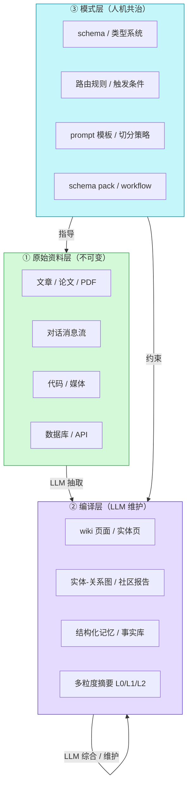
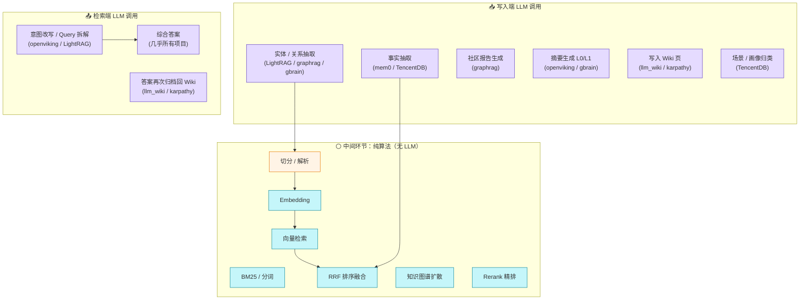
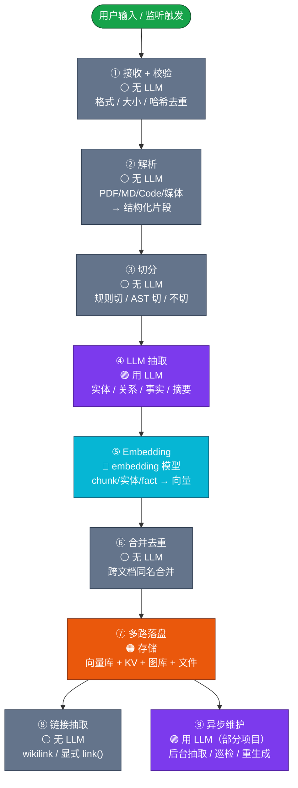
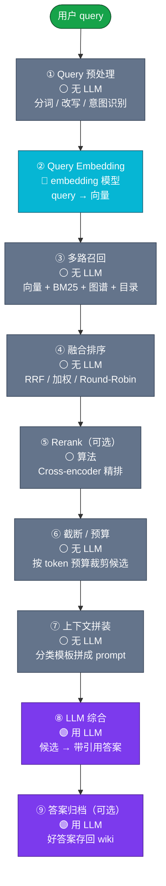
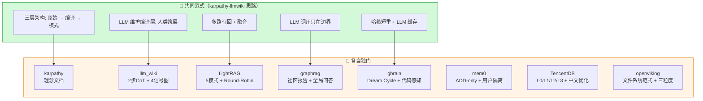

## RAG

- [知识库 / RAG 系统项目分析 - 总览（v0.1）](#知识库-rag-系统项目分析---总览v01)
- [第一章 总体范式（共同点）](#第一章-总体范式共同点)
  - [1.1 共同的设计哲学](#11-共同的设计哲学)
  - [1.2 共同的三层架构](#12-共同的三层架构)
  - [1.3 共同的"LLM 介入边界"](#13-共同的llm-介入边界)
  - [1.4 共同的检索范式](#14-共同的检索范式)
  - [1.5 共同的存储范式](#15-共同的存储范式)
  - [1.6 共同的"分块"思路](#16-共同的分块思路)
- [第二章 共同的写入套路](#第二章-共同的写入套路)
  - [2.1 标准写入流水线](#21-标准写入流水线)
  - [2.2 八个项目在标准流水线上的具体差异](#22-八个项目在标准流水线上的具体差异)
  - [2.3 写入阶段共同的设计模式](#23-写入阶段共同的设计模式)
- [第三章 共同的检索套路](#第三章-共同的检索套路)
  - [3.1 标准检索流水线](#31-标准检索流水线)
  - [3.2 检索阶段共同的"上下文拼装"模板](#32-检索阶段共同的上下文拼装模板)
  - [3.3 检索阶段共同的设计模式](#33-检索阶段共同的设计模式)
- [第四章 每个项目的特别之处](#第四章-每个项目的特别之处)
  - [4.1 karpathy-llmwiki — 思想源头](#41-karpathy-llmwiki-思想源头)
  - [4.2 llm_wiki（社区实现版）— 最贴近 Karpathy 原意](#42-llm_wiki社区实现版-最贴近-karpathy-原意)
  - [4.3 LightRAG — 最简洁的"知识图谱 + 向量"实现](#43-lightrag-最简洁的知识图谱-向量实现)
  - [4.4 graphrag — 解决"全局问答"](#44-graphrag-解决全局问答)
  - [4.5 gbrain — 最工程化的"脑"](#45-gbrain-最工程化的脑)
  - [4.6 mem0 — Agent 的"用户级记忆"](#46-mem0-agent-的用户级记忆)
  - [4.7 TencentDB-Agent-Memory — LLM Agent 的多层记忆系统](#47-tencentdb-agent-memory-llm-agent-的多层记忆系统)
  - [4.8 openviking — Agent 的文件系统范式](#48-openviking-agent-的文件系统范式)
- [第五章 横向对比](#第五章-横向对比)
  - [5.1 一图总览](#51-一图总览)
  - [5.2 横向对比表](#52-横向对比表)
  - [5.3 项目之间的"血缘关系"](#53-项目之间的血缘关系)
- [第六章 选型建议](#第六章-选型建议)
- [第七章 名词解释](#第七章-名词解释)
  - [7.1 RRF（Reciprocal Rank Fusion，倒数排名融合）](#71-rrfreciprocal-rank-fusion倒数排名融合)
  - [7.2 Round-Robin（轮转调度）](#72-round-robin轮转调度)
  - [7.3 Cross-encoder（Rerank 精排）](#73-cross-encoderrerank-精排)
# 知识库 / RAG 系统项目分析 - 总览（v0.1）

> 对 8 个项目的横向分析：**总套路**（共同点） + **每个的特别之处**。
>
> 涵盖项目：karpathy-llmwiki（理念）、LightRAG、TencentDB-Agent-Memory、gbrain、graphrag、llm_wiki（社区实现版）、mem0、openviking。
>
> 大部分范式都源自 karpathy-llmwiki 提出的"LLM Wiki 模式"——**让 LLM 当知识库管理员，人类当内容策展人；知识被编译一次、持续维护，而非每次查询重新派生**。

---

# 第一章 总体范式（共同点）

## 1.1 共同的设计哲学

8 个项目虽然形态各异（轻量哲学文档 / 单文件 RAG 库 / 多脑持久化引擎 / SaaS 记忆平台 / Agent 文件系统），但骨子里都在回答同一个问题：

> **怎么让 AI Agent 拥有"长期记忆"或"长期知识库"，而不是每次都从原始资料重新出发？**

围绕这个问题，它们共享了五条基本共识：

1. **"原始资料不可变，派生层可改"**：原始源 / 消息流是单一可信源（Source of Truth）；所有索引、向量化、抽取、摘要都是派生层，可以重建、可以重写。
2. **"知识被编译一次、持续维护"**：写入时用 LLM 把原始内容"编译"成结构化知识（实体、关系、记忆、社区报告、wiki 页面……）；查询时直接用编译产物，而不是重新做一遍抽取。
3. **"人类做策展，LLM 做整理"**：人负责选源、定 schema、问问题；LLM 负责摘要、抽取、链接、维护。
4. **"多路召回 + 融合"是检索的标配**：单靠向量检索漏召回严重，所有项目都把向量 + 关键词（BM25） + 图谱/实体等信号叠加。

## 1.2 共同的三层架构

几乎所有项目都遵循 Karpathy 的"原始资料层 → Wiki/记忆层 → Schema 层"架构，只是命名不同：



**关键观察**：
- 三层不是"数据-逻辑-配置"的硬分层，而是"信任级别"的硬分层——**原始资料 > 编译产物 > 模式配置**。所有项目都把"如何保证原始资料不被污染"作为一等公民设计。
- "模式层"是项目之间差异最大的地方：karpathy-llmwiki 就是一份 Markdown 哲学文档；gbrain 是一套可插拔的 schema pack；mem0 是固定的 user_id/app_id/run_id 三元组隔离规则。

## 1.3 共同的"LLM 介入边界"

8 个项目对"LLM 应该在哪儿调、调几次"有惊人一致的看法。下图把所有项目的 LLM 调用点画在一起（**紫框 = 用 LLM**）：



**共同设计原则**：
- **写入重，读取轻**：所有重 LLM 推理（实体抽取、关系抽取、社区报告生成、Wiki 页面撰写）都集中在离线索引阶段。查询阶段只做少量 LLM 综合。
- **LLM 不直接写盘**：LLM 输出"结构化 JSON / Markdown"，应用层校验后才落盘——防 LLM 写出畸形内容。

## 1.4 共同的检索范式

7 个项目都做"多路召回 + 融合 + 综合"，但具体组合不同。下表是横向对比（karpathy-llmwiki 是理念原型，无实现，详见 4.1）：

| 项目 | 向量召回 | BM25/分词召回 | 图谱召回 | Rerank | 综合用 LLM | 备注 |
|------|:--------:|:------------:|:--------:|:------:|:----------:|------|
| **llm_wiki（社区版）** | ✅（可选） | ✅ | ✅（4信号 + Louvain 社区） | ❌ | ✅ | 召回率 58%→71%（开向量） |
| **LightRAG** | ✅（3张向量表） | ❌ | ✅（图遍历） | ❌ | ✅ | 5 种检索模式 + Round-Robin |
| **graphrag** | ✅（3张向量表） | ❌ | ✅（Leiden 社区） | ❌ | ✅（map-reduce） | 解决"全局问答" |
| **gbrain** | ✅ | ✅（RRF 融合） | ✅（知识图谱扩散） | ✅ | ✅（think 接口） | 唯一内置 Rerank |
| **mem0** | ✅ | ✅ | ❌（用实体链接代替） | ❌ | ✅ | 用户级隔离 |
| **TencentDB** | ✅（vec0） | ✅（FTS5） | ❌ | ❌ | ✅（仅场景/画像） | 场景导航 + 画像常驻 System |
| **openviking** | ✅（L0/L1 双粒度） | ❌ | ✅（目录递归） | ✅（可选） | ✅（意图分析） | 三层粒度摘要 |

**共同点**：
- **几乎所有项目都至少做"向量 + 关键词"两路召回**，gbrain / mem0 / TencentDB 三个做得最规范（都用 RRF 倒数排序融合算法融合）。
- **Rerank 不是标配**——只有 gbrain 和 openviking 把 Rerank 当一等公民，多数项目靠 LLM 在综合阶段自己判别。
- **图谱召回有两种流派**：LightRAG / graphrag 走"实体-关系图 + 社区检测"；llm_wiki / gbrain 走"多信号相关图 + 社区"；openviking 走"目录递归"。

## 1.5 共同的存储范式

8 个项目用的存储介质高度重叠——**向量库 + 关系表 + 文件系统**是三大支柱：

| 存储类型 | 典型用途 | 使用项目 |
|----------|----------|----------|
| **向量库**（pgvector / LanceDB / Faiss / Qdrant / Milvus 等） | 存 chunks/entities/facts 的 embedding | 几乎所有 |
| **关系型数据库**（PostgreSQL / SQLite） | 存元数据、状态、关系表、权限、审计 | gbrain / mem0 / TencentDB |
| **图数据库 / 图算法**（NetworkX / Neo4j / Leiden） | 存实体-关系图、社区结构 | LightRAG / graphrag |
| **文件系统 / Markdown** | 存原始源、Wiki 页、笔记 | karpathy / llm_wiki / openviking |
| **KV 存储**（JSON / Redis） | 存 LLM 缓存、配置、状态 | LightRAG / gbrain / mem0 |
| **对象存储**（S3 / Blob） | 存大文件、媒体、备份 | graphrag / openviking |
| **BM25/FTS5 倒排索引** | 存分词索引、关键词召回 | TencentDB / mem0 |

**关键观察**：没有哪个项目只用一种存储。**多存储协作**是常态——通常的做法是"向量库管语义、关系表管结构、文件系统管人类可读、KV 管临时状态"。

## 1.6 共同的"分块"思路

8 个项目的 chunk 策略惊人一致：

| 策略 | 默认参数 | 使用项目 |
|------|----------|----------|
| **Token 切分 + overlap** | 1000-1200 token / 100-200 overlap | LightRAG / graphrag / gbrain |
| **Markdown 标题感知递归切分** | 800-1500 字符 / 200 overlap | llm_wiki / openviking |
| **代码 AST 切分**（tree-sitter） | 按函数/类/类型 | gbrain / openviking |
| **媒体整段 + 多模态模型描述** | 整图/整视频一段 | gbrain / openviking |
| **不切分**（整条 fact / 整页） | LLM 抽出的就是 atomic unit | mem0 |

**共同点**：
- **chunk 大小都集中在 800-1500 字符 / 200-400 token**。经验平衡点。
- **overlap 都是 10-20%**——防"想法在段间断开"。
- **元数据前缀是标配**——把 title / date / source 拼到每块开头，避免后续块丢失上下文。
- **代码和媒体都有特殊处理**——不能按 token 切代码（撕裂语法结构）；媒体走多模态模型先转文字。

---

# 第二章 共同的写入套路

## 2.1 标准写入流水线

把所有项目的写入流程叠在一起，能提炼出一条"通用版"流水线：



## 2.2 八个项目在标准流水线上的具体差异

| 阶段 | karpathy | llm_wiki | LightRAG | graphrag | gbrain | mem0 | TencentDB | openviking |
|------|:--------:|:--------:|:--------:|:--------:|:------:|:----:|:---------:|:----------:|
| ① 接收 | 手动放源文件夹 | UI / API / 监听 | `insert()` / 文件 | `graphrag index` | CLI / MCP / Webhook | SDK / API / CLI | 自动捕获 | `add_resource()` |
| ② 解析 | 用户自己 | Rust 多格式解析器 | 内置 reader | markitdown | 自带 + skill | 不需要 | Jieba 分词 | 解析器链 |
| ③ 切分 | LLM 自己决定 | Markdown 递归切 | Token 1200/100 | Token 1200/100 | Token+AST | **不切** | **不切** | 目录节点粒度 |
| ④ LLM 抽 | 2 步 CoT | 2 步 CoT | 实体+关系 + gleaning | 实体+关系+claim | takes/facts | **ADD-only fact** | L1 fact | L0/L1 摘要 |
| ⑤ Embedding | 可选 | 可选 | 3 张向量表 | 3 张向量表 | 单向量 | 单向量 | 单向量 | L0+L1 双向量 |
| ⑥ 合并 | LLM 写 | LLM 写 | 描述拼接 + 投票 | 描述拼接 | takes 合并 | **不合并** | 去重判断 | 自动 |
| ⑦ 落盘 | Markdown 文件 | Markdown 文件 | 4 类存储 | Parquet + Lance | PG + 文件 | PG + 向量库 | SQLite + 文件 | VikingFS + 向量库 |
| ⑧ 链接 | LLM wikilink | LLM + 4 信号 | 图库自动 | 图库自动 | 正则 3 行 | entity linking | scene_name | `link()` 显式 |
| ⑨ 异步 | Lint / 巡检 | Graph Insights | 无 | 无 | **Dream Cycle 8 阶段** | 实体索引刷新 | L2/L3 触发 | DAG 摘要 |

## 2.3 写入阶段共同的设计模式

1. **"哈希 + 短重" 几乎是标配**：所有项目都计算内容哈希（SHA256 为主），命中即跳过整个 LLM 抽取流程。这是 0 成本增量。
2. **"先解析再切分"是规范动作**：把文档先转成纯文本 + 结构化元数据，再按规则切分。LLM 不参与切分。
3. **"LLM 抽事实/实体 + Embedding" 是两段独立流程**：前者慢（秒级/段），后者快（毫秒级/段），可以并行 + 异步。
4. **"异步维护 / 后台 cron" 是大型项目的标配**：gbrain 有 8 阶段 Dream Cycle；llm_wiki 有 Graph Insights；openviking 有 DAG 摘要队列；TencentDB 有 L2/L3 触发器。
5. **"链接"有两派**：LLM 决定（karpathy / llm_wiki）vs. 算法自动（LightRAG / graphrag / gbrain 正则 / openviking 显式 link()）。

---

# 第三章 共同的检索套路

## 3.1 标准检索流水线



## 3.2 检索阶段共同的"上下文拼装"模板

所有项目的 prompt 拼装都长一个样——**结构化分类区块 + 候选内容 + 用户问题**：

```
【System Prompt】
  你是 [角色描述]
  使用以下参考资料回答问题：
  -----------------------
  【Entities / 实体】
  - 实体名（类型）：描述
  - 实体名（类型）：描述
  -----------------------
  【Relationships / 关系】
  - 源 → 目标：描述
  -----------------------
  【Chunks / 文档片段】
  [ref_1] 原文片段
  [ref_2] 原文片段
  -----------------------

【User Prompt】
  问题：[用户原 query]
  要求：基于参考资料回答，标注来源 [ref_N]
```

**差异**：
- **LightRAG** 把候选分到 3 个区块（Entities / Relationships / Chunks）+ 1 个引用映射表。
- **graphrag** 在 Global Search 时用 map-reduce：每个社区报告独立喂给 LLM，最后汇总。
- **gbrain** 的 `think` 接口输出带 `[1][2]` 引用 + gap 缺口标注。
- **TencentDB** 把 L2 场景导航 + L3 用户画像放在 System 末尾（可缓存），L1 记忆放在 User 前缀（每轮新鲜）。

## 3.3 检索阶段共同的设计模式

1. **"意图识别 / Query 改写"是少数项目的选择**：openviking 的 search() 第一步必做（调 LLM 出 TypedQuery）；LightRAG 提取 hl_keywords/ll_keywords；其它项目让用户自己组织 query。
2. **"截断 / Token 预算"几乎所有项目都做**：超过上下文窗口的候选按"前 N 条"截断——LightRAG 按 max_entity_tokens / max_relation_tokens；openviking 按 budget；llm_wiki 按 60/20/5/15 比例。
3. **"答案可归档"是 llm_wiki/karpathy 的独门**：用户的好答案当成新 Wiki 页归档——实现"查询即摄入"的闭环。
4. **"返回引用编号"是 gbrain / LightRAG 的标配**：答案带 `[1][2]` 引用，让用户能溯源。

---

# 第四章 每个项目的特别之处

> 共同套路已经讲完，本章讲**每个项目为了解决某个特定问题，做了什么不一样的事**。

## 4.1 karpathy-llmwiki — 思想源头

**特别之处**：这不是一个项目，是**一份理念文档**。Karpathy 没有写代码，只写了一段"LLM Wiki 模式"的概念描述。社区所有 LLM Wiki 实现（llm_wiki 桌面应用、各种 Agent 实践）都在尝试把这段描述变成可运行的系统。

**关键洞见**（被所有后来者继承）：
- **"知识是复利式增长的产物"**——而不是一次性产出。
- **三层架构**：原始资料 → Wiki → Schema。
- **"index.md 是文件目录，log.md 是时间线"**——替代向量库索引。
- **维护是知识库失败的真正原因**——LLM 把维护成本压至近零。

**对其他项目的影响**：几乎是所有项目的"精神父亲"。LightRAG / graphrag / gbrain / llm_wiki / openviking 都遵循"LLM 维护编译层、人类策展原始资料"的核心思想。

## 4.2 llm_wiki（社区实现版）— 最贴近 Karpathy 原意

**特别之处**：把 Karpathy 的理念文档**真正实现成一个桌面应用**（Tauri v2 跨平台），并加了三个独特设计：

1. **两步 CoT 摄入**：第一次 LLM 调用只读源 + 已有 wiki → 出"结构化分析"；第二次 LLM 调用拿分析 + wiki → 出"完整多页面写入清单"。**比单步质量显著提升**。
2. **4 信号相关图谱**：不靠"wikilink 计数"，而是 4 个加权信号建图——
   - 直接链接 ×3.0
   - 共同源 ×4.0（同一原始源衍生的页面天然相关）
   - Adamic-Adar 邻居权重 ×1.5（共同邻居越稀有权重越大）
   - 页面类型亲和 ×1.0（同类型页面天然相关）
   
   再跑 **Louvain 社区检测**找"自然聚类"。查询时返回"5 个知识聚类 + 代表页"，而不是"10 个 chunk"。
3. **Obsidian 兼容的 wiki 仓库**：人类用 Obsidian 编辑，LLM 用文件系统修改，git 版本控制。**把 Obsidian 当 IDE、LLM 当程序员、Wiki 当代码库**。
4. **可选向量 + 必选图谱双轨**：默认关向量（无 API key 也能跑），开启后召回率从 58% 涨到 71%。

**和原版 Karpathy 的差别**：原版说"自己复制粘贴给 Agent"，llm_wiki 把这套流程工程化、可视化、可扩展。

## 4.3 LightRAG — 最简洁的"知识图谱 + 向量"实现

**特别之处**：所有项目里**最简单可跑**——一个 Python 文件就能起步，KV/向量/图/状态四种存储即插即用。

**独特设计**：
1. **5 种检索模式**（naive / local / global / hybrid / mix / bypass），用户可按场景选：
   - `naive` —— 只做向量
   - `local` —— 实体为中心，向量找实体 → 图遍历找邻居
   - `global` —— 关系为中心，向量找关系 → 取两端实体
   - `hybrid` —— local + global 合并
   - `mix` —— local + global + 向量 chunks，三路 Round-Robin
   - `bypass` —— 跳过检索，直接当聊天
2. **Round-Robin 融合**：跨路候选**交错合并**（A1 B1 A2 B2 A3 B3...），避免同类内容扎堆，确保结果多样性。
3. **Gleaning（淘洗）**：抽实体/关系时**调两次 LLM**——第二次把第一次结果作为 history 喂回去问"还有遗漏吗"，合并保留更长的描述。
4. **三种存储间 ID 反查**：实体→chunks、关系→chunks 反查表，让"图谱候选"能展开成"原文候选"。

## 4.4 graphrag — 解决"全局问答"

**特别之处**：唯一一个**正经回答"数据集讲什么"** 的项目——其他项目只能答"具体一段讲什么"。

**独特设计**：
1. **Leiden 层次化社区检测**：把整个实体-关系图按 Leiden 算法分层聚类（顶层 1 个含全图，下层 N 个细分社区）。**把整本语料压缩成 5-20 份主题报告**。
2. **3 套互补检索范式**：
   - **Local Search** —— 实体为中心，类似 LightRAG 的 local 模式
   - **Global Search** —— **map-reduce**：每个社区报告独立喂 LLM，汇总出"全数据集主题"
   - **DRIFT Search** —— Global 做广度扫描 + 多轮 Local 做深度挖掘
3. **声明式知识模型**：7 张表（documents / text_units / entities / relationships / covariates / communities / community_reports）拼出整个数据流，**多后端落盘**（parquet 文件 / Azure Blob / CosmosDB）。
4. **Auto Prompt Tuning**：`graphrag prompt-tune` 用 5-10 个示例文本反向生成领域适配的 prompt 模板。
5. **官方明确警告"indexing can be expensive"**——一次 1M token 语料完整索引要 $5-$50。

**和 LightRAG 的差别**：LightRAG 重点是"实体-关系图谱 + 多模式检索"；graphrag 重点是"社区主题 + 全局问答"。graphrag 的图更大、社区更多、报告更丰富，但成本也更高。

## 4.5 gbrain — 最工程化的"脑"

**特别之处**：唯一一个把"长期记忆脑"做成**完整 PostgreSQL 数据库 + Markdown 仓库 + 8 阶段后台维护**的工程化产品。

**独特设计**：
1. **8 阶段 Dream Cycle 后台维护**：`lint → backlinks → sync → synthesize → extract → patterns → embed → orphans`，**让脑"越睡越聪明"**。
2. **代码感知切分**：用 tree-sitter WASM 切 36 种语言，按函数/类/类型成段，**提供 `code_callers` / `code_callees` / `code_def` / `code_refs` 4 个 MCP 操作**。唯一支持代码检索的项目。
3. **热/冷知识分离**：
   - **`facts` 表**（热记忆，单 holder，Haiku 实时抽，对话里来一条抽一条）
   - **`takes` 表**（冷认知，多 holder，Dream Cycle 后台抽，记"PG 怎么看 X 学校"这种非本人观点）
   - **两套不互相倒的表**——写入路径、读出路径、置信度更新规则都不一样。
4. **零 LLM 知识图谱**：写入时跑 3 行正则（markdown 链接 / Obsidian 双链 / 限定双链）自动建图，**不调 LLM**。一次写入 17 万页全图抽取只要几秒。
5. **瘦客户端（Thin Client）远程模式**：Agent 在笔记本上、脑在云端服务器、MCP 走 OAuth。Agent 无需本地数据库。
6. **`think` 接口**：检索后接 LLM 综合，输出带 `[1][2]` 引用 + gap 缺口标注。

**和 LightRAG / graphrag 的差别**：LightRAG/graphrag 是"无状态 RAG 引擎"（跑一次得一次结果）；gbrain 是"有状态的脑"（持续维护 + 后台自我进化 + 多源多脑）。

## 4.6 mem0 — Agent 的"用户级记忆"

**特别之处**：唯一一个**完全不做文档 chunking** 的项目——它是"消息流 → 事实库"的记忆层，不是"文档 → chunks"的知识库。

**独特设计**：
1. **ADD-only 抽取**：早期 LLM 自己决定加/改/删，结果回归严重。**新版强制 LLM 只抽新事实，永不 UPDATE/DELETE**。冲突通过时间戳 + 多版本共存处理。
2. **三信号融合召回**：向量语义 + BM25 关键词 + 实体链接，**并行打分后融合**——不是串联。
3. **user_id + app_id + run_id 三元组隔离**：
   - `user_id` —— 防止跨用户泄露（**没有 user_id 直接拒绝**）
   - `app_id` —— 同一用户在 chatbot / IDE / 邮件助手 3 个应用里的偏好互不干扰
   - `run_id` —— 单次会话隔离
4. **世界级 benchmark**：LoCoMo 91.6 / LongMemEval 94.8 / BEAM-1M 64.1，超过 RAG / LangMem / Zep 等所有竞品。
5. **20+ 集成框架**：LangChain / LangGraph / CrewAI / AutoGen / Vercel AI SDK / Dify / Flowise / LiveKit 等开箱即用。
6. **完整时间感知**：能区分"用户现在喜欢 X" vs "用户以前喜欢 X"，按时间戳排序返回正确版本。

**和其他项目的差别**：mem0 不解决"知识管理"问题，而是解决"AI Agent 跨会话失忆"问题。**它是"记忆层"，不是"知识库"**。

## 4.7 TencentDB-Agent-Memory — LLM Agent 的多层记忆系统

**特别之处**：唯一一个**把记忆明确分层（L0/L1/L2/L3）** 的项目，从原始对话到人格画像逐级抽象。

**独特设计**：
1. **L0/L1/L2/L3 四层抽象**：
   - **L0 原始对话** —— 每条消息原文（JSONL + SQLite）
   - **L1 结构化记忆** —— LLM 提炼的事实条目（persona / episodic / instruction）
   - **L2 场景归类** —— LLM 把 L1 归类成场景（工作 / 学习 / 健身...），每个场景一个 .md 文件
   - **L3 用户画像** —— LLM 综合所有场景生成用户人格（性格 / 偏好 / 习惯 / 专长）
2. **逐层触发机制**：
   - L0 → L1：累计 N 轮对话触发
   - L1 → L2：累计记忆条数触发
   - L2 → L3：累计场景数触发
3. **场景导航 + 用户画像常驻 System Prompt**：L2/L3 内容**可缓存**（不频繁读 storage），每轮对话都注入。L1 记忆每轮新鲜搜索。
4. **RRF 融合多路召回**：SQLite vec0（向量） + FTS5（BM25）→ RRF 融合 → Top-K L1 记忆注入 User 前缀。
5. **Jieba 中文分词**：唯一对中文做专门分词处理的项目。

**和 mem0 的差别**：mem0 是"事实列表 + 向量库"，TencentDB 是"分层抽象 + 场景化 + 中文优化"。TencentDB 多了一层"用户人格"——不是记"用户喜欢 X"，而是"用户是什么样的人"。

## 4.8 openviking — Agent 的文件系统范式

**特别之处**：唯一一个**用文件系统范式组织所有上下文**的项目，把"资源 / 记忆 / 技能"三类东西统一成 `viking://` 下的文件树。

**独特设计**：
1. **L0/L1/L2 三粒度摘要**：每个目录节点都有——
   - `.abstract.md`（L0，约 100 词）—— 向量检索时实际比对
   - `.overview.md`（L1，约 1-2k 词）—— Rerank 时比对
   - **原始文件**（L2）—— 按需读取
   
   **目录节点写 2 条向量（L0 + L1），叶子文件写 1 条向量**——检索粒度匹配召回粒度。
2. **目录递归检索**：先用全局向量检索定位起点目录（粗筛），再按目录树逐层往下钻（精排）。**用目录结构作为天然的分层索引**，避免"扁平 RAG 丢失上下文"。
3. **资源 / 记忆 / 技能三类上下文统一管理**：
   - `viking://resources/...` —— 文档、代码库、规范
   - `viking://memories/...` —— 用户偏好、事件、经验
   - `viking://skills/...` —— 脚本、MCP 工具描述
4. **`link()` / `unlink()` 显式关联**：关系是 `from_uri/.relations.json` 显式维护的列表，**不是图数据库里的边**。导出备份时不打包（关系是本地视图，跨实例无意义）。
5. **意图分析（search() 才做）**：`find()` 是无 LLM 的简单检索；`search()` 第一步调 LLM 出 0-5 个 TypedQuery（query 改写 + 上下文类型 + 意图 + 优先级），并行执行后合并。
6. **DAG 异步摘要队列**：自底向上摘要（叶子 → 父 → 根），每个目录基于子节点摘要生成自己的 L0/L1。

**和其他项目的差别**：其他项目都把"知识"建模成"数据库里的行"；openviking 把它建模成"文件系统里的文件"。**这让 Agent 可以用 `ls/read/write/mv/rm` 这种直觉接口操作上下文**，不用关心底层是向量还是 KV。

---

# 第五章 横向对比

## 5.1 一图总览



## 5.2 横向对比表

| 项目 | 抽象模型 | LLM 调用点 | 检索范式 | 切分策略 | 后台维护 | 适合场景 |
|------|----------|------------|----------|----------|----------|----------|
| **karpathy-llmwiki** | 理念 | — | — | — | — | 想清楚"为什么做" |
| **llm_wiki** | Markdown wiki + 4信号图 | 2步CoT 摄入 | 分词 + 图谱 ±向量 | Markdown 递归 | Graph Insights | 个人/学术长期知识库 |
| **LightRAG** | 实体-关系图 + chunks | 实体+关系抽取 | 5模式可选 | Token 1200/100 | 无 | 想跑通图谱 RAG |
| **graphrag** | 实体-关系图 + 社区 | 实体+关系+claim+社区报告 | Local / Global / DRIFT | Token 1200/100 | 无 | 全局问答（"讲什么"） |
| **gbrain** | Markdown + PG + 多层 | takes/facts/think | 向量+BM25+图+Rerank | Token+AST+媒体 | **8阶段 Dream Cycle** | 长期工程化个人脑 |
| **mem0** | 事实库 + 用户隔离 | ADD-only 抽取 | 向量+BM25+实体链接 | **不切分** | 实体索引刷新 | Agent 跨会话记忆 |
| **TencentDB** | L0/L1/L2/L3 分层 | fact/场景/画像 | 向量+BM25+RRF | **不切分** | L2/L3 触发 | LLM Agent 多层记忆 |
| **openviking** | 文件系统 + 三粒度 | L0/L1 摘要 + 意图分析 | 目录递归 + 向量 + Rerank | 目录节点粒度 | DAG 摘要队列 | Agent 上下文管理 |

## 5.3 项目之间的"血缘关系"

```
karpathy-llmwiki (理念源头, 2026-04)
    │
    ├── llm_wiki (社区实现, 把理念文档工程化)
    │
    └── 所有其他项目都遵循"LLM 维护编译层"的精神
            │
            ├── LightRAG / graphrag (知识图谱流派)
            │       ├── LightRAG: 单文件即跑, 5模式, 入门首选
            │       └── graphrag: Leiden社区 + 主题报告, 适合全局问答
            │
            ├── gbrain (有状态脑流派)
            │       └── 8阶段 Dream Cycle + 代码感知 + 热冷分离
            │
            ├── mem0 / TencentDB (Agent 记忆流派)
            │       ├── mem0: 事实列表 + 用户隔离, 英文为主
            │       └── TencentDB: L0/L1/L2/L3 分层 + 中文优化
            │
            └── openviking (文件系统范式)
                    └── 用 ls/read/write 操作上下文, 三粒度摘要
```

---

# 第六章 选型建议

> "我该选哪个？"——按场景看：

| 场景 | 推荐项目 | 理由 |
|------|----------|------|
| 想快速跑通"图谱 + 向量 RAG" | **LightRAG** | 单文件即跑，5 种检索模式可调 |
| 想回答"整本语料讲什么" | **graphrag** | 唯一有 Leiden 社区 + 主题报告 |
| 想做长期个人知识库（兼容 Obsidian） | **llm_wiki** | Karpathy 原味 + 4 信号图谱 + 2 步 CoT |
| 想做工程化的"长期记忆脑" | **gbrain** | 8 阶段 Dream Cycle + 代码感知 + 多源多脑 |
| 想给 Agent 加"用户级长期记忆" | **mem0** | ADD-only 不丢记忆 + user_id 隔离 + 20+ 集成 |
| 中文 Agent 多层记忆 | **TencentDB-Agent-Memory** | L0/L1/L2/L3 分层 + Jieba 分词 |
| 想用"文件系统范式"管理 Agent 上下文 | **openviking** | 三粒度摘要 + 目录递归 + 资源/记忆/技能统一 |

---

# 第七章 名词解释

> 本文档里反复出现的几个"黑话"，统一解释一下。

## 7.1 RRF（Reciprocal Rank Fusion，倒数排名融合）

**问题**：向量召回和 BM25 召回各自返回一个排名，怎么合并成一个排名？（各路分数量纲不同，没法直接相加）

**做法**：每条候选在每路里的排名换成"倒数分"，加起来就是最终分。

```
候选 X 在向量召回里排第 3 → 1/(3 + k) = 0.125
候选 X 在 BM25 里排第 1    → 1/(1 + k) = 0.500
候选 X 在图谱里排第 7     → 1/(7 + k) = 0.077
                                总分 = 0.702
```

- `k` 是常数（一般取 60），用来削弱"排第一"的优势，避免一边倒
- 不需要归一化各路的分数（向量分数和 BM25 分数量纲不同），只看排名——这是它能跨路融合的关键
- 出处：Cormack 等 2009 年提出的论文
- 使用项目：gbrain / mem0 / TencentDB 都明确用了 RRF 融合

## 7.2 Round-Robin（轮转调度）

**问题**：多路召回合并后，同类候选扎堆怎么办？（比如图谱召回返回 10 条全是同一个实体的邻居）

**做法**：来自不同路的候选**轮流取出**，而不是把一路全取完再取下一路。

```
向量路:  [A1, A2, A3, A4, A5]
BM25路:  [B1, B2, B3, B4, B5]
图谱路:  [C1, C2, C3, C4, C5]

Round-Robin 合并: A1, B1, C1, A2, B2, C2, A3, B3, C3 ...
```

保证最终列表的**多样性**——避免"全是同一种来源"。
使用项目：LightRAG 用它做 `mix` 模式的融合

## 7.3 Cross-encoder（Rerank 精排）

**问题**：向量召回是"双塔模型"——query 和 doc 各自编码成向量再算相似度，**快但粗**。能不能更精确？

**做法**：把 query 和 doc **拼在一起**喂给一个 BERT 类模型，让它直接输出"这对有多相关"。

```
输入:  [CLS] 用户问题 [SEP] 候选文档内容 [SEP]
输出:  相关性分数 0.95
```

- 比双塔慢 100 倍（每对都要重新算一次前向），所以**只对前 30-50 条候选做精排**
- 不参与召回（太慢），只参与精排阶段
- 使用项目：gbrain（唯一内置）、openviking（可选 Rerank）


