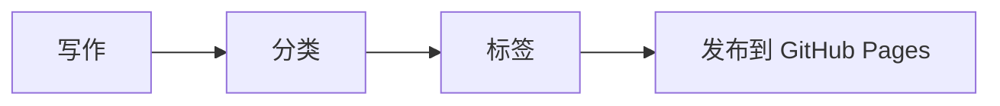

这是博客的第一篇示例文章。你可以把自己的 Markdown 文件放进 `posts/` 目录，并在 `posts/index.json` 里登记它，首页就会自动出现对应文章。

## Markdown 示例

支持常见 Markdown 语法：

- 标题、段落、列表
- 引用与代码块
- 表格
- 链接与图片

> 文字博客最重要的是阅读节奏：留白、行高、层级和稳定的导航。

```js
const idea = "write clearly";
console.log(idea);
```

## Mermaid 示例

下面的图会由 Mermaid 自动渲染：



## 新增文章

1. 在 `posts/` 里新建一个 Markdown 文件。
2. 在文件头部写上标题、日期、分类和标签。
3. 把文章信息加到 `posts/index.json`。

这样就能保持页面本身很轻，文章内容也清清楚楚地放在仓库里。
